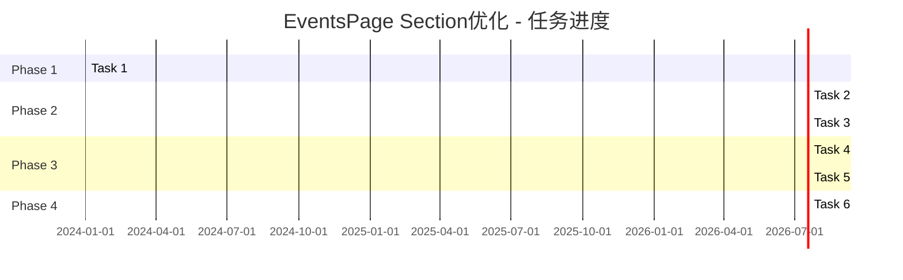

# EventsPage Section优化 - 验收跟踪文档

## 1. 项目概览

**项目名称**: EventsPage Filter Section优化  
**开始时间**: 2024年当前时间  
**项目状态**: 🟡 规划完成，等待执行  
**完成进度**: 0/6 任务完成

## 2. 任务执行状态

### 2.1 执行进度概览



### 2.2 详细任务状态

#### Task 1: 创建自定义Hooks
**状态**: ⏳ 待执行  
**预估时间**: 1.5小时  
**实际时间**: -  
**完成度**: 0%

**验收清单**:
- [ ] useHeaderHeight正确计算Header高度
- [ ] useFilterAnimation提供动画状态管理
- [ ] useEventCounts正确统计各分类事件数量
- [ ] 所有Hook都有TypeScript类型定义
- [ ] 包含基础单元测试

**交付物状态**:
- [ ] `src/hooks/useHeaderHeight.ts`
- [ ] `src/hooks/useFilterAnimation.ts`
- [ ] `src/hooks/useEventCounts.ts`

**执行记录**:
```
开始时间: -
结束时间: -
遇到问题: -
解决方案: -
```

---

#### Task 2: 优化Filter Section布局
**状态**: ⏳ 待执行  
**预估时间**: 1小时  
**实际时间**: -  
**完成度**: 0%

**验收清单**:
- [ ] 粘性定位基于动态Header高度
- [ ] 背景模糊效果正确应用
- [ ] 在所有屏幕尺寸下位置正确
- [ ] z-index层级无冲突
- [ ] 滚动性能流畅

**交付物状态**:
- [ ] 更新`src/pages/EventsPage.tsx`中的Filter Section
- [ ] 新增CSS类定义

**执行记录**:
```
开始时间: -
结束时间: -
遇到问题: -
解决方案: -
```

---

#### Task 3: 实现响应式按钮组件
**状态**: ⏳ 待执行  
**预估时间**: 1小时  
**实际时间**: -  
**完成度**: 0%

**验收清单**:
- [ ] 按钮显示事件计数徽章
- [ ] 响应式尺寸在各设备上合适
- [ ] 选中状态视觉区分明显
- [ ] 触摸目标大小符合标准(44px+)
- [ ] 文本在所有尺寸下可读

**交付物状态**:
- [ ] 更新EventsPage中的按钮渲染逻辑
- [ ] 新增FilterBadge组件（如需要）

**执行记录**:
```
开始时间: -
结束时间: -
遇到问题: -
解决方案: -
```

---

#### Task 4: 添加交互动画系统
**状态**: ⏳ 待执行  
**预估时间**: 1.5小时  
**实际时间**: -  
**完成度**: 0%

**验收清单**:
- [ ] 悬停效果流畅自然
- [ ] 选中状态有发光动画
- [ ] 过滤切换有反馈动画
- [ ] 支持prefers-reduced-motion
- [ ] 动画性能60fps

**交付物状态**:
- [ ] CSS动画类定义
- [ ] 组件动画状态集成
- [ ] 动画降级处理

**执行记录**:
```
开始时间: -
结束时间: -
遇到问题: -
解决方案: -
```

---

#### Task 5: 增强无障碍性支持
**状态**: ⏳ 待执行  
**预估时间**: 1小时  
**实际时间**: -  
**完成度**: 0%

**验收清单**:
- [ ] 支持Tab键导航
- [ ] 支持Enter/Space键激活
- [ ] 屏幕阅读器正确识别
- [ ] 焦点指示器清晰可见
- [ ] 颜色对比度达到AA标准

**交付物状态**:
- [ ] ARIA标签和角色定义
- [ ] 键盘导航支持
- [ ] 焦点管理优化

**执行记录**:
```
开始时间: -
结束时间: -
遇到问题: -
解决方案: -
```

---

#### Task 6: 性能优化和测试
**状态**: ⏳ 待执行  
**预估时间**: 1小时  
**实际时间**: -  
**完成度**: 0%

**验收清单**:
- [ ] 组件渲染次数最小化
- [ ] 内存泄漏检查通过
- [ ] 滚动性能60fps稳定
- [ ] 单元测试覆盖率>90%
- [ ] 集成测试通过

**交付物状态**:
- [ ] React.memo优化
- [ ] 事件处理器优化
- [ ] 单元测试和集成测试
- [ ] 性能测试报告

**执行记录**:
```
开始时间: -
结束时间: -
遇到问题: -
解决方案: -
```

## 3. 里程碑检查点

### Checkpoint 1: Hooks基础设施就绪
**状态**: ⏳ 待达成  
**条件**: Task 1完成  
**验证标准**:
- [ ] 所有自定义Hooks功能正常
- [ ] TypeScript类型检查通过
- [ ] 基础单元测试通过

### Checkpoint 2: 核心功能实现
**状态**: ⏳ 待达成  
**条件**: Task 2 + Task 3完成  
**验证标准**:
- [ ] Filter Section布局优化完成
- [ ] 响应式按钮组件实现
- [ ] 跨设备兼容性验证通过

### Checkpoint 3: 交互体验完善
**状态**: ⏳ 待达成  
**条件**: Task 4完成  
**验证标准**:
- [ ] 所有交互动画正常工作
- [ ] 动画性能达标
- [ ] 用户体验测试通过

### Checkpoint 4: 无障碍性达标
**状态**: ⏳ 待达成  
**条件**: Task 5完成  
**验证标准**:
- [ ] WCAG 2.1 AA级合规
- [ ] 键盘导航完整支持
- [ ] 辅助技术兼容性验证

### Checkpoint 5: 最终交付就绪
**状态**: ⏳ 待达成  
**条件**: Task 6完成  
**验证标准**:
- [ ] 所有性能指标达标
- [ ] 测试覆盖率满足要求
- [ ] 代码质量检查通过

## 4. 质量指标跟踪

### 4.1 技术指标

| 指标 | 目标值 | 当前值 | 状态 |
|------|--------|--------|------|
| 滚动帧率 | ≥60fps | - | ⏳ 待测试 |
| 过滤切换延迟 | <100ms | - | ⏳ 待测试 |
| 浏览器兼容性 | 95%+ | - | ⏳ 待测试 |
| WCAG合规性 | AA级 | - | ⏳ 待测试 |

### 4.2 代码质量指标

| 指标 | 目标值 | 当前值 | 状态 |
|------|--------|--------|------|
| 单元测试覆盖率 | >90% | - | ⏳ 待测试 |
| TypeScript类型覆盖 | 100% | - | ⏳ 待检查 |
| ESLint规则通过 | 100% | - | ⏳ 待检查 |
| 代码重复率 | <5% | - | ⏳ 待检查 |

## 5. 问题跟踪

### 5.1 已知问题

| 问题ID | 描述 | 严重程度 | 状态 | 负责人 | 解决方案 |
|--------|------|----------|------|--------|----------|
| - | 暂无问题 | - | - | - | - |

### 5.2 风险监控

| 风险 | 概率 | 影响 | 当前状态 | 缓解措施 |
|------|------|------|----------|----------|
| CSS兼容性问题 | 低 | 中 | 🟢 监控中 | 提供降级方案 |
| 性能影响 | 中 | 中 | 🟡 关注中 | 性能监控和优化 |
| 复杂交互状态 | 中 | 高 | 🟡 关注中 | 充分测试和状态管理 |

## 6. 测试计划

### 6.1 单元测试

**测试范围**:
- [ ] useHeaderHeight Hook
- [ ] useFilterAnimation Hook
- [ ] useEventCounts Hook
- [ ] Filter Section组件
- [ ] 响应式按钮组件

**测试工具**: Jest + React Testing Library

### 6.2 集成测试

**测试场景**:
- [ ] 完整过滤流程
- [ ] 响应式布局切换
- [ ] 动画交互流程
- [ ] 键盘导航流程

### 6.3 性能测试

**测试指标**:
- [ ] 组件渲染性能
- [ ] 滚动性能
- [ ] 内存使用情况
- [ ] 动画帧率

### 6.4 兼容性测试

**测试环境**:
- [ ] Chrome (最新版)
- [ ] Firefox (最新版)
- [ ] Safari (最新版)
- [ ] Edge (最新版)
- [ ] 移动端浏览器

## 7. 部署检查清单

### 7.1 代码质量
- [ ] 所有TypeScript错误已解决
- [ ] ESLint检查通过
- [ ] Prettier格式化完成
- [ ] 代码审查完成

### 7.2 功能验证
- [ ] 所有验收标准通过
- [ ] 用户体验测试通过
- [ ] 性能基准测试通过
- [ ] 无障碍性测试通过

### 7.3 文档更新
- [ ] 代码注释完整
- [ ] README更新
- [ ] 变更日志记录
- [ ] API文档更新

## 8. 项目总结

**当前状态**: 🟡 文档规划完成，等待开始执行

**下一步行动**:
1. 开始执行Task 1: 创建自定义Hooks
2. 建立开发环境和测试环境
3. 设置持续集成检查

**预期完成时间**: 7小时（按计划执行）

---

**文档更新**: 本文档将在每个任务完成后实时更新，记录实际执行情况和遇到的问题。