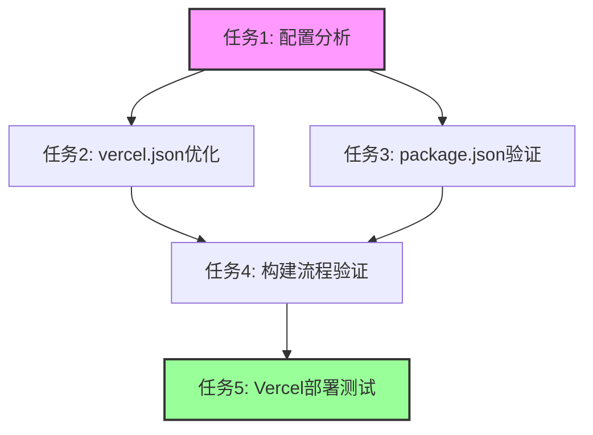

# Vercel部署配置优化任务清单

## 任务目标
解决Vercel生产部署配置与项目设置之间的Framework Settings不匹配问题，确保部署流程的一致性和可靠性。

## 任务分解

### 任务1: 配置分析与现状评估
**输入契约**: 
- 当前vercel.json文件
- package.json脚本配置
- Vercel项目设置信息

**输出契约**:
- 配置差异分析报告
- 问题根因识别
- 标准化方案设计

**验收标准**:
- 明确所有配置差异
- 识别关键不匹配项
- 提供可行的标准化方案

---

### 任务2: vercel.json配置优化
**输入契约**:
- 当前vercel.json内容
- 标准化方案要求

**输出契约**:
- 更新后的vercel.json文件
- 显式的框架和构建配置

**实现约束**:
- 保持向后兼容性
- 明确所有构建参数
- 统一开发命令配置

**验收标准**:
- 包含完整的framework配置
- devCommand统一为`npm run dev`
- buildCommand保持`npm run build`

---

### 任务3: package.json脚本验证
**输入契约**:
- 当前package.json文件
- Vite项目标准要求

**输出契约**:
- 标准化的npm脚本配置
- 验证脚本正确性

**实现约束**:
- 遵循Vite官方最佳实践
- 确保脚本命令一致性
- 支持开发和生产环境

**验收标准**:
- 包含`dev`、`build`、`preview`脚本
- 所有脚本命令正确无误
- 与vercel.json配置匹配

---

### 任务4: 构建流程标准化验证
**输入契约**:
- 更新后的配置文件
- 本地开发环境

**输出契约**:
- 构建流程验证报告
- 环境一致性确认

**验收标准**:
- 本地开发命令正常运行
- 生产构建成功完成
- 输出目录结构正确

---

### 任务5: Vercel部署测试
**输入契约**:
- 标准化后的配置
- GitHub仓库代码

**输出契约**:
- Vercel部署成功确认
- 配置生效验证

**验收标准**:
- 预览部署成功
- 生产部署成功
- Framework Settings匹配

---

## 依赖关系

## 执行优先级

1. **高优先级** (立即执行)
   - 任务1: 配置分析与现状评估
   - 任务2: vercel.json配置优化

2. **中优先级** (次执行)
   - 任务3: package.json脚本验证
   - 任务4: 构建流程标准化验证

3. **低优先级** (后续优化)
   - 任务5: Vercel部署测试
   - 持续监控和优化

## 风险与应对

### 潜在风险
- 配置更改可能影响现有部署
- 框架检测机制变化
- 构建流程中断

### 应对措施
- 保留配置备份
- 分步骤渐进式实施
- 建立快速回滚机制

## 完成标准

- [ ] 所有配置差异已解决
- [ ] Framework Settings完全匹配
- [ ] 部署流程稳定可靠
- [ ] 文档同步更新完成
- [ ] 验证测试全部通过

## 后续维护

1. **定期检查**: 每月检查配置一致性
2. **版本控制**: 配置文件变更版本管理
3. **监控告警**: 部署状态实时监控
4. **文档更新**: 保持配置文档最新