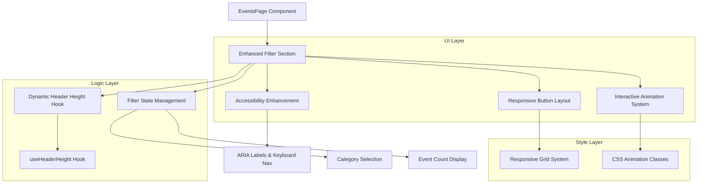
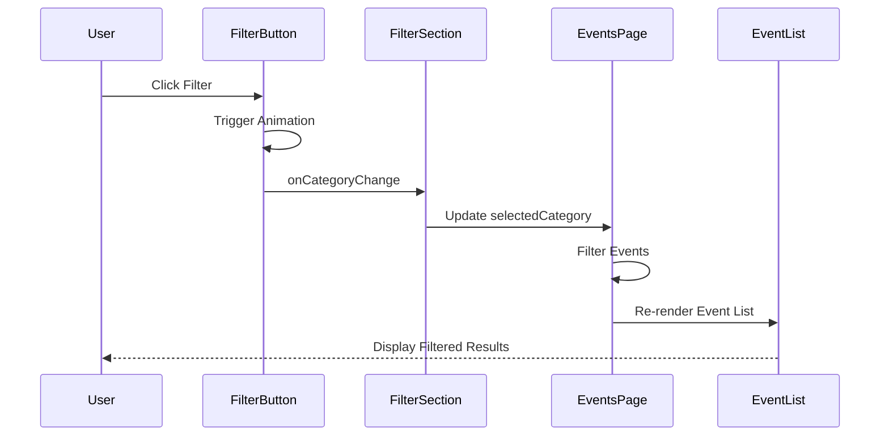

# EventsPage Section优化 - 设计文档

## 1. 整体架构设计

### 1.1 系统架构图


### 1.2 组件分层设计

#### 1.2.1 表现层 (Presentation Layer)
- **FilterSection**: 主要容器组件
- **FilterButton**: 单个过滤按钮组件
- **FilterBadge**: 活动计数徽章组件

#### 1.2.2 逻辑层 (Logic Layer)
- **useHeaderHeight**: 动态Header高度计算Hook
- **useFilterAnimation**: 过滤动画控制Hook
- **filterLogic**: 过滤器状态管理逻辑

#### 1.2.3 样式层 (Style Layer)
- **responsive.css**: 响应式布局样式
- **animations.css**: 交互动画样式
- **accessibility.css**: 无障碍性样式

## 2. 核心组件设计

### 2.1 Enhanced Filter Section 组件

```typescript
interface FilterSectionProps {
  selectedCategory: EventCategory
  onCategoryChange: (category: EventCategory) => void
  eventCounts: Record<EventCategory, number>
  className?: string
}

const FilterSection: React.FC<FilterSectionProps> = ({
  selectedCategory,
  onCategoryChange,
  eventCounts,
  className
}) => {
  const headerHeight = useHeaderHeight()
  const { animationClass, triggerAnimation } = useFilterAnimation()
  
  return (
    <section 
      className={cn(
        "filter-section py-4 md:py-6 border-b",
        "bg-background/80 backdrop-blur-md sticky z-40",
        "transition-all duration-200",
        animationClass,
        className
      )}
      style={{ top: `${headerHeight}px` }}
      role="navigation"
      aria-label="Event category filters"
    >
      <div className="container">
        <FilterButtonGroup
          selectedCategory={selectedCategory}
          onCategoryChange={(category) => {
            triggerAnimation()
            onCategoryChange(category)
          }}
          eventCounts={eventCounts}
        />
      </div>
    </section>
  )
}
```

### 2.2 Filter Button Group 组件

```typescript
interface FilterButtonGroupProps {
  selectedCategory: EventCategory
  onCategoryChange: (category: EventCategory) => void
  eventCounts: Record<EventCategory, number>
}

const FilterButtonGroup: React.FC<FilterButtonGroupProps> = ({
  selectedCategory,
  onCategoryChange,
  eventCounts
}) => {
  const t = useTranslation()
  
  return (
    <div 
      className="flex flex-wrap gap-2 md:gap-3 justify-center lg:justify-start mb-4 md:mb-6"
      role="group"
      aria-label="Filter categories"
    >
      {categoryFilters.map((filter, index) => (
        <FilterButton
          key={filter.key}
          filter={filter}
          isSelected={selectedCategory === filter.key}
          eventCount={eventCounts[filter.key]}
          onClick={() => onCategoryChange(filter.key)}
          tabIndex={0}
          aria-describedby={`filter-${filter.key}-description`}
        />
      ))}
    </div>
  )
}
```

### 2.3 Filter Button 组件

```typescript
interface FilterButtonProps {
  filter: CategoryFilter
  isSelected: boolean
  eventCount: number
  onClick: () => void
  tabIndex: number
  'aria-describedby': string
}

const FilterButton: React.FC<FilterButtonProps> = ({
  filter,
  isSelected,
  eventCount,
  onClick,
  ...ariaProps
}) => {
  const t = useTranslation()
  const [isAnimating, setIsAnimating] = useState(false)
  
  const handleClick = () => {
    setIsAnimating(true)
    onClick()
    setTimeout(() => setIsAnimating(false), 300)
  }
  
  const handleKeyDown = (e: KeyboardEvent<HTMLButtonElement>) => {
    if (e.key === 'Enter' || e.key === ' ') {
      e.preventDefault()
      handleClick()
    }
  }
  
  return (
    <Button
      variant={isSelected ? 'default' : 'outline'}
      onClick={handleClick}
      onKeyDown={handleKeyDown}
      className={cn(
        "filter-button min-w-[80px] h-9 md:h-10",
        "text-xs md:text-sm px-3 md:px-4 py-2",
        "focus-visible:ring-2 focus-visible:ring-primary focus-visible:ring-offset-2",
        "transition-all duration-300 ease-out",
        isSelected && "selected shadow-lg shadow-primary/25 scale-105",
        !isSelected && "hover:shadow-md hover:scale-102",
        isAnimating && "animate-pulse"
      )}
      size="sm"
      {...ariaProps}
    >
      <span>{t.events[filter.labelKey]}</span>
      <FilterBadge count={eventCount} isSelected={isSelected} />
    </Button>
  )
}
```

## 3. 自定义Hooks设计

### 3.1 useHeaderHeight Hook

```typescript
const useHeaderHeight = (): number => {
  const [headerHeight, setHeaderHeight] = useState(64) // 默认值
  
  useEffect(() => {
    const updateHeaderHeight = throttle(() => {
      const header = document.querySelector('header')
      if (header) {
        const height = header.getBoundingClientRect().height
        setHeaderHeight(height)
      }
    }, 100) // 节流100ms
    
    // 初始计算
    updateHeaderHeight()
    
    // 监听窗口大小变化
    window.addEventListener('resize', updateHeaderHeight)
    
    // 监听DOM变化（如果Header内容动态变化）
    const observer = new ResizeObserver(updateHeaderHeight)
    const header = document.querySelector('header')
    if (header) {
      observer.observe(header)
    }
    
    return () => {
      window.removeEventListener('resize', updateHeaderHeight)
      observer.disconnect()
    }
  }, [])
  
  return headerHeight
}
```

### 3.2 useFilterAnimation Hook

```typescript
interface FilterAnimationState {
  animationClass: string
  triggerAnimation: () => void
}

const useFilterAnimation = (): FilterAnimationState => {
  const [animationClass, setAnimationClass] = useState('')
  
  const triggerAnimation = useCallback(() => {
    setAnimationClass('filter-changing')
    
    // 清除动画类
    setTimeout(() => {
      setAnimationClass('')
    }, 300)
  }, [])
  
  return {
    animationClass,
    triggerAnimation
  }
}
```

### 3.3 useEventCounts Hook

```typescript
const useEventCounts = (events: Event[]): Record<EventCategory, number> => {
  return useMemo(() => {
    const counts: Record<EventCategory, number> = {
      all: events.length,
      workshop: 0,
      hackathon: 0,
      seminar: 0,
      competition: 0,
      networking: 0
    }
    
    events.forEach(event => {
      if (event.category !== 'all') {
        counts[event.category]++
      }
    })
    
    return counts
  }, [events])
}
```

## 4. 样式系统设计

### 4.1 响应式断点策略

```css
/* 移动端优先的响应式设计 */
.filter-section {
  /* 基础样式 - 移动端 */
  @apply py-4 px-4;
}

/* 平板端 */
@media (min-width: 768px) {
  .filter-section {
    @apply py-6 px-6;
  }
}

/* 桌面端 */
@media (min-width: 1024px) {
  .filter-section {
    @apply py-6 px-8;
  }
}

/* 大屏幕 */
@media (min-width: 1280px) {
  .filter-section {
    @apply py-8;
  }
}
```

### 4.2 动画系统设计

```css
/* 基础过渡动画 */
.filter-button {
  @apply transform transition-all duration-300 ease-out;
  transition-property: transform, box-shadow, background-color, border-color;
}

/* 悬停效果 */
.filter-button:hover {
  @apply scale-102;
  box-shadow: 0 4px 12px rgba(var(--primary), 0.15);
}

/* 激活效果 */
.filter-button:active {
  @apply scale-95;
  transition-duration: 150ms;
}

/* 选中状态 */
.filter-button.selected {
  @apply scale-105;
  box-shadow: 0 8px 25px rgba(var(--primary), 0.25);
  animation: selected-glow 2s ease-in-out infinite;
}

/* 选中状态发光动画 */
@keyframes selected-glow {
  0%, 100% { 
    box-shadow: 0 8px 25px rgba(var(--primary), 0.25);
  }
  50% { 
    box-shadow: 0 8px 25px rgba(var(--primary), 0.4);
  }
}

/* 过滤切换动画 */
.filter-changing {
  animation: filter-pulse 300ms ease-out;
}

@keyframes filter-pulse {
  0% { transform: scale(1); }
  50% { transform: scale(1.02); }
  100% { transform: scale(1); }
}
```

### 4.3 无障碍性样式

```css
/* 焦点指示器 */
.filter-button:focus-visible {
  @apply ring-2 ring-primary ring-offset-2 ring-offset-background;
  outline: none;
}

/* 高对比度模式支持 */
@media (prefers-contrast: high) {
  .filter-button {
    @apply border-2;
  }
  
  .filter-button.selected {
    @apply bg-primary text-primary-foreground border-primary;
  }
}

/* 减少动画偏好 */
@media (prefers-reduced-motion: reduce) {
  .filter-button,
  .filter-section {
    transition: none;
    animation: none;
  }
}
```

## 5. 数据流设计

### 5.1 状态管理流程



### 5.2 性能优化策略

```typescript
// 使用React.memo优化FilterButton渲染
const FilterButton = React.memo<FilterButtonProps>(({ 
  filter, 
  isSelected, 
  eventCount, 
  onClick 
}) => {
  // 组件实现
}, (prevProps, nextProps) => {
  // 自定义比较函数
  return (
    prevProps.isSelected === nextProps.isSelected &&
    prevProps.eventCount === nextProps.eventCount &&
    prevProps.filter.key === nextProps.filter.key
  )
})

// 使用useCallback优化事件处理器
const handleCategoryChange = useCallback((category: EventCategory) => {
  setSelectedCategory(category)
}, [])

// 使用useMemo优化计算
const eventCounts = useMemo(() => {
  return calculateEventCounts(mockEvents)
}, [mockEvents])
```

## 6. 接口契约定义

### 6.1 组件Props接口

```typescript
// Filter Section主组件接口
interface FilterSectionProps {
  selectedCategory: EventCategory
  onCategoryChange: (category: EventCategory) => void
  events: Event[]
  className?: string
  stickyOffset?: number
}

// Filter Button接口
interface FilterButtonProps {
  filter: CategoryFilter
  isSelected: boolean
  eventCount: number
  onClick: () => void
  disabled?: boolean
  'aria-describedby'?: string
}

// Category Filter配置接口
interface CategoryFilter {
  key: EventCategory
  labelKey: string
  icon?: React.ComponentType<{ className?: string }>
  color?: string
}
```

### 6.2 Hook接口定义

```typescript
// Header Height Hook接口
interface UseHeaderHeightReturn {
  height: number
  isCalculating: boolean
}

// Filter Animation Hook接口
interface UseFilterAnimationReturn {
  animationClass: string
  triggerAnimation: () => void
  isAnimating: boolean
}

// Event Counts Hook接口
interface UseEventCountsReturn {
  counts: Record<EventCategory, number>
  isLoading: boolean
}
```

## 7. 异常处理策略

### 7.1 错误边界处理

```typescript
class FilterSectionErrorBoundary extends React.Component {
  constructor(props) {
    super(props)
    this.state = { hasError: false }
  }
  
  static getDerivedStateFromError(error) {
    return { hasError: true }
  }
  
  componentDidCatch(error, errorInfo) {
    console.error('FilterSection Error:', error, errorInfo)
    // 发送错误报告到监控系统
  }
  
  render() {
    if (this.state.hasError) {
      return (
        <section className="py-4 text-center">
          <p className="text-muted-foreground">
            过滤器暂时不可用，请刷新页面重试
          </p>
        </section>
      )
    }
    
    return this.props.children
  }
}
```

### 7.2 降级策略

```typescript
// CSS支持检测和降级
const useCSSSupportDetection = () => {
  const [supports, setSupports] = useState({
    backdrop: true,
    sticky: true,
    transform: true
  })
  
  useEffect(() => {
    setSupports({
      backdrop: CSS.supports('backdrop-filter', 'blur(10px)'),
      sticky: CSS.supports('position', 'sticky'),
      transform: CSS.supports('transform', 'scale(1.1)')
    })
  }, [])
  
  return supports
}

// 根据支持情况应用不同样式
const getFilterSectionClasses = (supports) => {
  return cn(
    'filter-section',
    supports.backdrop ? 'backdrop-blur-md' : 'bg-background',
    supports.sticky ? 'sticky' : 'relative',
    supports.transform ? 'hover-effects' : 'simple-hover'
  )
}
```

## 8. 测试策略

### 8.1 单元测试覆盖

```typescript
// FilterButton组件测试
describe('FilterButton', () => {
  it('should render with correct label', () => {
    render(<FilterButton filter={mockFilter} />)
    expect(screen.getByText('工作坊')).toBeInTheDocument()
  })
  
  it('should show selected state correctly', () => {
    render(<FilterButton filter={mockFilter} isSelected={true} />)
    expect(screen.getByRole('button')).toHaveClass('selected')
  })
  
  it('should handle keyboard navigation', () => {
    const handleClick = jest.fn()
    render(<FilterButton filter={mockFilter} onClick={handleClick} />)
    
    fireEvent.keyDown(screen.getByRole('button'), { key: 'Enter' })
    expect(handleClick).toHaveBeenCalled()
  })
})
```

### 8.2 集成测试策略

```typescript
// Filter Section集成测试
describe('FilterSection Integration', () => {
  it('should filter events correctly when category changes', () => {
    render(<EventsPage />)
    
    fireEvent.click(screen.getByText('工作坊'))
    
    expect(screen.getAllByTestId('event-card'))
      .toHaveLength(mockWorkshopEvents.length)
  })
  
  it('should maintain sticky position during scroll', () => {
    render(<EventsPage />)
    
    fireEvent.scroll(window, { target: { scrollY: 500 } })
    
    const filterSection = screen.getByRole('navigation')
    expect(filterSection).toHaveStyle('position: sticky')
  })
})
```

---

**设计完成确认**: 架构设计清晰，组件接口明确，性能和异常处理策略完善，可以进入原子化任务拆分阶段。