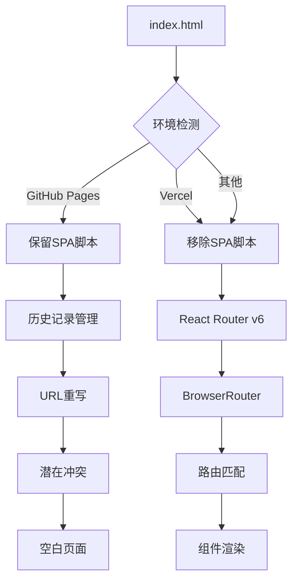
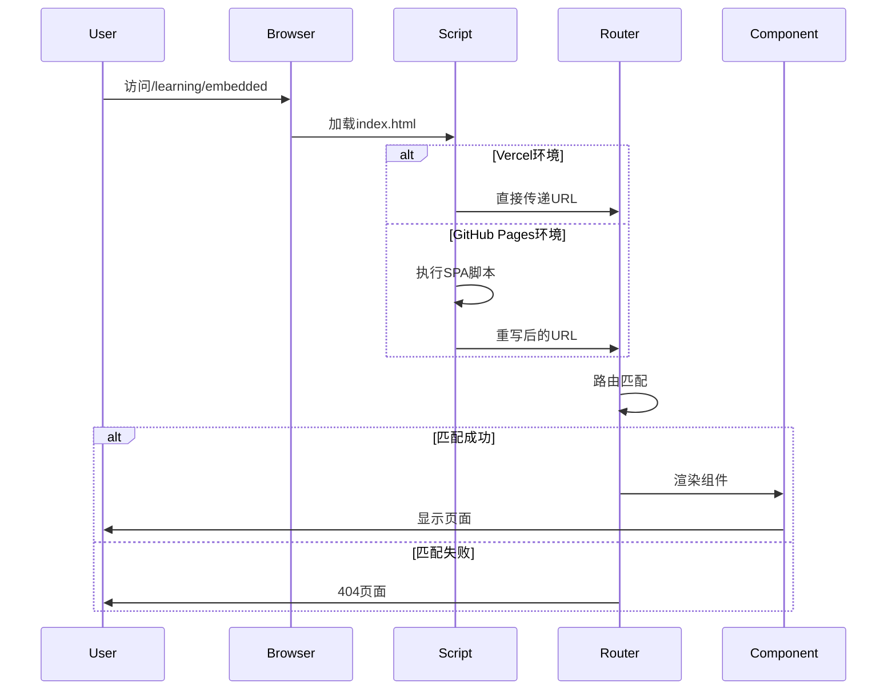
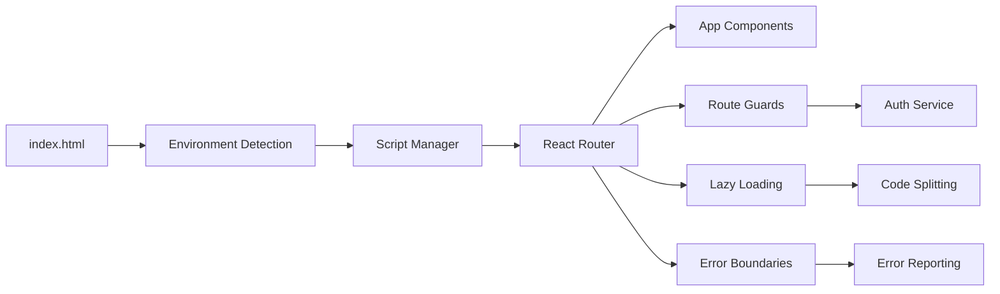

# GitHub Pages脚本修复架构设计

## 整体架构



## 分层设计

### 1. 表现层 (Presentation Layer)
- **index.html**: 入口HTML文件
- **meta标签**: SEO和Open Graph配置
- **脚本管理**: 条件加载控制

### 2. 路由层 (Routing Layer)
- **BrowserRouter**: HTML5 history API管理
- **Routes配置**: 组件路由映射
- **动态路由**: 参数化路由处理
- **懒加载**: 代码分割优化

### 3. 应用层 (Application Layer)
- **页面组件**: 各功能页面实现
- **布局组件**: 统一页面结构
- **状态管理**: 路由状态同步

### 4. 服务层 (Service Layer)
- **路由守卫**: 权限控制
- **预加载**: 性能优化
- **错误处理**: 异常捕获

## 核心组件设计

### 3.1 路由配置组件
```typescript
// App.tsx路由结构
<BrowserRouter>
  <RoutePreloader />
  <Suspense fallback={<Loading />}>
    <Routes>
      <Route path="/" element={<HomePage />} />
      <Route path="/learning/*" element={<LearningRoutes />} />
      <Route path="/docs/*" element={<DocumentRoutes />} />
      {/* 其他路由 */}
    </Routes>
  </Suspense>
</BrowserRouter>
```

### 3.2 环境检测机制
```javascript
// 环境检测逻辑
const isVercel = window.location.hostname.includes('vercel.app') || 
                 window.location.hostname === 'newenergycoder.club';
const isGitHubPages = window.location.hostname.includes('github.io');
```

### 3.3 脚本管理策略
```javascript
// 条件脚本加载
if (isGitHubPages) {
  // 加载GitHub Pages SPA脚本
  loadGitHubPagesScript();
}
// Vercel环境下不加载冲突脚本
```

## 接口契约定义

### 4.1 路由接口
```typescript
interface RouteConfig {
  path: string;
  element: React.ComponentType;
  children?: RouteConfig[];
  guards?: RouteGuard[];
}

interface RouteGuard {
  canActivate: () => boolean;
  fallback: string;
}
```

### 4.2 环境配置接口
```typescript
interface DeploymentConfig {
  platform: 'vercel' | 'github-pages' | 'netlify';
  baseUrl: string;
  spaScript: boolean;
  routingStrategy: 'browser' | 'hash';
}
```

## 数据流向图



## 异常处理策略

### 6.1 路由错误处理
```typescript
// 错误边界组件
class RouteErrorBoundary extends React.Component {
  componentDidCatch(error: Error, errorInfo: ErrorInfo) {
    if (error.message.includes('routing')) {
      this.logRoutingError(error);
      this.fallbackToHome();
    }
  }
}
```

### 6.2 降级策略
1. **脚本加载失败**: 降级到基础路由
2. **路由匹配失败**: 显示404页面
3. **组件加载失败**: 显示错误提示
4. **历史记录冲突**: 强制页面刷新

### 6.3 监控告警
```typescript
// 路由监控
const monitorRouting = () => {
  window.addEventListener('error', (event) => {
    if (event.message.includes('history')) {
      reportError('Routing conflict detected');
    }
  });
};
```

## 模块依赖关系



## 性能考虑

### 8.1 加载优化
- 脚本条件加载减少不必要的代码执行
- 路由懒加载优化初始加载时间
- 预加载策略提升用户体验

### 8.2 内存管理
- 及时清理事件监听器
- 避免内存泄漏的路由守卫
- 组件卸载时的清理工作

### 8.3 监控指标
- 路由加载时间
- 脚本执行时间
- 错误发生率
- 用户访问成功率