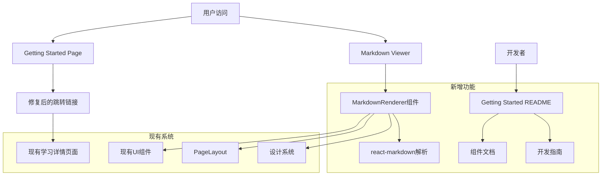
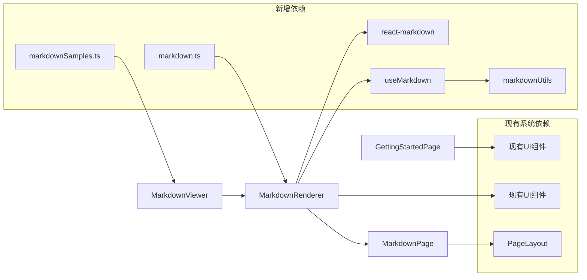
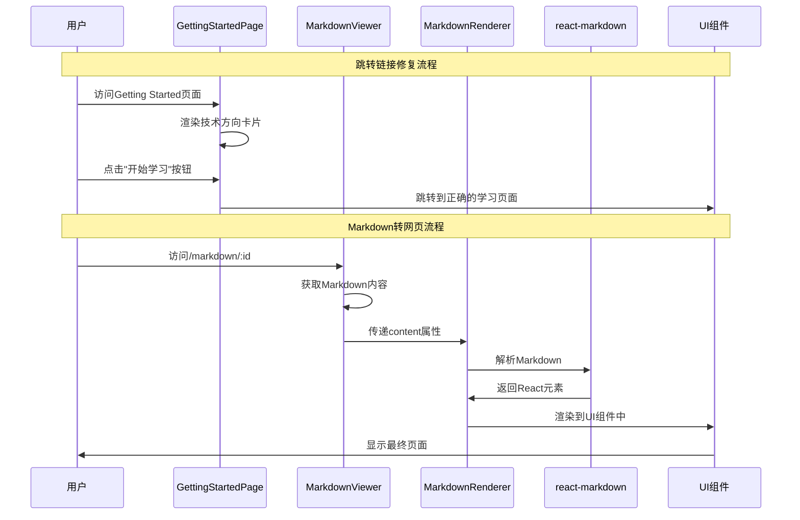

# DESIGN - Getting Started Enhancement 架构设计文档

## 1. 整体架构图



## 2. 分层设计和核心组件

### 2.1 表现层 (Presentation Layer)
```
├── pages/
│   ├── GettingStartedPage.tsx (修改)
│   └── MarkdownViewer.tsx (新增)
├── components/
│   └── markdown/
│       ├── MarkdownRenderer.tsx (新增)
│       └── MarkdownPage.tsx (新增)
```

### 2.2 业务逻辑层 (Business Logic Layer)
```
├── hooks/
│   └── useMarkdown.ts (新增)
├── utils/
│   └── markdownUtils.ts (新增)
```

### 2.3 数据层 (Data Layer)
```
├── types/
│   └── markdown.ts (新增)
├── data/
│   └── markdownSamples.ts (新增)
```

### 2.4 文档层 (Documentation Layer)
```
├── docs/
│   └── getting-started/
│       └── README.md (新增)
```

## 3. 模块依赖关系图



## 4. 接口契约定义

### 4.1 Markdown相关类型定义
```typescript
// types/markdown.ts
export interface MarkdownContent {
  id: string
  title: string
  content: string
  author?: string
  createdAt?: Date
  updatedAt?: Date
  tags?: string[]
}

export interface MarkdownRendererProps {
  content: string
  className?: string
  showToc?: boolean
  enableSyntaxHighlight?: boolean
}

export interface MarkdownPageProps {
  title: string
  content: string
  showBackButton?: boolean
  backUrl?: string
}

export interface MarkdownViewerProps {
  id?: string
  content?: string
}
```

### 4.2 Hook接口定义
```typescript
// hooks/useMarkdown.ts
export interface UseMarkdownReturn {
  content: string | null
  loading: boolean
  error: string | null
  loadContent: (id: string) => Promise<void>
  setContent: (content: string) => void
}

export interface UseMarkdownOptions {
  autoLoad?: boolean
  cacheEnabled?: boolean
}
```

### 4.3 工具函数接口
```typescript
// utils/markdownUtils.ts
export interface MarkdownParseOptions {
  enableGfm?: boolean
  enableSyntaxHighlight?: boolean
  customRenderers?: Record<string, any>
}

export interface TocItem {
  id: string
  title: string
  level: number
  children?: TocItem[]
}
```

## 5. 数据流向图



## 6. 异常处理策略

### 6.1 跳转链接异常处理
```typescript
// 在TechDirectionCard组件中添加错误边界
const handleLinkClick = (link: string) => {
  try {
    // 验证链接有效性
    if (!link || !link.startsWith('/')) {
      throw new Error('Invalid link format')
    }
    // 执行跳转
    window.location.href = link
  } catch (error) {
    console.error('Navigation error:', error)
    // 显示用户友好的错误信息
    toast.error('页面跳转失败，请稍后重试')
  }
}
```

### 6.2 Markdown解析异常处理
```typescript
// MarkdownRenderer组件异常处理
const MarkdownRenderer: React.FC<MarkdownRendererProps> = ({ content }) => {
  const [error, setError] = useState<string | null>(null)
  
  const handleError = useCallback((error: Error) => {
    console.error('Markdown parsing error:', error)
    setError('内容解析失败，请检查Markdown格式')
  }, [])
  
  if (error) {
    return (
      <Alert variant="destructive">
        <AlertCircle className="h-4 w-4" />
        <AlertTitle>解析错误</AlertTitle>
        <AlertDescription>{error}</AlertDescription>
      </Alert>
    )
  }
  
  // 正常渲染逻辑
}
```

### 6.3 路由异常处理
```typescript
// App.tsx中添加错误边界路由
<Route path="/markdown/:id" element={
  <ErrorBoundary fallback={<MarkdownErrorPage />}>
    <MarkdownViewer />
  </ErrorBoundary>
} />
```

## 7. 组件详细设计

### 7.1 MarkdownRenderer组件设计
```typescript
// components/markdown/MarkdownRenderer.tsx
import ReactMarkdown from 'react-markdown'
import remarkGfm from 'remark-gfm'
import { Prism as SyntaxHighlighter } from 'react-syntax-highlighter'
import { oneDark } from 'react-syntax-highlighter/dist/esm/styles/prism'

interface MarkdownRendererProps {
  content: string
  className?: string
  showToc?: boolean
  enableSyntaxHighlight?: boolean
}

const MarkdownRenderer: React.FC<MarkdownRendererProps> = ({
  content,
  className = '',
  showToc = false,
  enableSyntaxHighlight = true
}) => {
  const components = {
    // 自定义渲染组件
    h1: ({ children }: any) => (
      <h1 className="text-3xl font-bold mb-6 text-foreground">{children}</h1>
    ),
    h2: ({ children }: any) => (
      <h2 className="text-2xl font-semibold mb-4 text-foreground">{children}</h2>
    ),
    p: ({ children }: any) => (
      <p className="mb-4 text-muted-foreground leading-relaxed">{children}</p>
    ),
    code: ({ node, inline, className, children, ...props }: any) => {
      const match = /language-(\w+)/.exec(className || '')
      return !inline && match && enableSyntaxHighlight ? (
        <SyntaxHighlighter
          style={oneDark}
          language={match[1]}
          PreTag="div"
          className="rounded-lg mb-4"
          {...props}
        >
          {String(children).replace(/\n$/, '')}
        </SyntaxHighlighter>
      ) : (
        <code className="bg-muted px-1 py-0.5 rounded text-sm" {...props}>
          {children}
        </code>
      )
    }
  }
  
  return (
    <div className={`markdown-content ${className}`}>
      <ReactMarkdown
        remarkPlugins={[remarkGfm]}
        components={components}
      >
        {content}
      </ReactMarkdown>
    </div>
  )
}
```

### 7.2 MarkdownPage组件设计
```typescript
// components/markdown/MarkdownPage.tsx
import { PageLayout } from '@/components/layout/PageLayout'
import { Button } from '@/components/ui/button'
import { ArrowLeft } from 'lucide-react'
import { MarkdownRenderer } from './MarkdownRenderer'

interface MarkdownPageProps {
  title: string
  content: string
  showBackButton?: boolean
  backUrl?: string
}

const MarkdownPage: React.FC<MarkdownPageProps> = ({
  title,
  content,
  showBackButton = true,
  backUrl = '/'
}) => {
  return (
    <PageLayout>
      <div className="container mx-auto px-4 py-8">
        {showBackButton && (
          <Button
            variant="ghost"
            className="mb-6"
            onClick={() => window.history.back()}
          >
            <ArrowLeft className="h-4 w-4 mr-2" />
            返回
          </Button>
        )}
        
        <div className="max-w-4xl mx-auto">
          <h1 className="text-4xl font-bold mb-8 text-center">{title}</h1>
          <div className="bg-card rounded-lg p-8 shadow-lg">
            <MarkdownRenderer content={content} />
          </div>
        </div>
      </div>
    </PageLayout>
  )
}
```

### 7.3 MarkdownViewer页面设计
```typescript
// pages/MarkdownViewer.tsx
import { useParams, useSearchParams } from 'react-router-dom'
import { useEffect, useState } from 'react'
import { MarkdownPage } from '@/components/markdown/MarkdownPage'
import { useMarkdown } from '@/hooks/useMarkdown'
import { LoadingSpinner } from '@/components/ui/loading-spinner'
import { Alert, AlertDescription } from '@/components/ui/alert'

const MarkdownViewer: React.FC = () => {
  const { id } = useParams<{ id: string }>()
  const [searchParams] = useSearchParams()
  const { content, loading, error, loadContent } = useMarkdown()
  
  const title = searchParams.get('title') || 'Markdown文档'
  const directContent = searchParams.get('content')
  
  useEffect(() => {
    if (directContent) {
      // 直接使用URL参数中的内容
      return
    }
    
    if (id) {
      loadContent(id)
    }
  }, [id, directContent, loadContent])
  
  if (loading) {
    return (
      <div className="flex justify-center items-center min-h-screen">
        <LoadingSpinner />
      </div>
    )
  }
  
  if (error) {
    return (
      <div className="container mx-auto px-4 py-8">
        <Alert variant="destructive">
          <AlertDescription>{error}</AlertDescription>
        </Alert>
      </div>
    )
  }
  
  const finalContent = directContent || content || '# 内容未找到\n\n请检查URL参数或文档ID。'
  
  return (
    <MarkdownPage
      title={title}
      content={finalContent}
    />
  )
}
```

## 8. 样式集成策略

### 8.1 Tailwind CSS类名映射
```css
/* 在index.css中添加Markdown专用样式 */
.markdown-content {
  @apply text-foreground;
}

.markdown-content h1 {
  @apply text-3xl font-bold mb-6 text-foreground border-b border-border pb-2;
}

.markdown-content h2 {
  @apply text-2xl font-semibold mb-4 text-foreground;
}

.markdown-content h3 {
  @apply text-xl font-medium mb-3 text-foreground;
}

.markdown-content p {
  @apply mb-4 text-muted-foreground leading-relaxed;
}

.markdown-content ul, .markdown-content ol {
  @apply mb-4 ml-6;
}

.markdown-content li {
  @apply mb-2 text-muted-foreground;
}

.markdown-content blockquote {
  @apply border-l-4 border-primary pl-4 italic text-muted-foreground mb-4;
}

.markdown-content table {
  @apply w-full border-collapse border border-border mb-4;
}

.markdown-content th, .markdown-content td {
  @apply border border-border px-4 py-2 text-left;
}

.markdown-content th {
  @apply bg-muted font-semibold;
}
```

### 8.2 暗黑模式支持
```typescript
// 在MarkdownRenderer中添加主题感知
const { theme } = useTheme()

const syntaxHighlighterStyle = theme === 'dark' ? oneDark : oneLight
```

## 9. 性能优化策略

### 9.1 代码分割
```typescript
// 使用React.lazy进行组件懒加载
const MarkdownViewer = React.lazy(() => import('@/pages/MarkdownViewer'))
const MarkdownRenderer = React.lazy(() => import('@/components/markdown/MarkdownRenderer'))

// 在App.tsx中使用Suspense包装
<Route path="/markdown/:id" element={
  <Suspense fallback={<LoadingSpinner />}>
    <MarkdownViewer />
  </Suspense>
} />
```

### 9.2 内容缓存
```typescript
// hooks/useMarkdown.ts中实现缓存机制
const contentCache = new Map<string, string>()

export const useMarkdown = (options: UseMarkdownOptions = {}) => {
  const { cacheEnabled = true } = options
  
  const loadContent = useCallback(async (id: string) => {
    if (cacheEnabled && contentCache.has(id)) {
      setContent(contentCache.get(id)!)
      return
    }
    
    // 加载逻辑
    const content = await fetchMarkdownContent(id)
    
    if (cacheEnabled) {
      contentCache.set(id, content)
    }
    
    setContent(content)
  }, [cacheEnabled])
}
```

## 10. 测试策略

### 10.1 单元测试
```typescript
// __tests__/MarkdownRenderer.test.tsx
import { render, screen } from '@testing-library/react'
import { MarkdownRenderer } from '@/components/markdown/MarkdownRenderer'

describe('MarkdownRenderer', () => {
  it('renders basic markdown content', () => {
    const content = '# Hello World\n\nThis is a test.'
    render(<MarkdownRenderer content={content} />)
    
    expect(screen.getByText('Hello World')).toBeInTheDocument()
    expect(screen.getByText('This is a test.')).toBeInTheDocument()
  })
  
  it('handles code blocks with syntax highlighting', () => {
    const content = '```javascript\nconsole.log("Hello")\n```'
    render(<MarkdownRenderer content={content} enableSyntaxHighlight />)
    
    expect(screen.getByText('console.log("Hello")')).toBeInTheDocument()
  })
})
```

### 10.2 集成测试
```typescript
// __tests__/MarkdownViewer.integration.test.tsx
import { render, screen, waitFor } from '@testing-library/react'
import { BrowserRouter } from 'react-router-dom'
import { MarkdownViewer } from '@/pages/MarkdownViewer'

describe('MarkdownViewer Integration', () => {
  it('displays markdown content from URL parameters', async () => {
    const testContent = '# Test Title\n\nTest content'
    const searchParams = new URLSearchParams({
      title: 'Test Document',
      content: testContent
    })
    
    // Mock useSearchParams
    jest.mock('react-router-dom', () => ({
      ...jest.requireActual('react-router-dom'),
      useSearchParams: () => [searchParams]
    }))
    
    render(
      <BrowserRouter>
        <MarkdownViewer />
      </BrowserRouter>
    )
    
    await waitFor(() => {
      expect(screen.getByText('Test Document')).toBeInTheDocument()
      expect(screen.getByText('Test Title')).toBeInTheDocument()
    })
  })
})
```

## 11. 部署和配置

### 11.1 依赖包安装命令
```bash
npm install react-markdown remark-gfm react-syntax-highlighter
npm install -D @types/react-syntax-highlighter
```

### 11.2 Vite配置更新
```typescript
// vite.config.ts - 如果需要优化打包
export default defineConfig({
  // ... 现有配置
  build: {
    rollupOptions: {
      output: {
        manualChunks: {
          'markdown': ['react-markdown', 'remark-gfm'],
          'syntax-highlighter': ['react-syntax-highlighter']
        }
      }
    }
  }
})
```

## 12. 监控和日志

### 12.1 错误监控
```typescript
// utils/errorTracking.ts
export const trackMarkdownError = (error: Error, context: string) => {
  console.error(`Markdown Error [${context}]:`, error)
  
  // 如果有错误追踪服务，在这里发送
  if (process.env.NODE_ENV === 'production') {
    // 发送到错误追踪服务
  }
}
```

### 12.2 性能监控
```typescript
// hooks/useMarkdown.ts中添加性能监控
const loadContent = useCallback(async (id: string) => {
  const startTime = performance.now()
  
  try {
    // 加载逻辑
    const content = await fetchMarkdownContent(id)
    setContent(content)
    
    const loadTime = performance.now() - startTime
    console.log(`Markdown loaded in ${loadTime}ms`)
  } catch (error) {
    trackMarkdownError(error as Error, 'loadContent')
  }
}, [])
```

这个设计文档提供了完整的架构设计，包括组件结构、接口定义、数据流、异常处理、性能优化和测试策略。所有设计都与现有系统保持一致，确保无缝集成。