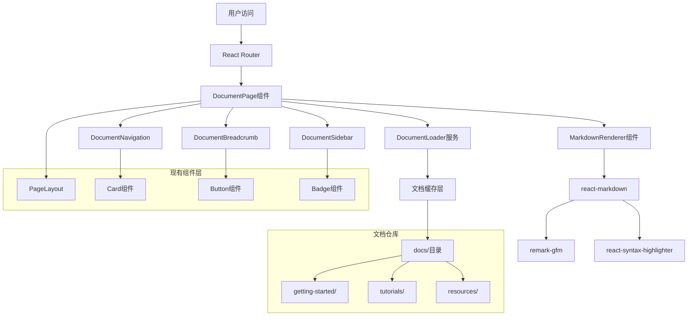
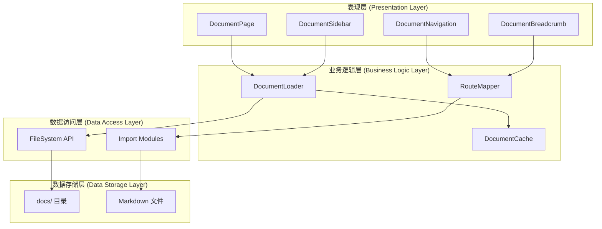
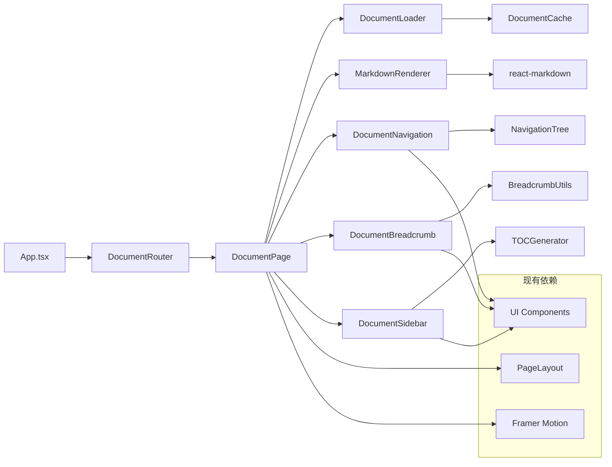
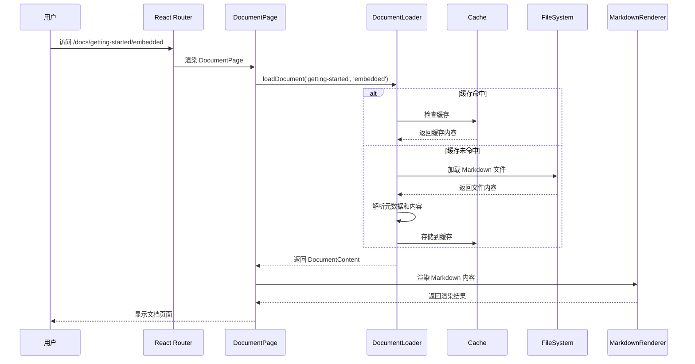
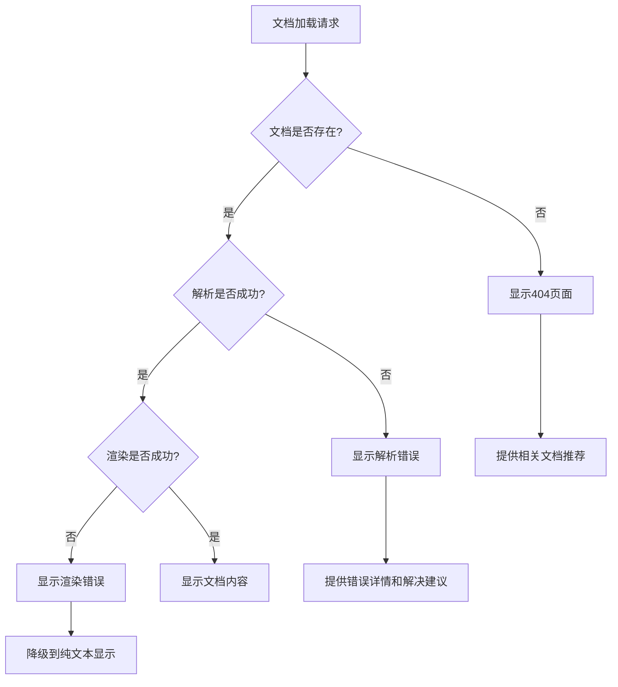

# DESIGN - Markdown文档仓库自动渲染系统架构设计

## 1. 整体架构设计

### 1.1 系统架构图


### 1.2 分层架构


## 2. 核心组件设计

### 2.1 DocumentLoader 服务
```typescript
// src/services/DocumentLoader.ts
interface DocumentMeta {
  title: string;
  description?: string;
  category: string;
  slug: string;
  path: string;
  lastModified?: Date;
  tags?: string[];
}

interface DocumentContent {
  meta: DocumentMeta;
  content: string;
  toc?: TableOfContent[];
}

class DocumentLoader {
  private cache: Map<string, DocumentContent> = new Map();
  
  async loadDocument(category: string, slug: string): Promise<DocumentContent>
  async loadDocumentList(category?: string): Promise<DocumentMeta[]>
  async searchDocuments(query: string): Promise<DocumentMeta[]>
  private parseMarkdownMeta(content: string): DocumentMeta
  private generateTOC(content: string): TableOfContent[]
}
```

### 2.2 DocumentPage 组件
```typescript
// src/components/docs/DocumentPage.tsx
interface DocumentPageProps {
  category: string;
  slug: string;
}

const DocumentPage: React.FC<DocumentPageProps> = ({ category, slug }) => {
  // 状态管理
  const [document, setDocument] = useState<DocumentContent | null>(null);
  const [loading, setLoading] = useState(true);
  const [error, setError] = useState<string | null>(null);
  
  // 文档加载逻辑
  // 渲染逻辑
  // 错误处理
};
```

### 2.3 DocumentNavigation 组件
```typescript
// src/components/docs/DocumentNavigation.tsx
interface NavigationItem {
  title: string;
  path: string;
  children?: NavigationItem[];
}

interface DocumentNavigationProps {
  currentPath: string;
  category: string;
}

const DocumentNavigation: React.FC<DocumentNavigationProps> = ({
  currentPath,
  category
}) => {
  // 导航树生成
  // 当前页面高亮
  // 折叠/展开逻辑
};
```

## 3. 模块依赖关系图



## 4. 接口契约定义

### 4.1 文档加载接口
```typescript
// src/types/document.ts
export interface DocumentMeta {
  title: string;
  description?: string;
  category: 'getting-started' | 'tutorials' | 'resources';
  slug: string;
  path: string;
  lastModified?: Date;
  tags?: string[];
  order?: number;
}

export interface DocumentContent {
  meta: DocumentMeta;
  content: string;
  toc: TableOfContent[];
}

export interface TableOfContent {
  id: string;
  title: string;
  level: number;
  children?: TableOfContent[];
}

export interface DocumentCache {
  get(key: string): DocumentContent | undefined;
  set(key: string, value: DocumentContent): void;
  clear(): void;
  has(key: string): boolean;
}
```

### 4.2 路由接口
```typescript
// src/types/routing.ts
export interface DocumentRoute {
  category: string;
  slug: string;
  path: string;
}

export interface RouteMapper {
  getDocumentRoute(category: string, slug: string): string;
  parseDocumentRoute(path: string): DocumentRoute | null;
  generateBreadcrumbs(route: DocumentRoute): BreadcrumbItem[];
}

export interface BreadcrumbItem {
  title: string;
  path?: string;
  active: boolean;
}
```

### 4.3 导航接口
```typescript
// src/types/navigation.ts
export interface NavigationItem {
  title: string;
  path: string;
  category: string;
  slug: string;
  order: number;
  children?: NavigationItem[];
}

export interface NavigationTree {
  [category: string]: NavigationItem[];
}

export interface NavigationState {
  currentPath: string;
  expandedItems: Set<string>;
  activeItem: string | null;
}
```

## 5. 数据流向图



## 6. 文件系统设计

### 6.1 文档目录结构
```
docs/
├── getting-started/
│   ├── _meta.json              # 分类元数据
│   ├── index.md                # 主页文档
│   ├── embedded-development.md # 嵌入式开发
│   ├── gui-development.md      # GUI开发
│   ├── algorithm-design.md     # 算法设计
│   └── quick-guides/
│       ├── _meta.json
│       ├── environment-setup.md
│       ├── first-project.md
│       └── community-join.md
├── tutorials/
│   ├── _meta.json
│   ├── basic/
│   │   ├── _meta.json
│   │   ├── introduction.md
│   │   └── fundamentals.md
│   ├── intermediate/
│   │   ├── _meta.json
│   │   ├── advanced-concepts.md
│   │   └── best-practices.md
│   └── advanced/
│       ├── _meta.json
│       ├── optimization.md
│       └── architecture.md
└── resources/
    ├── _meta.json
    ├── tools.md
    ├── libraries.md
    └── references.md
```

### 6.2 元数据文件格式
```json
// docs/getting-started/_meta.json
{
  "title": "快速开始",
  "description": "新能源编程俱乐部快速入门指南",
  "order": 1,
  "items": [
    {
      "slug": "index",
      "title": "概述",
      "order": 1
    },
    {
      "slug": "embedded-development",
      "title": "嵌入式开发",
      "order": 2
    },
    {
      "slug": "gui-development",
      "title": "GUI界面开发",
      "order": 3
    }
  ]
}
```

### 6.3 Markdown文件格式
```markdown
---
title: "嵌入式开发入门指南"
description: "学习嵌入式开发的基础知识和实践技能"
tags: ["嵌入式", "硬件", "编程"]
lastModified: "2024-12-19"
---

# 嵌入式开发入门指南

## 概述

嵌入式开发是...

## 环境搭建

### 1. 安装开发工具

```bash
# 安装必要的工具
npm install -g platformio
```

## 第一个项目

...
```

## 7. 组件实现规范

### 7.1 DocumentPage 组件规范
```typescript
// 组件职责
// 1. 管理文档加载状态
// 2. 处理加载错误
// 3. 渲染文档内容
// 4. 集成导航组件

// 性能要求
// 1. 支持文档内容缓存
// 2. 实现懒加载
// 3. 优化重渲染

// 用户体验
// 1. 加载状态提示
// 2. 错误状态处理
// 3. 平滑的页面切换
```

### 7.2 DocumentLoader 服务规范
```typescript
// 功能要求
// 1. 支持多种文档格式
// 2. 元数据解析
// 3. 内容缓存管理
// 4. 错误处理

// 性能要求
// 1. 缓存策略优化
// 2. 并发加载控制
// 3. 内存使用优化

// 扩展性
// 1. 支持插件机制
// 2. 支持自定义解析器
// 3. 支持远程文档源
```

## 8. 路由集成设计

### 8.1 路由配置
```typescript
// src/App.tsx 路由配置
const documentRoutes = [
  {
    path: '/docs/:category/:slug',
    element: <DocumentPage />
  },
  {
    path: '/docs/:category',
    element: <DocumentCategoryPage />
  },
  {
    path: '/docs',
    element: <DocumentIndexPage />
  }
];
```

### 8.2 GettingStarted页面集成
```typescript
// 更新技术方向卡片链接
const techDirections = [
  {
    title: '嵌入式开发',
    description: '学习嵌入式系统开发',
    link: '/docs/getting-started/embedded-development', // 更新链接
    icon: Cpu
  },
  {
    title: 'GUI界面开发',
    description: '掌握图形界面开发技术',
    link: '/docs/getting-started/gui-development', // 更新链接
    icon: Monitor
  }
];
```

## 9. 异常处理策略

### 9.1 错误类型定义
```typescript
export enum DocumentErrorType {
  NOT_FOUND = 'NOT_FOUND',
  PARSE_ERROR = 'PARSE_ERROR',
  NETWORK_ERROR = 'NETWORK_ERROR',
  CACHE_ERROR = 'CACHE_ERROR'
}

export interface DocumentError {
  type: DocumentErrorType;
  message: string;
  details?: any;
}
```

### 9.2 错误处理流程


## 10. 性能优化策略

### 10.1 缓存策略
```typescript
// 多级缓存设计
class DocumentCacheManager {
  private memoryCache: Map<string, DocumentContent>;
  private sessionCache: Storage;
  private persistentCache: IndexedDB;
  
  // 缓存优先级: 内存 > 会话 > 持久化
  async get(key: string): Promise<DocumentContent | null>
  async set(key: string, value: DocumentContent): Promise<void>
}
```

### 10.2 懒加载策略
```typescript
// 组件级懒加载
const DocumentPage = lazy(() => import('./DocumentPage'));
const DocumentNavigation = lazy(() => import('./DocumentNavigation'));

// 内容级懒加载
const useDocumentLoader = (category: string, slug: string) => {
  const [document, setDocument] = useState<DocumentContent | null>(null);
  
  useEffect(() => {
    // 延迟加载文档内容
    const timer = setTimeout(() => {
      loadDocument(category, slug).then(setDocument);
    }, 100);
    
    return () => clearTimeout(timer);
  }, [category, slug]);
  
  return document;
};
```

## 11. 测试策略

### 11.1 单元测试
```typescript
// DocumentLoader 测试
describe('DocumentLoader', () => {
  test('should load document successfully', async () => {
    const loader = new DocumentLoader();
    const doc = await loader.loadDocument('getting-started', 'index');
    expect(doc).toBeDefined();
    expect(doc.meta.title).toBeTruthy();
  });
  
  test('should handle document not found', async () => {
    const loader = new DocumentLoader();
    await expect(
      loader.loadDocument('invalid', 'invalid')
    ).rejects.toThrow('Document not found');
  });
});
```

### 11.2 集成测试
```typescript
// DocumentPage 集成测试
describe('DocumentPage Integration', () => {
  test('should render document page correctly', async () => {
    render(
      <MemoryRouter initialEntries={['/docs/getting-started/index']}>
        <DocumentPage category="getting-started" slug="index" />
      </MemoryRouter>
    );
    
    await waitFor(() => {
      expect(screen.getByRole('main')).toBeInTheDocument();
    });
  });
});
```

## 12. 部署和维护

### 12.1 构建优化
```typescript
// vite.config.ts 优化配置
export default defineConfig({
  build: {
    rollupOptions: {
      output: {
        manualChunks: {
          'docs': ['./src/components/docs/index.ts'],
          'markdown': ['react-markdown', 'remark-gfm']
        }
      }
    }
  }
});
```

### 12.2 监控和日志
```typescript
// 文档访问统计
class DocumentAnalytics {
  trackDocumentView(category: string, slug: string): void
  trackDocumentError(error: DocumentError): void
  getPopularDocuments(): Promise<DocumentMeta[]>
}
```

---

**文档状态**: 设计完成  
**创建时间**: 2024-12-19  
**设计人**: SOLO Document  
**下一步**: 进入原子化任务拆分阶段(TASK文档)