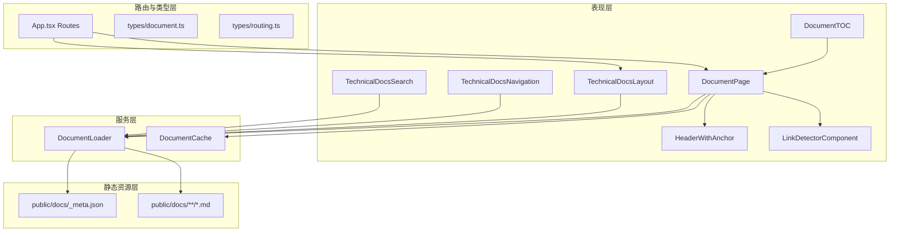
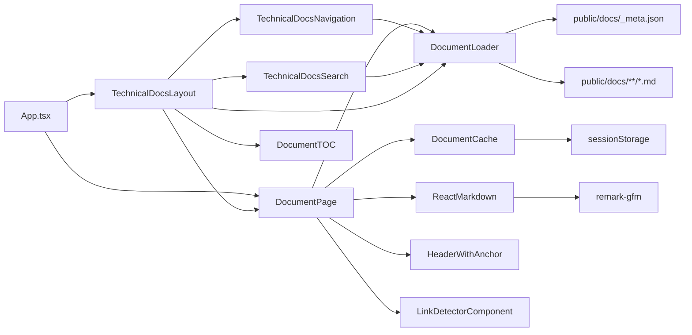
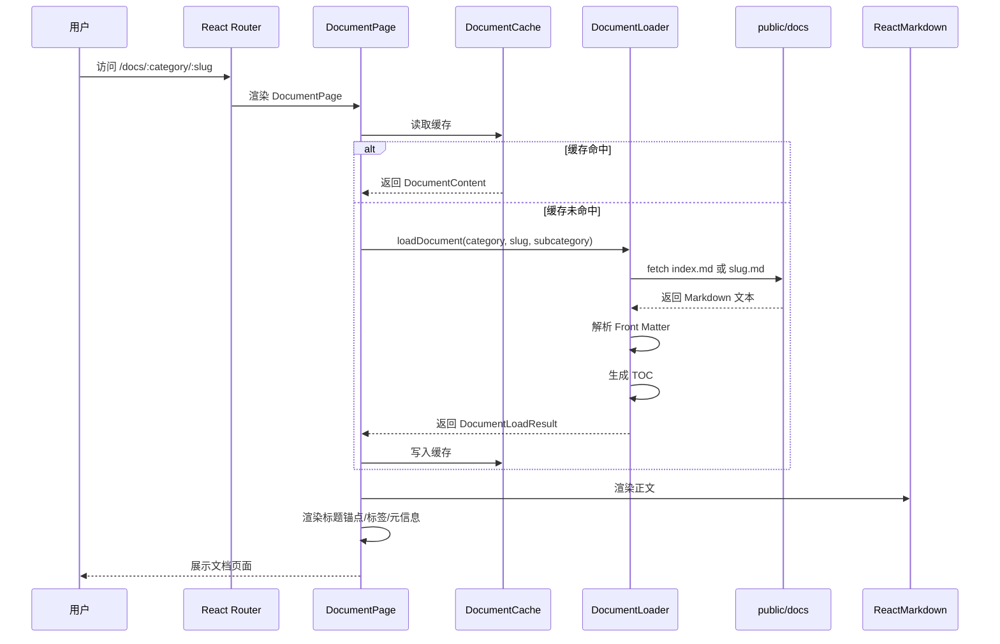
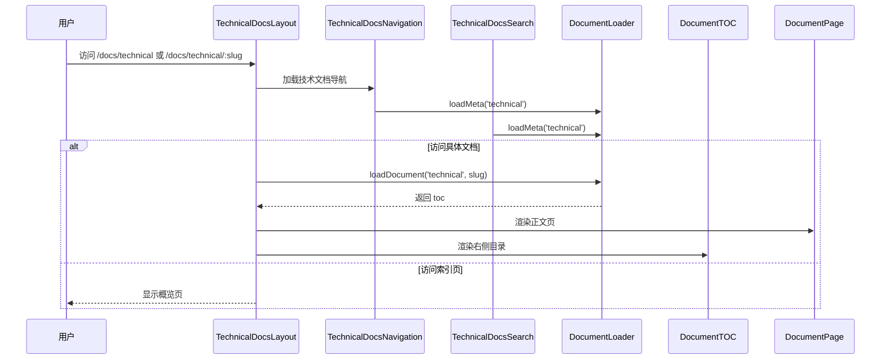
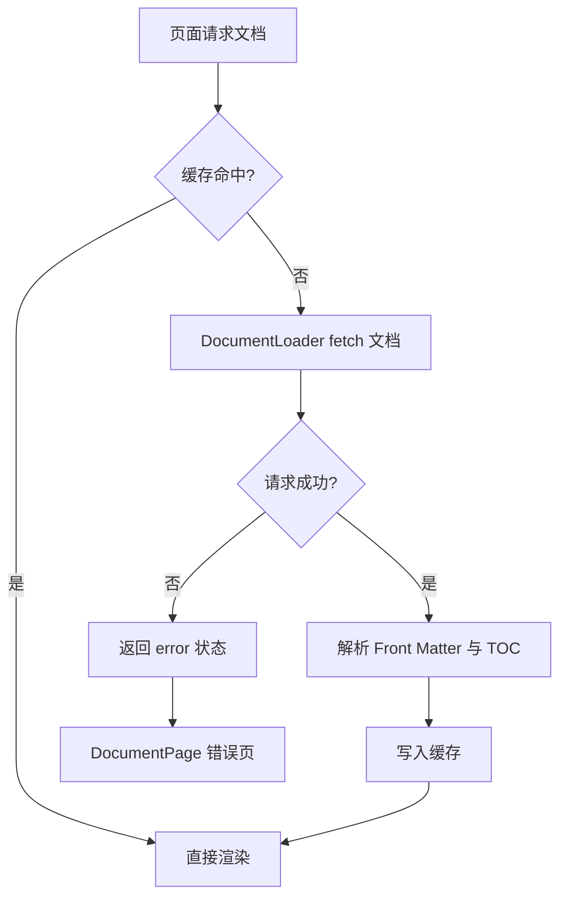

# DESIGN - Markdown 文档仓库自动渲染系统架构设计

## 1. 文档目的

本文档根据当前仓库的真实实现更新，描述 `newenergycoder.club` 项目内 Markdown 文档系统的现状架构、组件职责、路由结构、数据流与已知限制，作为后续维护和继续演进的基线设计文档。

## 2. 整体架构设计

### 2.1 当前系统架构图
```mermaid
graph TD
    A[用户访问文档路由] --> B[React Router]
    B --> C[App.tsx 路由分发]
    C --> D[PageLayout]
    D --> E[DocumentPage]
    C --> F[TechnicalDocsLayout]
    F --> E
    F --> G[TechnicalDocsNavigation]
    F --> H[TechnicalDocsSearch]
    F --> I[DocumentTOC]

    E --> J[DocumentCache]
    E --> K[DocumentLoader]
    K --> L[/public/docs/_meta.json]
    K --> M[/public/docs/**/*.md]

    E --> N[ReactMarkdown]
    N --> O[remark-gfm]
    E --> P[HeaderWithAnchor]
    E --> Q[LinkDetectorComponent]
    E --> R[ThemeToggle]

    subgraph "静态文档仓库"
        L
        M
    end
```

### 2.2 分层架构

```mermaid
graph TB
    subgraph "表现层"
        A1[DocumentPage]
        A2[TechnicalDocsLayout]
        A3[TechnicalDocsNavigation]
        A4[TechnicalDocsSearch]
        A5[DocumentTOC]
        A6[HeaderWithAnchor]
        A7[LinkDetectorComponent]
    end

    subgraph "服务层"
        B1[DocumentLoader]
        B2[DocumentCache]
    end

    subgraph "路由与类型层"
        C1[App.tsx Routes]
        C2[types/document.ts]
        C3[types/routing.ts]
    end

    subgraph "静态资源层"
        D1[public/docs/_meta.json]
        D2[public/docs/**/*.md]
    end

    A1 --> B1
    A1 --> B2
    A2 --> B1
    A3 --> B1
    A4 --> B1
    A5 --> A1
    B1 --> D1
    B1 --> D2
    C1 --> A1
    C1 --> A2
    A1 --> A6
    A1 --> A7
```

### 2.3 架构说明

- 文档系统当前不是基于运行时文件系统扫描或 `import.meta.glob`，而是通过浏览器 `fetch` 直接读取 `public/docs` 下的静态资源。
- 通用文档页入口为 `DocumentPage`，其内部同时负责数据加载、缓存读取、Markdown 渲染、标题锚点增强以及链接检测结果展示。
- 技术文档模块在通用文档能力之上增加了独立布局层 `TechnicalDocsLayout`，提供左侧导航、顶部搜索和右侧目录。
- 当前设计已经从“计划中的组件拆分”回收为“以 `DocumentPage` 为核心、局部增强组件围绕其工作”的实现方式。

## 3. 核心组件设计

### 3.1 DocumentLoader 服务

`src/services/DocumentLoader.ts` 是文档系统的数据入口，当前职责如下：

- 读取分类或子分类的 `_meta.json`
- 按约定路径加载 Markdown 文档
- 解析 Front Matter
- 生成目录树 TOC
- 将加载结果统一包装为 `DocumentLoadResult`

当前实际实现：

```typescript
class DocumentLoader {
  static getInstance(): DocumentLoader

  async loadMeta(category: string, subcategory?: string): Promise<DocumentMeta>

  async loadDocument(
    category: string,
    slug: string,
    subcategory?: string
  ): Promise<DocumentLoadResult>

  async loadAllCategories(): Promise<DocumentMeta>

  async searchDocuments(query: string, category?: string): Promise<any[]>

  private parseMarkdown(
    content: string,
    category: string,
    subcategory: string | undefined,
    slug: string
  ): DocumentContent

  private parseFrontMatter(
    content: string
  ): { frontMatter: DocumentFrontMatter; body: string }

  private parseYAML(yamlStr: string): DocumentFrontMatter

  private generateTOC(content: string): TableOfContentsItem[]
}
```

加载策略：

- 优先尝试 `/docs/{category}/{subcategory?}/{slug}/index.md`
- 若不存在，再回退到 `/docs/{category}/{subcategory?}/{slug}.md`
- 元数据文件路径为 `/docs/{category}/{subcategory?}/_meta.json`

实现约束：

- Front Matter 解析器为轻量自定义实现，仅支持基础键值和简单数组
- `searchDocuments()` 目前仍是占位实现，实际搜索由 `TechnicalDocsSearch` 自行遍历文档完成
- `baseUrl` 当前初始化为空字符串，系统默认从站点根路径读取 `/docs/...`

### 3.2 DocumentCache 服务

`src/services/DocumentCache.ts` 提供文档内容缓存，当前为双层缓存设计：

- 内存缓存：`Map<string, DocumentCacheItem>`
- 会话缓存：`sessionStorage`

关键特征：

- 默认 TTL 为 5 分钟
- 最多缓存 50 个内存项
- 读取顺序为内存缓存 -> 会话缓存
- 会话缓存命中后会重新提升到内存缓存

当前实际接口：

```typescript
class DocumentCache {
  static getInstance(): DocumentCache
  get(category: string, slug: string, subcategory?: string): DocumentContent | null
  set(
    category: string,
    slug: string,
    content: DocumentContent,
    subcategory?: string,
    ttl?: number
  ): void
  has(category: string, slug: string, subcategory?: string): boolean
  delete(category: string, slug: string, subcategory?: string): void
  clear(): void
  getStats(): { memoryItems: number; sessionItems: number; totalSize: number }
  preload(documents: Array<{ category: string; slug: string; subcategory?: string }>): Promise<void>
}
```

### 3.3 DocumentPage 组件

`src/components/DocumentPage.tsx` 是当前通用文档渲染页，承担以下职责：

- 从路由参数中解析 `category`、`subcategory`、`slug`
- 协调 `DocumentCache` 与 `DocumentLoader`
- 处理加载、成功、失败三种状态
- 渲染标题、描述、作者、更新时间、难度、标签
- 使用 `ReactMarkdown + remark-gfm` 渲染正文
- 将标题节点替换为 `HeaderWithAnchor`
- 在正文下方渲染 `LinkDetectorComponent`

当前实现不是单纯的内容展示组件，而是文档详情页的“页面级聚合组件”。

```typescript
const DocumentPage: React.FC = () => {
  const { category, subcategory, slug } = useParams<DocumentRouteParams>()
  const [document, setDocument] = useState<DocumentContent | null>(null)
  const [loadState, setLoadState] = useState<DocumentLoadState>('idle')
  const [error, setError] = useState<string | null>(null)

  // 1. 先读缓存
  // 2. 缓存未命中时请求 DocumentLoader
  // 3. 成功后写回缓存
  // 4. 渲染 Markdown 和链接检测结果
}
```

### 3.4 TechnicalDocsLayout 组件

`src/components/TechnicalDocsLayout.tsx` 只服务于技术文档模块，负责三栏布局：

- 左栏：`TechnicalDocsNavigation`
- 中栏：`TechnicalDocsOverview` 或 `DocumentPage`
- 右栏：`DocumentTOC`，仅在加载到具体技术文档且存在 TOC 时展示

它通过再次调用 `DocumentLoader.loadDocument('technical', slug)` 预取当前技术文档的 TOC，以支持右侧目录展示。

### 3.5 导航与搜索组件

当前文档系统不存在通用的 `DocumentNavigation`、`DocumentBreadcrumb`、`DocumentSidebar` 组件，实际已实现的是面向技术文档的专项组件：

- `TechnicalDocsNavigation`
  - 读取 `public/docs/technical/_meta.json`
  - 生成技术文档导航项
  - 按 `order` 排序
- `TechnicalDocsSearch`
  - 仅搜索 `technical` 分类
  - 先读取 `_meta.json` 中的 `items`
  - 再逐篇加载文档内容做前端全文匹配
- `DocumentTOC`
  - 使用 `DocumentPage` 中已生成的标题 `id`
  - 监听滚动位置高亮当前章节

### 3.6 Markdown 增强能力

当前系统对 Markdown 的增强主要体现在两个组件：

- `HeaderWithAnchor`
  - 自动生成标题锚点
  - 支持点击跳转和复制锚点链接
- `LinkDetectorComponent`
  - 对全文中的链接进行解析、统计与验证结果展示
  - 目前作为正文后的辅助检测区块存在
  - 并未直接替换 `ReactMarkdown` 渲染出来的正文超链接

## 4. 模块依赖关系图


```mermaid
graph LR
    A[App.tsx] --> B[DocumentPage]
    A --> C[TechnicalDocsLayout]

    C --> D[TechnicalDocsNavigation]
    C --> E[TechnicalDocsSearch]
    C --> F[DocumentTOC]
    C --> B

    B --> G[DocumentLoader]
    B --> H[DocumentCache]
    B --> I[ReactMarkdown]
    I --> J[remark-gfm]
    B --> K[HeaderWithAnchor]
    B --> L[LinkDetectorComponent]

    D --> G
    E --> G
    C --> G

    G --> M[public/docs/_meta.json]
    G --> N[public/docs/**/*.md]
    H --> O[sessionStorage]
```

## 5. 接口契约定义

### 5.1 文档类型接口
```typescript
export interface DocumentMeta {
  title: string
  description: string
  order: number
  slug?: string
  items?: DocumentItem[]
  subcategories?: DocumentSubcategory[]
}

export interface DocumentItem {
  slug: string
  title: string
  description: string
  order: number
  tags?: string[]
  lastModified?: string
}

export interface DocumentContent {
  slug: string
  title: string
  description?: string
  content: string
  frontMatter: DocumentFrontMatter
  toc: TableOfContentsItem[]
  lastModified?: string
}

export interface DocumentFrontMatter {
  title: string
  description?: string
  tags?: string[]
  category: string
  subcategory?: string
  order?: number
  lastModified?: string
  author?: string
  difficulty?: 'beginner' | 'intermediate' | 'advanced'
}

export interface TableOfContentsItem {
  id: string
  title: string
  level: number
  children?: TableOfContentsItem[]
}

export type DocumentLoadState = 'idle' | 'loading' | 'success' | 'error'

export interface DocumentLoadResult {
  state: DocumentLoadState
  data?: DocumentContent
  error?: string
}
```

### 5.2 路由接口
```typescript
export interface DocumentRouteParams extends Record<string, string | undefined> {
  category: string
  subcategory?: string
  slug: string
}

export interface BreadcrumbItem {
  title: string
  path?: string
  active?: boolean
}

export interface NavigationState {
  currentCategory?: string
  currentSubcategory?: string
  currentSlug?: string
  breadcrumbs: BreadcrumbItem[]
}
```

### 5.3 技术文档导航接口
```typescript
interface NavItem {
  slug: string
  title: string
  description: string
  icon: React.ReactNode
  order: number
}

interface SearchResult {
  slug: string
  title: string
  description: string
  content: string
  matchScore: number
}
```

## 6. 数据流向图

### 6.1 通用文档加载流程

```mermaid
sequenceDiagram
    participant U as 用户
    participant R as React Router
    participant DP as DocumentPage
    participant DC as DocumentCache
    participant DL as DocumentLoader
    participant FS as public/docs
    participant RM as ReactMarkdown

    U->>R: 访问 /docs/:category/:slug
    R->>DP: 渲染 DocumentPage
    DP->>DC: 读取缓存

    alt 缓存命中
        DC-->>DP: 返回 DocumentContent
    else 缓存未命中
        DP->>DL: loadDocument(category, slug, subcategory)
        DL->>FS: fetch index.md 或 slug.md
        FS-->>DL: 返回 Markdown 文本
        DL->>DL: 解析 Front Matter
        DL->>DL: 生成 TOC
        DL-->>DP: 返回 DocumentLoadResult
        DP->>DC: 写入缓存
    end

    DP->>RM: 渲染正文
    DP->>DP: 渲染标题锚点/标签/元信息
    DP-->>U: 展示文档页面
```

### 6.2 技术文档布局流程

```mermaid
sequenceDiagram
    participant U as 用户
    participant TL as TechnicalDocsLayout
    participant TN as TechnicalDocsNavigation
    participant TS as TechnicalDocsSearch
    participant DL as DocumentLoader
    participant TOC as DocumentTOC
    participant DP as DocumentPage

    U->>TL: 访问 /docs/technical 或 /docs/technical/:slug
    TL->>TN: 加载技术文档导航
    TN->>DL: loadMeta('technical')
    TS->>DL: loadMeta('technical')

    alt 访问具体文档
        TL->>DL: loadDocument('technical', slug)
        DL-->>TL: 返回 toc
        TL->>DP: 渲染正文页
        TL->>TOC: 渲染右侧目录
    else 访问索引页
        TL-->>U: 显示概览页
    end
```

## 7. 文件系统设计

### 7.1 实际文档目录结构
```text
public/docs/
├── _meta.json
├── LINK_DETECTION.md
├── TEST_SUMMARY.md
├── VERSION_ROLLBACK_COMPARISON.md
├── github.css
├── github-dark-default.css
├── github-dark-high-contrast.css
├── 项目兼容性检查报告.md
├── events/
│   ├── _meta.json
│   └── robocon-2026.md
├── getting-started/
│   ├── _meta.json
│   ├── index.md
│   ├── embedded-development.md
│   ├── gui-development.md
│   ├── algorithm-design.md
│   └── quick-guides/
│       ├── _meta.json
│       └── environment-setup.md
├── resources/
│   ├── _meta.json
│   ├── faq.md
│   ├── learning-resources.md
│   ├── libraries.md
│   └── tools.md
├── technical/
│   ├── _meta.json
│   ├── api-reference.md
│   ├── architecture.md
│   ├── development-guide.md
│   ├── integration-guide.md
│   └── technical-standards.md
├── theme-integration/
│   ├── ALIGNMENT_theme-integration.md
│   └── FINAL_theme-integration.md
└── tutorials/
    ├── _meta.json
    ├── basic/
    ├── intermediate/
    └── advanced/
```

### 7.2 元数据文件格式
```json
{
  "title": "技术文档",
  "description": "详细的技术文档和API参考",
  "order": 4,
  "items": [
    {
      "slug": "api-reference",
      "title": "API参考",
      "description": "完整的API接口文档",
      "order": 1
    }
  ]
}
```

### 7.3 Markdown 文件格式约定
```markdown
---
title: "嵌入式开发入门指南"
description: "学习嵌入式开发的基础知识和实践技能"
tags: ["嵌入式", "硬件", "编程"]
lastModified: "2024-12-19"
author: "newenergycoder"
difficulty: "beginner"
---

# 嵌入式开发入门指南

## 概述

正文内容...
```

## 8. 路由集成设计

当前在 `src/App.tsx` 中已接入的文档路由如下：

```typescript
<Route path="/docs/technical" element={<PageLayout><TechnicalDocsLayout /></PageLayout>} />
<Route path="/docs/technical/:slug" element={<PageLayout><DocumentPage /></PageLayout>} />
<Route path="/docs/:category/:subcategory/:slug" element={<PageLayout><DocumentPage /></PageLayout>} />
<Route path="/docs/:category" element={<PageLayout><DocumentPage /></PageLayout>} />
<Route path="/docs/:category/:slug" element={<PageLayout><DocumentPage /></PageLayout>} />
```

设计说明：

- `technical` 分类有独立列表页和增强布局
- 通用分类仍然直接走 `DocumentPage`
- `/getting-started` 当前已改为外部跳转到 `https://docs.newenergycoder.club/start-here`，不再直接进入本地 Markdown 页面

## 9. 异常处理策略

### 9.1 当前异常处理方式

- `DocumentLoader.loadDocument()` 失败时返回 `{ state: 'error', error }`
- `DocumentPage` 统一展示“文档未找到”页面和返回按钮
- `DocumentCache` 对 `sessionStorage` 读写失败仅打印 `console.warn`
- `TechnicalDocsNavigation`、`TechnicalDocsSearch`、`TechnicalDocsLayout` 均在局部捕获错误并降级展示

### 9.2 错误处理流程

```mermaid
flowchart TD
    A[页面请求文档] --> B{缓存命中?}
    B -->|是| C[直接渲染]
    B -->|否| D[DocumentLoader fetch 文档]
    D --> E{请求成功?}
    E -->|是| F[解析 Front Matter 与 TOC]
    E -->|否| G[返回 error 状态]
    F --> H[写入缓存]
    H --> C
    G --> I[DocumentPage 错误页]
```

## 10. 性能与实现约束

### 10.1 当前已实现优化

- `DocumentPage`、`TechnicalDocsLayout` 通过路由级 `React.lazy` 进行按需加载
- 文档内容采用内存缓存 + `sessionStorage` 双层缓存
- 右侧 TOC 仅在技术文档详情页中存在且有目录时显示

### 10.2 当前限制

- 搜索仅覆盖 `technical` 分类，且采用前端串行遍历文档内容的方式，成本较高
- `DocumentPage` 集中了加载、渲染、增强、元信息展示等多种职责，可维护性一般
- `DocumentLoader.searchDocuments()` 和 `DocumentCache.preload()` 仍为占位实现
- `LinkDetectorComponent` 目前是文档后的检测区块，不是 Markdown 正文中的统一链接渲染器
- `DocumentTOC` 的缩进类名使用了动态字符串 `ml-${level * 4}`，依赖 Tailwind 运行结果，存在样式失效风险

## 11. 测试现状与建议

### 11.1 当前现状

- 仓库内已有文档系统相关代码，但这套文档渲染链路尚未在本设计范围内看到成体系的自动化测试用例
- 现有实现更多依赖页面运行时行为验证

### 11.2 建议补充的测试范围

- `DocumentLoader`
  - `index.md` 与 `.md` 回退逻辑
  - Front Matter 解析
  - TOC 树生成
- `DocumentCache`
  - TTL 过期
  - `sessionStorage` 提升回内存缓存
- `DocumentPage`
  - 成功态 / 错误态渲染
  - 标题锚点生成
  - 标签、作者、更新时间展示
- `TechnicalDocsSearch`
  - 标题匹配、描述匹配、正文匹配排序

## 12. 后续演进方向

- 将 `DocumentPage` 进一步拆分为 `DocumentHeader`、`DocumentBody`、`DocumentMetaBar` 等更小组件
- 为通用分类补齐可复用的导航与目录布局能力，而不是只在 `technical` 分类增强
- 将搜索从前端遍历迁移为预构建索引或静态索引文件
- 增加对 `_meta.json` 与正文相对链接的自动校验
- 为文档系统补齐单元测试和集成测试

---

**文档状态**: 已按当前代码实现同步更新  
**创建时间**: 2024-12-19  
**最后更新**: 2026-08-17  
**设计人**: SOLO Document  
**说明**: 本文档描述当前实现现状，不再保留尚未落地的规划型组件描述
