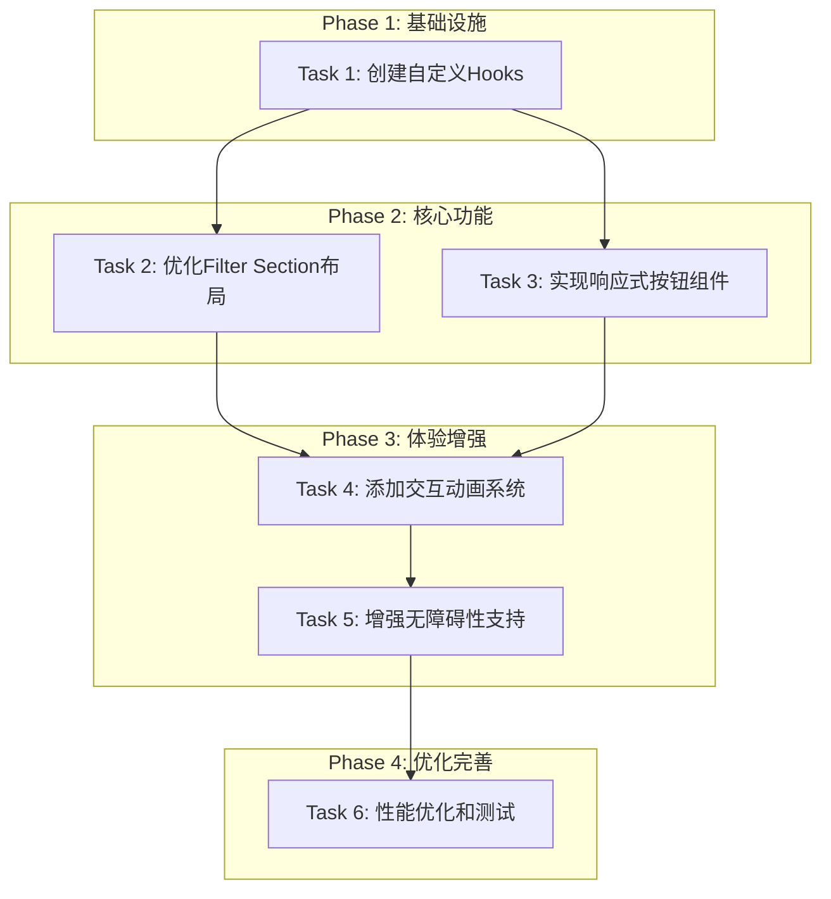

# EventsPage Section优化 - 任务拆分文档

## 1. 任务概览

基于DESIGN文档，将Filter Section优化拆分为6个原子化任务，按依赖关系顺序执行。

### 1.1 任务依赖图

## 2. 任务详细定义

### Task 1: 创建自定义Hooks

#### 输入契约
- **前置依赖**: 无
- **输入数据**: EventsPage现有代码结构
- **环境依赖**: React 18+, TypeScript

#### 输出契约
- **输出数据**: 
  - `useHeaderHeight` Hook
  - `useFilterAnimation` Hook  
  - `useEventCounts` Hook
- **交付物**: 
  - `src/hooks/useHeaderHeight.ts`
  - `src/hooks/useFilterAnimation.ts`
  - `src/hooks/useEventCounts.ts`
- **验收标准**:
  - [ ] useHeaderHeight正确计算Header高度
  - [ ] useFilterAnimation提供动画状态管理
  - [ ] useEventCounts正确统计各分类事件数量
  - [ ] 所有Hook都有TypeScript类型定义
  - [ ] 包含基础单元测试

#### 实现约束
- **技术栈**: React Hooks, TypeScript
- **接口规范**: 遵循现有Hook命名约定
- **质量要求**: 
  - 使用useCallback和useMemo优化性能
  - 正确清理事件监听器
  - 提供错误处理机制

#### 依赖关系
- **后置任务**: Task 2, Task 3
- **并行任务**: 无

---

### Task 2: 优化Filter Section布局

#### 输入契约
- **前置依赖**: Task 1完成
- **输入数据**: 
  - 现有FilterSection代码
  - useHeaderHeight Hook
- **环境依赖**: Tailwind CSS, 现有UI组件

#### 输出契约
- **输出数据**: 优化后的Filter Section组件
- **交付物**: 
  - 更新`src/pages/EventsPage.tsx`中的Filter Section
  - 新增CSS类定义
- **验收标准**:
  - [ ] 粘性定位基于动态Header高度
  - [ ] 背景模糊效果正确应用
  - [ ] 在所有屏幕尺寸下位置正确
  - [ ] z-index层级无冲突
  - [ ] 滚动性能流畅

#### 实现约束
- **技术栈**: React, Tailwind CSS
- **接口规范**: 保持现有className结构
- **质量要求**: 
  - 兼容现有PageLayout
  - 支持主题切换
  - 性能无明显影响

#### 依赖关系
- **后置任务**: Task 4
- **并行任务**: Task 3

---

### Task 3: 实现响应式按钮组件

#### 输入契约
- **前置依赖**: Task 1完成
- **输入数据**: 
  - useEventCounts Hook
  - 现有Button组件
  - categoryFilters配置
- **环境依赖**: 现有UI组件库, Badge组件

#### 输出契约
- **输出数据**: 增强的过滤按钮组件
- **交付物**: 
  - 更新EventsPage中的按钮渲染逻辑
  - 新增FilterBadge组件（如需要）
- **验收标准**:
  - [ ] 按钮显示事件计数徽章
  - [ ] 响应式尺寸在各设备上合适
  - [ ] 选中状态视觉区分明显
  - [ ] 触摸目标大小符合标准(44px+)
  - [ ] 文本在所有尺寸下可读

#### 实现约束
- **技术栈**: React, Tailwind CSS, 现有UI组件
- **接口规范**: 复用现有Button和Badge组件
- **质量要求**: 
  - 保持国际化支持
  - 兼容现有主题系统
  - 代码复用最大化

#### 依赖关系
- **后置任务**: Task 4
- **并行任务**: Task 2

---

### Task 4: 添加交互动画系统

#### 输入契约
- **前置依赖**: Task 2, Task 3完成
- **输入数据**: 
  - useFilterAnimation Hook
  - 优化后的Filter Section
  - 响应式按钮组件
- **环境依赖**: CSS动画支持, Tailwind CSS

#### 输出契约
- **输出数据**: 完整的交互动画系统
- **交付物**: 
  - CSS动画类定义
  - 组件动画状态集成
  - 动画降级处理
- **验收标准**:
  - [ ] 悬停效果流畅自然
  - [ ] 选中状态有发光动画
  - [ ] 过滤切换有反馈动画
  - [ ] 支持prefers-reduced-motion
  - [ ] 动画性能60fps

#### 实现约束
- **技术栈**: CSS Animations, CSS Transforms
- **接口规范**: 使用Tailwind CSS类名
- **质量要求**: 
  - 动画时长<300ms
  - 支持动画偏好设置
  - 浏览器兼容性良好

#### 依赖关系
- **后置任务**: Task 5
- **并行任务**: 无

---

### Task 5: 增强无障碍性支持

#### 输入契约
- **前置依赖**: Task 4完成
- **输入数据**: 完整的Filter Section组件
- **环境依赖**: ARIA标准, 键盘导航支持

#### 输出契约
- **输出数据**: 无障碍性增强的Filter Section
- **交付物**: 
  - ARIA标签和角色定义
  - 键盘导航支持
  - 焦点管理优化
- **验收标准**:
  - [ ] 支持Tab键导航
  - [ ] 支持Enter/Space键激活
  - [ ] 屏幕阅读器正确识别
  - [ ] 焦点指示器清晰可见
  - [ ] 颜色对比度达到AA标准

#### 实现约束
- **技术栈**: ARIA属性, 键盘事件处理
- **接口规范**: 遵循WCAG 2.1标准
- **质量要求**: 
  - 不影响现有交互
  - 语义化标记完整
  - 兼容辅助技术

#### 依赖关系
- **后置任务**: Task 6
- **并行任务**: 无

---

### Task 6: 性能优化和测试

#### 输入契约
- **前置依赖**: Task 5完成
- **输入数据**: 完整的Filter Section实现
- **环境依赖**: 测试框架, 性能监控工具

#### 输出契约
- **输出数据**: 性能优化的最终版本
- **交付物**: 
  - React.memo优化
  - 事件处理器优化
  - 单元测试和集成测试
  - 性能测试报告
- **验收标准**:
  - [ ] 组件渲染次数最小化
  - [ ] 内存泄漏检查通过
  - [ ] 滚动性能60fps稳定
  - [ ] 单元测试覆盖率>90%
  - [ ] 集成测试通过

#### 实现约束
- **技术栈**: React DevTools, Jest, React Testing Library
- **接口规范**: 现有测试约定
- **质量要求**: 
  - 性能回归测试
  - 多浏览器兼容性测试
  - 移动设备测试

#### 依赖关系
- **后置任务**: 无
- **并行任务**: 无

## 3. 实施计划

### 3.1 时间估算

| 任务 | 预估时间 | 复杂度 | 风险等级 |
|------|----------|--------|----------|
| Task 1 | 1.5小时 | 中等 | 低 |
| Task 2 | 1小时 | 低 | 低 |
| Task 3 | 1小时 | 低 | 低 |
| Task 4 | 1.5小时 | 中等 | 中 |
| Task 5 | 1小时 | 中等 | 低 |
| Task 6 | 1小时 | 中等 | 低 |
| **总计** | **7小时** | - | - |

### 3.2 执行顺序

1. **Phase 1** (1.5小时): Task 1 - 建立基础设施
2. **Phase 2** (2小时): Task 2 + Task 3 - 并行开发核心功能
3. **Phase 3** (2.5小时): Task 4 + Task 5 - 顺序增强体验
4. **Phase 4** (1小时): Task 6 - 优化和验证

### 3.3 里程碑检查点

- **Checkpoint 1**: Task 1完成 - Hooks基础设施就绪
- **Checkpoint 2**: Task 2+3完成 - 核心功能实现
- **Checkpoint 3**: Task 4完成 - 交互体验完善
- **Checkpoint 4**: Task 5完成 - 无障碍性达标
- **Checkpoint 5**: Task 6完成 - 最终交付就绪

## 4. 质量保证

### 4.1 每个任务的验收流程

1. **代码审查**: 检查代码质量和规范
2. **功能测试**: 验证功能正确性
3. **性能测试**: 检查性能影响
4. **兼容性测试**: 多浏览器和设备测试
5. **无障碍性测试**: ARIA和键盘导航测试

### 4.2 集成验证标准

- [ ] 所有任务验收标准通过
- [ ] 整体功能完整性验证
- [ ] 性能基准测试通过
- [ ] 用户体验测试通过
- [ ] 代码质量检查通过

## 5. 风险管理

### 5.1 技术风险

| 风险 | 概率 | 影响 | 缓解措施 |
|------|------|------|----------|
| CSS兼容性问题 | 低 | 中 | 提供降级方案 |
| 性能影响 | 中 | 中 | 性能监控和优化 |
| 复杂交互状态 | 中 | 高 | 充分测试和状态管理 |

### 5.2 进度风险

| 风险 | 概率 | 影响 | 缓解措施 |
|------|------|------|----------|
| 任务时间超期 | 中 | 中 | 任务拆分更细化 |
| 依赖任务阻塞 | 低 | 高 | 并行任务设计 |
| 需求变更 | 低 | 高 | 明确需求边界 |

## 6. 成功指标

### 6.1 技术指标

- **性能**: 滚动帧率≥60fps
- **响应性**: 过滤切换延迟<100ms
- **兼容性**: 支持主流浏览器95%+
- **可访问性**: WCAG 2.1 AA级合规

### 6.2 用户体验指标

- **可用性**: 过滤操作成功率>98%
- **满意度**: 用户反馈积极
- **学习成本**: 无需额外学习
- **一致性**: 多设备体验统一

---

**任务拆分完成**: 6个原子化任务已明确定义，依赖关系清晰，验收标准具体，可以进入审批和执行阶段。