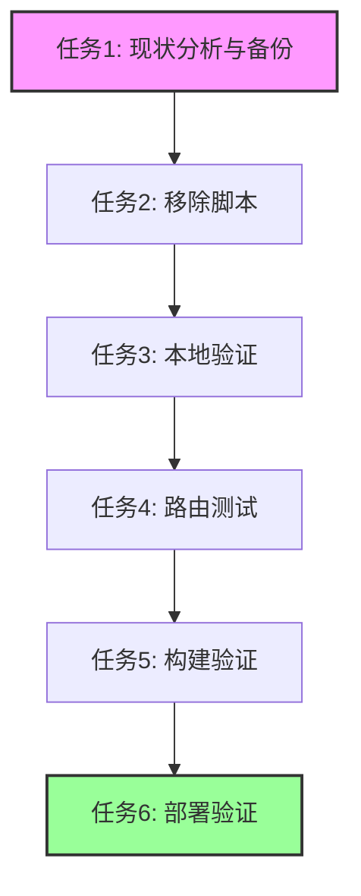

# GitHub Pages脚本修复任务清单

## 任务目标
移除`index.html`中的GitHub Pages专用SPA脚本，解决与Vercel环境下React Router的路由冲突问题。

## 任务分解

### 任务1: 现状分析与备份
**输入契约**: 
- 当前`index.html`文件
- GitHub Pages脚本位置确认

**输出契约**:
- 完整文件备份
- 脚本内容分析报告

**验收标准**:
- 确认脚本精确位置（第41-55行）
- 备份文件保存成功
- 脚本功能分析完整

---

### 任务2: 移除GitHub Pages脚本
**输入契约**:
- 当前`index.html`文件
- 脚本位置确认

**输出契约**:
- 更新后的`index.html`文件
- 移除GitHub Pages SPA脚本段

**实现约束**:
- 保持所有meta标签不变
- 保持所有样式链接不变
- 保持页面结构完整性

**验收标准**:
- GitHub Pages脚本完全移除
- 其他HTML内容无变化
- 文件格式保持正确

---

### 任务3: 本地开发环境验证
**输入契约**:
- 更新后的`index.html`文件
- 本地开发服务器

**输出契约**:
- 本地测试报告
- 路由功能验证结果

**验收标准**:
- 开发服务器正常启动
- 主页路由正常加载
- 控制台无错误输出

---

### 任务4: 路由功能全面测试
**输入契约**:
- 更新后的应用
- React Router配置

**输出契约**:
- 路由测试报告
- 功能验证清单

**验收标准**:
- 所有主要路由正常访问
- 直接访问子路由无404
- 页面刷新功能正常
- 浏览器前进/后退正常

---

### 任务5: 生产构建验证
**输入契约**:
- 更新后的代码
- 构建配置

**输出契约**:
- 生产构建结果
- 构建日志分析

**验收标准**:
- 生产构建成功完成
- 输出文件结构正确
- 无构建错误和警告

---

### 任务6: Vercel部署验证
**输入契约**:
- 构建产物
- Vercel配置

**输出契约**:
- 部署结果确认
- 生产环境验证报告

**验收标准**:
- Vercel部署成功
- 生产域名访问正常
- 所有路由功能正常

---

## 任务依赖关系

## 执行优先级

### 高优先级 (立即执行)
- 任务1: 现状分析与备份
- 任务2: 移除GitHub Pages脚本

### 中优先级 (次执行)
- 任务3: 本地开发环境验证
- 任务4: 路由功能全面测试

### 低优先级 (后续验证)
- 任务5: 生产构建验证
- 任务6: Vercel部署验证

## 风险与应对

### 潜在风险
- **意外删除重要代码**: 通过版本控制回滚
- **路由功能退化**: 全面测试覆盖
- **SEO影响**: 保留所有meta标签

### 应对措施
1. 完整的文件备份机制
2. 分步骤渐进式验证
3. 快速回滚能力保留
4. 实时监控部署状态

## 完成标准

- [ ] GitHub Pages脚本成功移除
- [ ] 所有路由功能正常
- [ ] 生产环境部署成功
- [ ] 用户访问无影响
- [ ] 文档同步更新完成