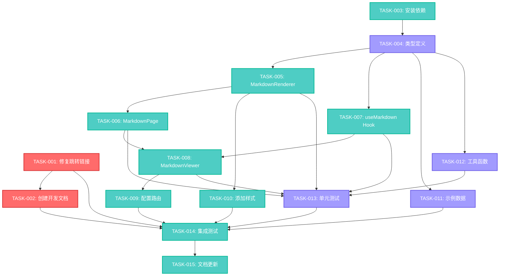

# TASK - Getting Started Enhancement 任务拆分文档

## 1. 任务概览

基于DESIGN文档，将Getting Started Enhancement项目拆分为以下原子任务：

### 任务优先级分类
- **P0 (高优先级)**: 必须完成的核心功能
- **P1 (中优先级)**: 重要功能，影响用户体验
- **P2 (低优先级)**: 增强功能，可后续迭代

## 2. 原子任务列表

### 任务1: 修复Getting Started页面跳转链接 [P0]
**任务ID**: TASK-001
**预估时间**: 30分钟
**复杂度**: 简单

**输入契约**:
- 现有的GettingStartedPage.tsx文件
- App.tsx中的路由配置信息
- 需要修复的链接路径列表

**输出契约**:
- 修改后的GettingStartedPage.tsx文件
- 所有技术方向卡片链接指向正确路由
- 链接跳转功能正常工作

**实现约束**:
- 不能修改现有路由配置
- 保持现有组件结构不变
- 确保链接样式和交互保持一致

**验收标准**:
- [ ] 嵌入式开发链接指向 `/learning/embedded`
- [ ] GUI界面开发链接指向 `/learning/designer`
- [ ] 算法与数据结构链接指向合适的现有页面
- [ ] 所有链接点击后能正常跳转，无404错误
- [ ] 在不同浏览器中测试通过

**依赖关系**: 无前置依赖

---

### 任务2: 创建Getting Started开发文档 [P0]
**任务ID**: TASK-002
**预估时间**: 2小时
**复杂度**: 中等

**输入契约**:
- 现有的GettingStartedPage.tsx组件代码
- 项目的整体文档结构
- 现有的README.md作为参考

**输出契约**:
- 完整的 `docs/getting-started/README.md` 文档
- 包含组件结构、配置方法、开发指南
- 提供实用的代码示例和最佳实践

**实现约束**:
- 遵循项目现有的文档格式规范
- 使用Markdown格式编写
- 确保文档内容与实际代码保持一致

**验收标准**:
- [ ] 文档结构清晰，包含所有必要章节
- [ ] 代码示例准确且可执行
- [ ] 包含组件架构说明
- [ ] 包含数据配置指南
- [ ] 包含样式定制方法
- [ ] 包含常见问题解答
- [ ] 格式规范，易于阅读

**依赖关系**: 依赖TASK-001完成（确保文档中的链接信息准确）

---

### 任务3: 安装和配置Markdown相关依赖 [P1]
**任务ID**: TASK-003
**预估时间**: 15分钟
**复杂度**: 简单

**输入契约**:
- 现有的package.json文件
- 项目的依赖管理配置

**输出契约**:
- 更新的package.json文件
- 安装完成的Markdown相关依赖包
- 类型定义文件正确安装

**实现约束**:
- 使用npm进行包管理
- 选择稳定版本的依赖包
- 确保与现有依赖无冲突

**验收标准**:
- [ ] react-markdown@^9.0.0 安装成功
- [ ] remark-gfm@^4.0.0 安装成功
- [ ] react-syntax-highlighter@^15.5.0 安装成功
- [ ] @types/react-syntax-highlighter@^15.5.0 安装成功
- [ ] npm install 运行无错误
- [ ] 项目能正常启动

**依赖关系**: 无前置依赖，但是TASK-004及后续任务的前置条件

---

### 任务4: 创建Markdown类型定义 [P1]
**任务ID**: TASK-004
**预估时间**: 30分钟
**复杂度**: 简单

**输入契约**:
- 项目的TypeScript配置
- 现有的类型定义结构
- DESIGN文档中的接口定义

**输出契约**:
- 新建的 `src/types/markdown.ts` 文件
- 完整的Markdown相关类型定义
- 与其他类型文件的一致性

**实现约束**:
- 遵循项目的TypeScript规范
- 确保类型定义的完整性和准确性
- 与现有类型系统保持一致

**验收标准**:
- [ ] MarkdownContent接口定义完整
- [ ] MarkdownRendererProps接口定义完整
- [ ] MarkdownPageProps接口定义完整
- [ ] MarkdownViewerProps接口定义完整
- [ ] 所有接口都有适当的JSDoc注释
- [ ] TypeScript编译无错误

**依赖关系**: 依赖TASK-003（需要安装的依赖包）

---

### 任务5: 实现MarkdownRenderer核心组件 [P1]
**任务ID**: TASK-005
**预估时间**: 2小时
**复杂度**: 中等

**输入契约**:
- TASK-004创建的类型定义
- 现有的UI组件库
- 项目的样式系统（Tailwind CSS）

**输出契约**:
- 完整的 `src/components/markdown/MarkdownRenderer.tsx` 组件
- 支持标准Markdown语法解析
- 集成语法高亮功能
- 与项目设计系统一致的样式

**实现约束**:
- 使用react-markdown进行解析
- 集成react-syntax-highlighter
- 使用现有的Tailwind CSS类名
- 支持暗黑模式切换

**验收标准**:
- [ ] 能正确解析标题、段落、列表
- [ ] 支持代码块和内联代码
- [ ] 语法高亮功能正常工作
- [ ] 样式与项目整体风格一致
- [ ] 支持明亮和暗黑主题
- [ ] 响应式设计正常工作
- [ ] 组件props类型检查通过

**依赖关系**: 依赖TASK-003和TASK-004

---

### 任务6: 实现MarkdownPage容器组件 [P1]
**任务ID**: TASK-006
**预估时间**: 1小时
**复杂度**: 简单

**输入契约**:
- TASK-005创建的MarkdownRenderer组件
- 现有的PageLayout组件
- 现有的UI组件（Button等）

**输出契约**:
- 完整的 `src/components/markdown/MarkdownPage.tsx` 组件
- 集成PageLayout的页面容器
- 包含返回按钮和标题显示

**实现约束**:
- 复用现有的PageLayout组件
- 使用现有的Button组件
- 保持与其他页面的布局一致性

**验收标准**:
- [ ] 正确集成PageLayout组件
- [ ] 返回按钮功能正常
- [ ] 标题显示正确
- [ ] 内容区域布局合理
- [ ] 响应式设计正常工作
- [ ] 与其他页面视觉风格一致

**依赖关系**: 依赖TASK-005

---

### 任务7: 创建useMarkdown自定义Hook [P1]
**任务ID**: TASK-007
**预估时间**: 1.5小时
**复杂度**: 中等

**输入契约**:
- React Hook最佳实践
- 项目的状态管理模式
- TASK-004创建的类型定义

**输出契约**:
- 完整的 `src/hooks/useMarkdown.ts` Hook
- 支持内容加载和状态管理
- 包含错误处理和加载状态
- 支持缓存机制

**实现约束**:
- 遵循React Hook规范
- 使用TypeScript进行类型约束
- 实现适当的错误处理

**验收标准**:
- [ ] Hook接口定义正确
- [ ] 支持异步内容加载
- [ ] 包含loading、error、content状态
- [ ] 实现基础缓存功能
- [ ] 错误处理机制完善
- [ ] TypeScript类型检查通过

**依赖关系**: 依赖TASK-004

---

### 任务8: 实现MarkdownViewer页面组件 [P1]
**任务ID**: TASK-008
**预估时间**: 2小时
**复杂度**: 中等

**输入契约**:
- TASK-006创建的MarkdownPage组件
- TASK-007创建的useMarkdown Hook
- React Router的useParams和useSearchParams

**输出契约**:
- 完整的 `src/pages/MarkdownViewer.tsx` 页面组件
- 支持通过URL参数传递内容
- 支持通过ID加载预定义内容
- 包含加载状态和错误处理

**实现约束**:
- 使用React Router进行路由参数获取
- 集成useMarkdown Hook
- 实现适当的加载和错误状态显示

**验收标准**:
- [ ] 能通过URL参数显示Markdown内容
- [ ] 支持title和content参数
- [ ] 加载状态显示正确
- [ ] 错误状态处理完善
- [ ] 页面布局和样式正确
- [ ] 路由参数解析正常

**依赖关系**: 依赖TASK-006和TASK-007

---

### 任务9: 配置Markdown路由 [P1]
**任务ID**: TASK-009
**预估时间**: 30分钟
**复杂度**: 简单

**输入契约**:
- 现有的App.tsx路由配置
- TASK-008创建的MarkdownViewer组件
- React Router配置模式

**输出契约**:
- 更新的App.tsx文件
- 新增的 `/markdown/:id` 路由
- 支持动态路由参数

**实现约束**:
- 不能破坏现有路由配置
- 遵循现有的路由组织模式
- 添加适当的错误边界

**验收标准**:
- [ ] `/markdown/:id` 路由配置正确
- [ ] 路由能正常匹配和渲染
- [ ] 与现有路由无冲突
- [ ] 错误边界配置正确
- [ ] 路由参数传递正常

**依赖关系**: 依赖TASK-008

---

### 任务10: 添加Markdown专用样式 [P1]
**任务ID**: TASK-010
**预估时间**: 1小时
**复杂度**: 简单

**输入契约**:
- 现有的src/index.css文件
- 项目的Tailwind CSS配置
- 现有的CSS变量和主题系统

**输出契约**:
- 更新的src/index.css文件
- 完整的Markdown内容样式定义
- 支持明亮和暗黑主题

**实现约束**:
- 使用Tailwind CSS的@apply指令
- 复用现有的CSS变量
- 确保与现有样式系统兼容

**验收标准**:
- [ ] 所有Markdown元素都有适当样式
- [ ] 样式与项目整体风格一致
- [ ] 支持明亮和暗黑主题切换
- [ ] 响应式设计正常工作
- [ ] 不影响现有组件样式

**依赖关系**: 依赖TASK-005（需要了解MarkdownRenderer的结构）

---

### 任务11: 创建Markdown示例数据 [P2]
**任务ID**: TASK-011
**预估时间**: 45分钟
**复杂度**: 简单

**输入契约**:
- TASK-004创建的类型定义
- 项目的数据组织模式

**输出契约**:
- 新建的 `src/data/markdownSamples.ts` 文件
- 包含多个示例Markdown内容
- 用于测试和演示功能

**实现约束**:
- 遵循项目的数据文件组织规范
- 提供多样化的Markdown示例
- 包含各种Markdown语法元素

**验收标准**:
- [ ] 至少包含3个不同类型的示例
- [ ] 涵盖标题、段落、列表、代码块等元素
- [ ] 数据结构符合类型定义
- [ ] 内容质量高，适合演示

**依赖关系**: 依赖TASK-004

---

### 任务12: 实现工具函数 [P2]
**任务ID**: TASK-012
**预估时间**: 1小时
**复杂度**: 简单

**输入契约**:
- TASK-004创建的类型定义
- Markdown处理的常见需求

**输出契约**:
- 新建的 `src/utils/markdownUtils.ts` 文件
- 包含Markdown处理的工具函数
- 支持内容验证、格式化等功能

**实现约束**:
- 遵循项目的工具函数组织规范
- 提供纯函数实现
- 包含适当的错误处理

**验收标准**:
- [ ] 包含内容验证函数
- [ ] 包含格式化工具函数
- [ ] 函数都有完整的类型定义
- [ ] 包含单元测试
- [ ] 错误处理完善

**依赖关系**: 依赖TASK-004

---

### 任务13: 编写单元测试 [P2]
**任务ID**: TASK-013
**预估时间**: 3小时
**复杂度**: 中等

**输入契约**:
- 已完成的所有组件和Hook
- 项目的测试配置和规范
- Jest和React Testing Library

**输出契约**:
- 完整的测试文件集合
- 覆盖所有核心组件和Hook
- 测试覆盖率达到80%以上

**实现约束**:
- 使用项目现有的测试框架
- 遵循测试最佳实践
- 包含单元测试和集成测试

**验收标准**:
- [ ] MarkdownRenderer组件测试完整
- [ ] MarkdownPage组件测试完整
- [ ] useMarkdown Hook测试完整
- [ ] MarkdownViewer页面测试完整
- [ ] 工具函数测试完整
- [ ] 所有测试都能通过
- [ ] 测试覆盖率达到要求

**依赖关系**: 依赖TASK-005到TASK-012的所有实现任务

---

### 任务14: 集成测试和端到端验证 [P1]
**任务ID**: TASK-014
**预估时间**: 2小时
**复杂度**: 中等

**输入契约**:
- 所有已完成的功能模块
- 项目的测试环境
- 浏览器测试工具

**输出契约**:
- 完整的功能验证报告
- 所有用户场景测试通过
- 性能和兼容性验证完成

**实现约束**:
- 在多个浏览器中进行测试
- 验证移动端和桌面端兼容性
- 测试各种边界情况

**验收标准**:
- [ ] Getting Started页面链接跳转正常
- [ ] Markdown渲染功能完全正常
- [ ] 所有URL参数场景都能正确处理
- [ ] 响应式设计在各设备正常工作
- [ ] 主题切换功能正常
- [ ] 性能表现符合要求
- [ ] 跨浏览器兼容性良好

**依赖关系**: 依赖所有前置任务完成

---

### 任务15: 文档更新和部署准备 [P1]
**任务ID**: TASK-015
**预估时间**: 1小时
**复杂度**: 简单

**输入契约**:
- 所有已完成的功能
- 项目的主README.md文件
- 部署配置文件

**输出契约**:
- 更新的项目文档
- 部署配置验证完成
- 功能使用说明文档

**实现约束**:
- 保持文档的一致性和准确性
- 确保部署配置正确
- 提供清晰的使用指南

**验收标准**:
- [ ] 主README.md包含新功能说明
- [ ] 部署配置文件正确
- [ ] 功能使用文档完整
- [ ] 所有文档链接都有效
- [ ] 版本信息更新正确

**依赖关系**: 依赖TASK-014完成

## 3. 任务依赖关系图

## 4. 执行计划

### 第一阶段：核心功能实现 (预估4小时)
1. TASK-001: 修复跳转链接 (30分钟)
2. TASK-003: 安装依赖 (15分钟)
3. TASK-004: 类型定义 (30分钟)
4. TASK-005: MarkdownRenderer (2小时)
5. TASK-002: 创建开发文档 (2小时) - 可并行进行

### 第二阶段：页面和路由集成 (预估4小时)
6. TASK-006: MarkdownPage (1小时)
7. TASK-007: useMarkdown Hook (1.5小时)
8. TASK-008: MarkdownViewer (2小时)
9. TASK-009: 配置路由 (30分钟)
10. TASK-010: 添加样式 (1小时) - 可并行进行

### 第三阶段：完善和测试 (预估5小时)
11. TASK-011: 示例数据 (45分钟) - 可并行进行
12. TASK-012: 工具函数 (1小时) - 可并行进行
13. TASK-013: 单元测试 (3小时)
14. TASK-014: 集成测试 (2小时)
15. TASK-015: 文档更新 (1小时)

### 总预估时间：13小时
### 关键路径：TASK-001 → TASK-003 → TASK-004 → TASK-005 → TASK-006 → TASK-008 → TASK-009 → TASK-014 → TASK-015

## 5. 风险评估

### 高风险任务
- **TASK-005 (MarkdownRenderer)**: 样式集成可能存在冲突
- **TASK-008 (MarkdownViewer)**: 路由参数处理复杂
- **TASK-014 (集成测试)**: 可能发现集成问题

### 缓解策略
- 提前进行样式隔离设计
- 充分测试各种URL参数组合
- 预留额外时间处理集成问题

## 6. 质量保证

### 代码质量标准
- TypeScript严格模式检查通过
- ESLint规则检查通过
- 单元测试覆盖率≥80%
- 组件props完整的类型定义

### 用户体验标准
- 页面加载时间<2秒
- 响应式设计完美适配
- 无障碍访问支持
- 错误状态友好提示

### 兼容性标准
- 支持Chrome、Firefox、Safari、Edge最新版本
- 移动端iOS Safari和Android Chrome支持
- 支持明亮和暗黑主题

这个任务拆分文档将复杂的项目分解为15个可管理的原子任务，每个任务都有明确的输入输出、验收标准和依赖关系，确保项目能够高效有序地完成。