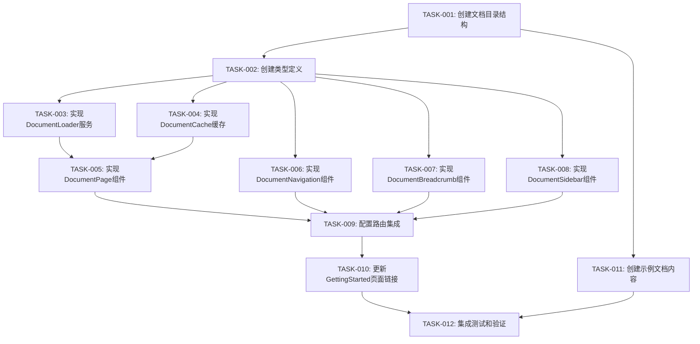

# TASK - Markdown文档仓库自动渲染系统任务拆分

## 任务依赖关系图

## 原子任务详细定义

### TASK-001: 创建文档目录结构

**优先级**: P0 (最高优先级)  
**预估工作量**: 30分钟  
**复杂度**: 简单

#### 输入契约
- **前置依赖**: 无
- **输入数据**: DESIGN文档中的文件系统设计
- **环境依赖**: 项目根目录访问权限

#### 输出契约
- **输出数据**: 完整的docs/目录结构
- **交付物**: 
  - `docs/getting-started/` 目录及子目录
  - `docs/tutorials/` 目录及子目录
  - `docs/resources/` 目录及子目录
  - 各级 `_meta.json` 元数据文件
- **验收标准**: 
  - 所有目录按设计文档创建完成
  - 元数据文件格式正确且包含必要字段
  - 目录结构与设计文档完全一致

#### 实现约束
- **技术栈**: 文件系统操作
- **接口规范**: 遵循设计文档中的目录结构
- **质量要求**: 目录权限正确，元数据格式验证通过

#### 依赖关系
- **后置任务**: TASK-011 (创建示例文档内容)
- **并行任务**: TASK-002 (创建类型定义)

---

### TASK-002: 创建类型定义

**优先级**: P0 (最高优先级)  
**预估工作量**: 45分钟  
**复杂度**: 简单

#### 输入契约
- **前置依赖**: 无
- **输入数据**: DESIGN文档中的接口契约定义
- **环境依赖**: TypeScript开发环境

#### 输出契约
- **输出数据**: 完整的TypeScript类型定义
- **交付物**: 
  - `src/types/document.ts` - 文档相关类型
  - `src/types/routing.ts` - 路由相关类型
  - `src/types/navigation.ts` - 导航相关类型
- **验收标准**: 
  - 所有接口定义完整且类型安全
  - 类型定义与设计文档完全对应
  - TypeScript编译无错误

#### 实现约束
- **技术栈**: TypeScript
- **接口规范**: 严格按照设计文档中的接口契约
- **质量要求**: 类型安全，支持泛型，包含完整的JSDoc注释

#### 依赖关系
- **后置任务**: TASK-003, TASK-004, TASK-005, TASK-006, TASK-007, TASK-008
- **并行任务**: TASK-001

---

### TASK-003: 实现DocumentLoader服务

**优先级**: P0 (最高优先级)  
**预估工作量**: 90分钟  
**复杂度**: 中等

#### 输入契约
- **前置依赖**: TASK-002 (类型定义)
- **输入数据**: 文档目录结构，类型定义
- **环境依赖**: Node.js文件系统API，Markdown解析库

#### 输出契约
- **输出数据**: 完整的DocumentLoader服务类
- **交付物**: 
  - `src/services/DocumentLoader.ts` - 主服务类
  - `src/utils/markdownParser.ts` - Markdown解析工具
  - `src/utils/metaParser.ts` - 元数据解析工具
- **验收标准**: 
  - 支持按category和slug加载文档
  - 支持文档列表获取
  - 支持元数据解析
  - 支持TOC生成
  - 错误处理完善
  - 单元测试覆盖率>80%

#### 实现约束
- **技术栈**: TypeScript, 现有的react-markdown生态
- **接口规范**: 实现设计文档中的DocumentLoader接口
- **质量要求**: 异步操作，错误处理，性能优化

#### 依赖关系
- **后置任务**: TASK-005 (DocumentPage组件)
- **并行任务**: TASK-004 (DocumentCache缓存)

---

### TASK-004: 实现DocumentCache缓存

**优先级**: P1 (高优先级)  
**预估工作量**: 60分钟  
**复杂度**: 中等

#### 输入契约
- **前置依赖**: TASK-002 (类型定义)
- **输入数据**: DocumentContent类型定义
- **环境依赖**: 浏览器存储API

#### 输出契约
- **输出数据**: 多级缓存管理系统
- **交付物**: 
  - `src/services/DocumentCache.ts` - 缓存管理类
  - `src/utils/cacheUtils.ts` - 缓存工具函数
- **验收标准**: 
  - 支持内存缓存
  - 支持会话存储
  - 缓存过期机制
  - 缓存大小限制
  - 缓存命中率统计

#### 实现约束
- **技术栈**: TypeScript, Web Storage API
- **接口规范**: 实现设计文档中的DocumentCache接口
- **质量要求**: 内存管理，性能优化，错误恢复

#### 依赖关系
- **后置任务**: TASK-005 (DocumentPage组件)
- **并行任务**: TASK-003 (DocumentLoader服务)

---

### TASK-005: 实现DocumentPage组件

**优先级**: P0 (最高优先级)  
**预估工作量**: 120分钟  
**复杂度**: 复杂

#### 输入契约
- **前置依赖**: TASK-002, TASK-003, TASK-004
- **输入数据**: DocumentLoader服务，DocumentCache缓存，类型定义
- **环境依赖**: React, react-router-dom, 现有UI组件

#### 输出契约
- **输出数据**: 完整的文档页面组件
- **交付物**: 
  - `src/components/docs/DocumentPage.tsx` - 主页面组件
  - `src/components/docs/DocumentContent.tsx` - 内容渲染组件
  - `src/components/docs/DocumentLoading.tsx` - 加载状态组件
  - `src/components/docs/DocumentError.tsx` - 错误状态组件
- **验收标准**: 
  - 支持动态路由参数解析
  - 集成DocumentLoader和DocumentCache
  - 完整的加载状态管理
  - 错误状态处理
  - 响应式设计
  - 与现有设计系统一致
  - 组件测试覆盖率>85%

#### 实现约束
- **技术栈**: React, TypeScript, Framer Motion, 现有UI组件库
- **接口规范**: 使用现有的PageLayout和Card组件
- **质量要求**: 性能优化，用户体验，可访问性

#### 依赖关系
- **后置任务**: TASK-009 (路由集成)
- **并行任务**: TASK-006, TASK-007, TASK-008

---

### TASK-006: 实现DocumentNavigation组件

**优先级**: P1 (高优先级)  
**预估工作量**: 75分钟  
**复杂度**: 中等

#### 输入契约
- **前置依赖**: TASK-002 (类型定义)
- **输入数据**: NavigationItem类型，文档元数据
- **环境依赖**: React, 现有UI组件

#### 输出契约
- **输出数据**: 文档导航组件
- **交付物**: 
  - `src/components/docs/DocumentNavigation.tsx` - 导航组件
  - `src/components/docs/NavigationItem.tsx` - 导航项组件
  - `src/hooks/useNavigation.ts` - 导航状态管理Hook
- **验收标准**: 
  - 支持多级导航树
  - 当前页面高亮
  - 折叠/展开功能
  - 响应式设计
  - 键盘导航支持

#### 实现约束
- **技术栈**: React, TypeScript, 现有UI组件
- **接口规范**: 使用现有的Button和Badge组件
- **质量要求**: 可访问性，用户体验，性能优化

#### 依赖关系
- **后置任务**: TASK-009 (路由集成)
- **并行任务**: TASK-005, TASK-007, TASK-008

---

### TASK-007: 实现DocumentBreadcrumb组件

**优先级**: P2 (中优先级)  
**预估工作量**: 45分钟  
**复杂度**: 简单

#### 输入契约
- **前置依赖**: TASK-002 (类型定义)
- **输入数据**: BreadcrumbItem类型，路由信息
- **环境依赖**: React, react-router-dom

#### 输出契约
- **输出数据**: 面包屑导航组件
- **交付物**: 
  - `src/components/docs/DocumentBreadcrumb.tsx` - 面包屑组件
  - `src/utils/breadcrumbUtils.ts` - 面包屑工具函数
- **验收标准**: 
  - 自动生成面包屑路径
  - 支持点击导航
  - 响应式设计
  - 与现有设计一致

#### 实现约束
- **技术栈**: React, TypeScript, react-router-dom
- **接口规范**: 使用现有的Link组件样式
- **质量要求**: 简洁明了，用户体验良好

#### 依赖关系
- **后置任务**: TASK-009 (路由集成)
- **并行任务**: TASK-005, TASK-006, TASK-008

---

### TASK-008: 实现DocumentSidebar组件

**优先级**: P2 (中优先级)  
**预估工作量**: 60分钟  
**复杂度**: 中等

#### 输入契约
- **前置依赖**: TASK-002 (类型定义)
- **输入数据**: TableOfContent类型，文档内容
- **环境依赖**: React, 现有UI组件

#### 输出契约
- **输出数据**: 文档侧边栏组件
- **交付物**: 
  - `src/components/docs/DocumentSidebar.tsx` - 侧边栏组件
  - `src/components/docs/TableOfContents.tsx` - 目录组件
  - `src/hooks/useScrollSpy.ts` - 滚动监听Hook
- **验收标准**: 
  - 自动生成文档目录
  - 滚动同步高亮
  - 点击跳转功能
  - 响应式隐藏/显示

#### 实现约束
- **技术栈**: React, TypeScript, 现有UI组件
- **接口规范**: 使用现有的Card组件样式
- **质量要求**: 平滑滚动，性能优化

#### 依赖关系
- **后置任务**: TASK-009 (路由集成)
- **并行任务**: TASK-005, TASK-006, TASK-007

---

### TASK-009: 配置路由集成

**优先级**: P0 (最高优先级)  
**预估工作量**: 60分钟  
**复杂度**: 中等

#### 输入契约
- **前置依赖**: TASK-005, TASK-006, TASK-007, TASK-008
- **输入数据**: 所有文档相关组件
- **环境依赖**: React Router, 现有App.tsx配置

#### 输出契约
- **输出数据**: 完整的路由配置
- **交付物**: 
  - 更新 `src/App.tsx` - 添加文档路由
  - `src/components/docs/DocumentRouter.tsx` - 文档路由组件
  - `src/utils/routeUtils.ts` - 路由工具函数
- **验收标准**: 
  - 支持 `/docs/:category/:slug` 路由
  - 支持 `/docs/:category` 分类页面
  - 支持 `/docs` 索引页面
  - 路由参数正确解析
  - 404错误处理

#### 实现约束
- **技术栈**: React Router v6, TypeScript
- **接口规范**: 保持与现有路由配置一致
- **质量要求**: 路由性能，SEO友好

#### 依赖关系
- **后置任务**: TASK-010 (更新GettingStarted页面)
- **并行任务**: 无

---

### TASK-010: 更新GettingStarted页面链接

**优先级**: P0 (最高优先级)  
**预估工作量**: 30分钟  
**复杂度**: 简单

#### 输入契约
- **前置依赖**: TASK-009 (路由集成)
- **输入数据**: 新的文档路由配置
- **环境依赖**: 现有GettingStartedPage组件

#### 输出契约
- **输出数据**: 更新后的GettingStarted页面
- **交付物**: 
  - 更新 `src/pages/GettingStartedPage.tsx` - 修正技术方向链接
- **验收标准**: 
  - 嵌入式开发链接指向 `/docs/getting-started/embedded-development`
  - GUI界面开发链接指向 `/docs/getting-started/gui-development`
  - 算法与数据结构链接指向 `/docs/getting-started/algorithm-design`
  - 所有链接可正常跳转
  - 页面样式保持不变

#### 实现约束
- **技术栈**: React, TypeScript
- **接口规范**: 保持现有组件接口不变
- **质量要求**: 向后兼容，无破坏性变更

#### 依赖关系
- **后置任务**: TASK-012 (集成测试)
- **并行任务**: TASK-011

---

### TASK-011: 创建示例文档内容

**优先级**: P1 (高优先级)  
**预估工作量**: 90分钟  
**复杂度**: 简单

#### 输入契约
- **前置依赖**: TASK-001 (文档目录结构)
- **输入数据**: 文档目录结构，元数据格式
- **环境依赖**: Markdown编辑环境

#### 输出契约
- **输出数据**: 完整的示例文档内容
- **交付物**: 
  - `docs/getting-started/index.md` - 快速开始主页
  - `docs/getting-started/embedded-development.md` - 嵌入式开发指南
  - `docs/getting-started/gui-development.md` - GUI开发指南
  - `docs/getting-started/algorithm-design.md` - 算法设计指南
  - `docs/tutorials/` 下的示例教程文档
  - `docs/resources/` 下的资源文档
- **验收标准**: 
  - 所有文档包含正确的Front Matter
  - 内容结构清晰，格式规范
  - 支持代码高亮和表格
  - 包含适当的内部链接
  - 内容与新能源编程俱乐部主题相关

#### 实现约束
- **技术栈**: Markdown, Front Matter YAML
- **接口规范**: 遵循设计文档中的Markdown格式
- **质量要求**: 内容质量，格式规范，可读性

#### 依赖关系
- **后置任务**: TASK-012 (集成测试)
- **并行任务**: TASK-010

---

### TASK-012: 集成测试和验证

**优先级**: P0 (最高优先级)  
**预估工作量**: 75分钟  
**复杂度**: 中等

#### 输入契约
- **前置依赖**: TASK-010, TASK-011
- **输入数据**: 完整的系统实现
- **环境依赖**: 测试框架，开发服务器

#### 输出契约
- **输出数据**: 完整的测试套件和验证报告
- **交付物**: 
  - `src/components/docs/__tests__/` - 组件测试文件
  - `src/services/__tests__/` - 服务测试文件
  - `docs/TESTING_REPORT.md` - 测试报告
  - `docs/USER_ACCEPTANCE_TEST.md` - 用户验收测试
- **验收标准**: 
  - 所有单元测试通过
  - 集成测试覆盖主要用户流程
  - 性能测试满足要求
  - 用户验收测试通过
  - 浏览器兼容性验证
  - 响应式设计验证

#### 实现约束
- **技术栈**: Jest, React Testing Library, Cypress
- **接口规范**: 遵循现有测试规范
- **质量要求**: 测试覆盖率>80%，性能指标达标

#### 依赖关系
- **后置任务**: 无 (最终任务)
- **并行任务**: 无

---

## 任务执行计划

### 第一阶段 (基础设施) - 预计2.5小时
- **并行执行**: TASK-001, TASK-002
- **顺序执行**: TASK-003, TASK-004
- **里程碑**: 核心服务和类型系统完成

### 第二阶段 (组件开发) - 预计4.5小时
- **并行执行**: TASK-005, TASK-006, TASK-007, TASK-008
- **里程碑**: 所有UI组件完成

### 第三阶段 (集成部署) - 预计3小时
- **顺序执行**: TASK-009, TASK-010
- **并行执行**: TASK-011
- **顺序执行**: TASK-012
- **里程碑**: 系统完整集成并通过验证

### 总预计工作量: 10小时
### 关键路径: TASK-001 → TASK-002 → TASK-003 → TASK-005 → TASK-009 → TASK-010 → TASK-012

## 风险评估

### 高风险任务
- **TASK-005 (DocumentPage组件)**: 复杂度高，集成点多
- **TASK-003 (DocumentLoader服务)**: 核心业务逻辑，错误处理复杂

### 缓解策略
- 优先完成高风险任务
- 增加单元测试覆盖
- 分阶段验证功能
- 保持与现有系统的兼容性

## 质量门控

### 每个任务完成标准
1. **功能完整性**: 满足所有验收标准
2. **代码质量**: 通过ESLint和TypeScript检查
3. **测试覆盖**: 单元测试覆盖率达标
4. **文档同步**: 相关文档已更新
5. **集成验证**: 与现有系统无冲突

### 阶段门控
1. **第一阶段**: 核心服务可独立运行
2. **第二阶段**: UI组件可正常渲染
3. **第三阶段**: 端到端功能验证通过

---

**文档状态**: 任务拆分完成  
**创建时间**: 2024-12-19  
**拆分人**: SOLO Document  
**下一步**: 等待用户确认后进入执行阶段