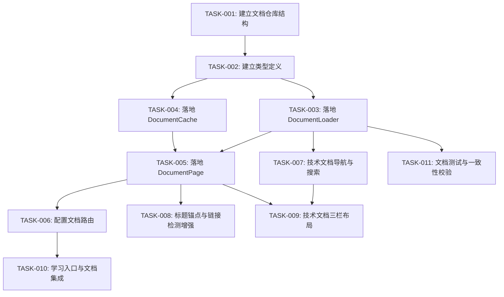

# TASK - Markdown 文档仓库自动渲染系统任务拆分

## 1. 说明

本文档按当前代码现状重构，不再描述“未来计划创建哪些模块”，而是将该系统拆分为：

- 已完成任务
- 部分完成任务
- 待补齐任务

用于支撑后续维护、补齐和重构工作。

## 2. 当前任务依赖关系图

```mermaid
graph TD
    T001[TASK-001: 建立文档仓库结构] --> T002[TASK-002: 建立类型定义]
    T002 --> T003[TASK-003: 落地 DocumentLoader]
    T002 --> T004[TASK-004: 落地 DocumentCache]
    T003 --> T005[TASK-005: 落地 DocumentPage]
    T004 --> T005
    T005 --> T006[TASK-006: 配置文档路由]
    T003 --> T007[TASK-007: 技术文档导航与搜索]
    T005 --> T008[TASK-008: 标题锚点与链接检测增强]
    T007 --> T009[TASK-009: 技术文档三栏布局]
    T005 --> T009
    T006 --> T010[TASK-010: 学习入口与文档集成]
    T003 --> T011[TASK-011: 文档测试与一致性校验]
```

## 3. 当前任务状态总览

| 任务编号 | 任务名称 | 当前状态 | 说明 |
| --- | --- | --- | --- |
| TASK-001 | 建立文档仓库结构 | 已完成 | 实际目录为 `public/docs/` |
| TASK-002 | 建立类型定义 | 已完成 | `document.ts`、`routing.ts` 已存在 |
| TASK-003 | 落地 DocumentLoader | 已完成 | 已支持加载、解析、TOC |
| TASK-004 | 落地 DocumentCache | 已完成 | 已支持内存和会话缓存 |
| TASK-005 | 落地 DocumentPage | 已完成 | 但职责偏重，未完全拆分 |
| TASK-006 | 配置文档路由 | 已完成 | `/docs/...` 路由已接入 |
| TASK-007 | 技术文档导航与搜索 | 部分完成 | 仅覆盖 `technical` 分类 |
| TASK-008 | 标题锚点与链接检测增强 | 部分完成 | 链接检测为附加区块，不是正文统一渲染 |
| TASK-009 | 技术文档三栏布局 | 已完成 | `TechnicalDocsLayout` 已存在 |
| TASK-010 | 学习入口与文档集成 | 部分完成 | `/getting-started` 已改为外部跳转 |
| TASK-011 | 文档测试与一致性校验 | 未完成 | 自动化测试与元数据校验不足 |

## 4. 原子任务详细定义

### TASK-001: 建立文档仓库结构

**状态**: 已完成  
**优先级**: P0

#### 当前交付物

- `public/docs/getting-started/`
- `public/docs/tutorials/`
- `public/docs/resources/`
- `public/docs/technical/`
- `public/docs/events/`
- 各目录下 `_meta.json`

#### 当前结论

- 原设计中的 `docs/` 已调整为 `public/docs/`
- 文档仓库已具备可用结构，后续重点是校验一致性而不是继续创建空目录

---

### TASK-002: 建立类型定义

**状态**: 已完成  
**优先级**: P0

#### 当前交付物

- `src/types/document.ts`
- `src/types/routing.ts`

#### 当前结论

- 文档加载、缓存、路由参数等核心类型已具备
- 原规划中的 `src/types/navigation.ts` 未看到独立落地，不再按必需项处理

---

### TASK-003: 落地 DocumentLoader

**状态**: 已完成  
**优先级**: P0

#### 当前交付物

- `src/services/DocumentLoader.ts`

#### 已实现能力

- 读取 `_meta.json`
- 支持 `index.md` 与 `slug.md` 双路径回退
- 解析 Front Matter
- 生成 TOC
- 统一返回 `DocumentLoadResult`

#### 当前缺口

- `searchDocuments()` 仍是占位实现
- YAML 解析器能力较轻，仅适合当前简单格式

---

### TASK-004: 落地 DocumentCache

**状态**: 已完成  
**优先级**: P1

#### 当前交付物

- `src/services/DocumentCache.ts`

#### 已实现能力

- 内存缓存
- `sessionStorage` 缓存
- TTL 失效机制
- 缓存统计

#### 当前缺口

- `preload()` 仍是占位实现

---

### TASK-005: 落地 DocumentPage

**状态**: 已完成  
**优先级**: P0

#### 当前交付物

- `src/components/DocumentPage.tsx`

#### 已实现能力

- 读取路由参数
- 集成加载和缓存
- 渲染标题、描述、作者、难度、标签
- 使用 `ReactMarkdown + remark-gfm` 渲染正文
- 支持任务列表交互渲染
- 集成标题锚点与链接检测区块

#### 当前缺口

- 页面职责过多
- 未按原规划拆为 `DocumentContent / DocumentLoading / DocumentError` 等独立组件

---

### TASK-006: 配置文档路由

**状态**: 已完成  
**优先级**: P0

#### 当前交付物

- `src/App.tsx`

#### 已实现路由

- `/docs/technical`
- `/docs/technical/:slug`
- `/docs/:category/:subcategory/:slug`
- `/docs/:category/:slug`
- `/docs/:category`

#### 当前缺口

- 未形成原规划中的独立 `DocumentRouter`
- 通用分类索引页能力较弱，仍复用 `DocumentPage`

---

### TASK-007: 技术文档导航与搜索

**状态**: 部分完成  
**优先级**: P1

#### 当前交付物

- `src/components/TechnicalDocsNavigation.tsx`
- `src/components/TechnicalDocsSearch.tsx`

#### 已实现能力

- 技术文档导航读取 `_meta.json`
- 导航排序与当前项高亮
- 基于前端遍历的技术文档搜索

#### 当前缺口

- 仅覆盖 `technical`
- 搜索通过逐篇加载实现，性能扩展性有限

---

### TASK-008: 标题锚点与链接检测增强

**状态**: 部分完成  
**优先级**: P1

#### 当前交付物

- `src/components/HeaderWithAnchor.tsx`
- `src/components/LinkDetectorComponent.tsx`

#### 已实现能力

- 标题锚点生成
- 复制锚点链接
- 链接检测统计与校验结果展示

#### 当前缺口

- 链接检测是正文后附加模块，不是正文内统一链接替换方案
- 存在部分样式策略偏动态的问题，维护成本较高

---

### TASK-009: 技术文档三栏布局

**状态**: 已完成  
**优先级**: P1

#### 当前交付物

- `src/components/TechnicalDocsLayout.tsx`
- `src/components/DocumentTOC.tsx`

#### 已实现能力

- 左导航、中正文、右目录布局
- 技术文档概览页
- 目录滚动高亮

#### 当前缺口

- 仅技术文档具备该能力
- `DocumentTOC` 动态缩进类名存在 Tailwind 兼容风险

---

### TASK-010: 学习入口与文档集成

**状态**: 部分完成  
**优先级**: P1

#### 当前结论

- 历史上已存在从学习入口访问文档的路径
- 当前 `/getting-started` 已改为跳转外部文档站
- 因此“本地学习入口统一承载 Markdown 文档”这一目标不再完全成立

#### 后续选择

- 保持外部文档站策略
- 或重新把学习入口接回本地文档系统

---

### TASK-011: 文档测试与一致性校验

**状态**: 未完成  
**优先级**: P0

#### 待补齐内容

- `DocumentLoader` 单元测试
- `DocumentCache` 单元测试
- `DocumentPage` 集成测试
- 文档正文相对链接与实际文件存在性的自动校验

#### 已发现问题

- `public/docs/getting-started/index.md` 与 `public/docs/getting-started/quick-guides/environment-setup.md` 中仍存在指向缺失文档的相对链接

## 5. 当前执行建议

### 第一优先级

1. 补齐正文相对链接与真实文档文件的一致性检查
2. 为 `DocumentLoader` 与 `DocumentCache` 增加测试
3. 明确 `/getting-started` 是否继续与本地文档系统耦合

### 第二优先级

1. 将 `TechnicalDocsSearch` 升级为索引式搜索
2. 抽象通用文档导航能力
3. 拆分 `DocumentPage` 的过重职责

## 6. 质量门控

### 当前已通过

1. 基础文档可访问
2. 基础渲染链路可用
3. 缓存可用
4. 技术文档增强布局可用

### 当前未通过或未覆盖

1. 自动化测试覆盖
2. 元数据一致性校验
3. 全站统一文档体验

---

**文档状态**: 已按现状重构  
**创建时间**: 2024-12-19  
**最后更新**: 2026-08-17  
**拆分人**: SOLO Document  
**下一步**: 依据现状优先补齐测试与文档一致性校验
