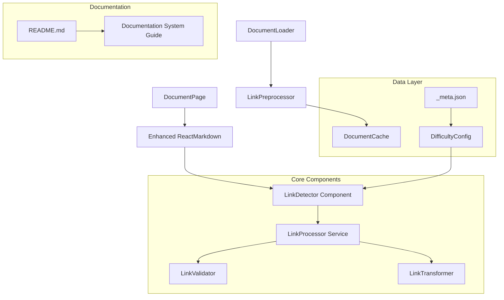
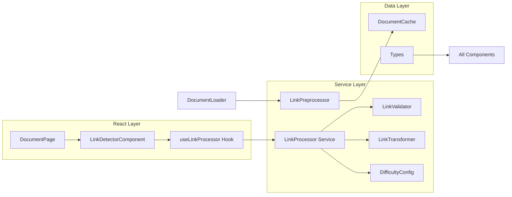
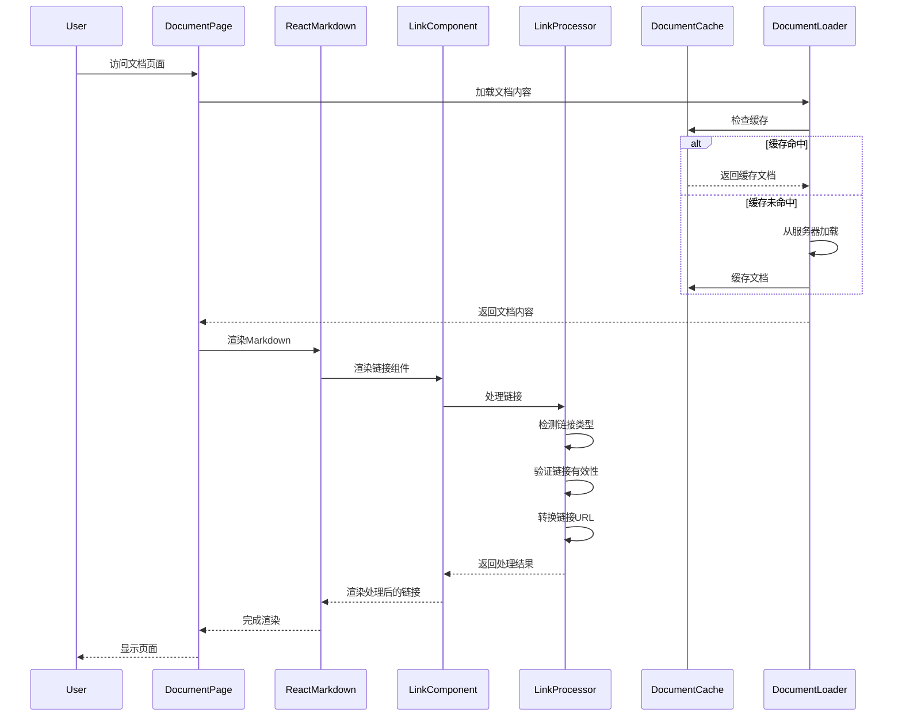

# 文档系统链接自动检测功能 - 架构设计文档

## 1. 整体架构图



## 2. 分层设计和核心组件

### 2.1 表现层 (Presentation Layer)

#### DocumentPage 组件增强
```typescript
// 现有组件保持不变，仅在ReactMarkdown配置中集成链接检测
const enhancedComponents = {
  ...existingComponents,
  a: LinkDetectorComponent,
  h1: HeaderWithAnchor,
  h2: HeaderWithAnchor,
  h3: HeaderWithAnchor,
};
```

#### LinkDetectorComponent
```typescript
interface LinkDetectorComponentProps {
  href?: string;
  children: React.ReactNode;
  className?: string;
}

const LinkDetectorComponent: React.FC<LinkDetectorComponentProps> = ({
  href,
  children,
  className,
  ...props
}) => {
  const processedLink = useLinkProcessor(href, currentDocument);
  
  return (
    <a
      href={processedLink.url}
      className={cn(getLinkStyles(processedLink.type), className)}
      target={processedLink.target}
      rel={processedLink.rel}
      {...props}
    >
      {children}
      {processedLink.type === 'external' && <ExternalLinkIcon />}
    </a>
  );
};
```

### 2.2 业务逻辑层 (Business Logic Layer)

#### LinkProcessor Service
```typescript
class LinkProcessor {
  private validator: LinkValidator;
  private transformer: LinkTransformer;
  private config: DifficultyConfig;
  
  constructor(difficulty: DocumentDifficulty) {
    this.validator = new LinkValidator();
    this.transformer = new LinkTransformer();
    this.config = DifficultyConfig.load(difficulty);
  }
  
  processLink(url: string, context: DocumentContext): ProcessedLink {
    const linkType = this.detectLinkType(url);
    const isValid = this.validator.validate(url, linkType);
    const transformedUrl = this.transformer.transform(url, linkType, context);
    
    return {
      type: linkType,
      url: transformedUrl,
      isValid,
      target: this.getTarget(linkType),
      rel: this.getRel(linkType),
      styles: this.config.getLinkStyles(linkType)
    };
  }
  
  private detectLinkType(url: string): LinkType {
    if (url.startsWith('#')) return 'anchor';
    if (url.startsWith('http')) return 'external';
    if (url.startsWith('/') || url.startsWith('./')) return 'internal';
    if (this.isResourceLink(url)) return 'resource';
    return 'unknown';
  }
}
```

#### LinkValidator
```typescript
class LinkValidator {
  validate(url: string, type: LinkType): boolean {
    switch (type) {
      case 'internal':
        return this.validateInternalLink(url);
      case 'external':
        return this.validateExternalLink(url);
      case 'anchor':
        return this.validateAnchorLink(url);
      case 'resource':
        return this.validateResourceLink(url);
      default:
        return false;
    }
  }
  
  private validateInternalLink(url: string): boolean {
    // 检查内部链接是否指向有效的文档路径
    const documentPath = this.resolveDocumentPath(url);
    return DocumentCache.getInstance().exists(documentPath);
  }
  
  private validateExternalLink(url: string): boolean {
    // 基础URL格式验证
    try {
      new URL(url);
      return true;
    } catch {
      return false;
    }
  }
}
```

#### LinkTransformer
```typescript
class LinkTransformer {
  transform(url: string, type: LinkType, context: DocumentContext): string {
    switch (type) {
      case 'internal':
        return this.transformInternalLink(url, context);
      case 'external':
        return url; // 外部链接保持不变
      case 'anchor':
        return this.transformAnchorLink(url, context);
      case 'resource':
        return this.transformResourceLink(url, context);
      default:
        return url;
    }
  }
  
  private transformInternalLink(url: string, context: DocumentContext): string {
    // 将相对路径转换为React Router路径
    const documentPath = this.resolveDocumentPath(url, context.currentPath);
    return `/docs/${documentPath}`;
  }
}
```

### 2.3 数据层 (Data Layer)

#### DifficultyConfig
```typescript
class DifficultyConfig {
  private static configs: Map<DocumentDifficulty, DifficultyConfig> = new Map();
  
  static load(difficulty: DocumentDifficulty): DifficultyConfig {
    if (!this.configs.has(difficulty)) {
      this.configs.set(difficulty, new DifficultyConfig(difficulty));
    }
    return this.configs.get(difficulty)!;
  }
  
  constructor(private difficulty: DocumentDifficulty) {}
  
  getLinkStyles(type: LinkType): string {
    const baseStyles = 'text-blue-600 hover:text-blue-800 underline';
    const difficultyStyles = {
      basic: 'decoration-green-400',
      intermediate: 'decoration-yellow-400', 
      advanced: 'decoration-red-400'
    };
    
    return `${baseStyles} ${difficultyStyles[this.difficulty]}`;
  }
  
  getNavigationConfig(): NavigationConfig {
    return {
      showPrevNext: true,
      showRelated: this.difficulty !== 'basic',
      showDifficultyBadge: true
    };
  }
}
```

#### DocumentCache 扩展
```typescript
// 扩展现有DocumentCache以支持链接信息缓存
interface CachedDocument extends DocumentContent {
  links?: ProcessedLink[];
  anchors?: AnchorInfo[];
  lastLinkCheck?: Date;
}

class DocumentCache {
  // ... 现有方法保持不变
  
  setLinks(category: string, slug: string, links: ProcessedLink[], subcategory?: string): void {
    const key = this.generateKey(category, slug, subcategory);
    const cached = this.cache.get(key);
    if (cached) {
      cached.links = links;
      cached.lastLinkCheck = new Date();
    }
  }
  
  getLinks(category: string, slug: string, subcategory?: string): ProcessedLink[] | null {
    const key = this.generateKey(category, slug, subcategory);
    const cached = this.cache.get(key);
    return cached?.links || null;
  }
}
```

## 3. 模块依赖关系图



## 4. 接口契约定义

### 4.1 核心类型定义

```typescript
// types/link-detection.ts
export type LinkType = 'internal' | 'external' | 'anchor' | 'resource' | 'unknown';
export type DocumentDifficulty = 'basic' | 'intermediate' | 'advanced';

export interface ProcessedLink {
  type: LinkType;
  url: string;
  originalUrl: string;
  isValid: boolean;
  target?: string;
  rel?: string;
  styles: string;
  metadata?: LinkMetadata;
}

export interface LinkMetadata {
  title?: string;
  description?: string;
  difficulty?: DocumentDifficulty;
  estimatedReadTime?: number;
}

export interface DocumentContext {
  category: string;
  subcategory?: string;
  slug: string;
  difficulty: DocumentDifficulty;
  currentPath: string;
}

export interface AnchorInfo {
  id: string;
  text: string;
  level: number;
  position: number;
}

export interface NavigationConfig {
  showPrevNext: boolean;
  showRelated: boolean;
  showDifficultyBadge: boolean;
  maxRelatedItems: number;
}
```

### 4.2 Hook接口

```typescript
// hooks/useLinkProcessor.ts
export interface UseLinkProcessorOptions {
  enableValidation?: boolean;
  enableCaching?: boolean;
  onLinkProcessed?: (link: ProcessedLink) => void;
}

export function useLinkProcessor(
  url: string | undefined,
  context: DocumentContext,
  options?: UseLinkProcessorOptions
): ProcessedLink | null;
```

### 4.3 服务接口

```typescript
// services/LinkDetectionService.ts
export interface ILinkDetectionService {
  processDocument(content: string, context: DocumentContext): Promise<ProcessedDocument>;
  validateLinks(links: string[]): Promise<ValidationResult[]>;
  generateNavigation(context: DocumentContext): Promise<NavigationData>;
}

export interface ProcessedDocument {
  content: string;
  links: ProcessedLink[];
  anchors: AnchorInfo[];
  navigation: NavigationData;
}

export interface ValidationResult {
  url: string;
  isValid: boolean;
  error?: string;
  suggestions?: string[];
}

export interface NavigationData {
  previous?: DocumentReference;
  next?: DocumentReference;
  related: DocumentReference[];
  breadcrumbs: BreadcrumbItem[];
}
```

## 5. 数据流向图



## 6. 异常处理策略

### 6.1 链接处理异常

```typescript
class LinkProcessingError extends Error {
  constructor(
    message: string,
    public readonly url: string,
    public readonly type: LinkType,
    public readonly cause?: Error
  ) {
    super(message);
    this.name = 'LinkProcessingError';
  }
}

// 异常处理策略
const handleLinkError = (error: LinkProcessingError): ProcessedLink => {
  console.warn(`Link processing failed for ${error.url}:`, error.message);
  
  // 返回安全的默认链接
  return {
    type: 'unknown',
    url: error.url,
    originalUrl: error.url,
    isValid: false,
    styles: 'text-gray-400 cursor-not-allowed',
    metadata: {
      title: '链接无效'
    }
  };
};
```

### 6.2 性能异常处理

```typescript
// 超时处理
const LINK_PROCESSING_TIMEOUT = 5000; // 5秒

const processLinkWithTimeout = async (
  url: string,
  context: DocumentContext
): Promise<ProcessedLink> => {
  return Promise.race([
    linkProcessor.processLink(url, context),
    new Promise<ProcessedLink>((_, reject) => 
      setTimeout(() => reject(new Error('Link processing timeout')), LINK_PROCESSING_TIMEOUT)
    )
  ]).catch(error => handleLinkError(new LinkProcessingError(
    'Processing timeout',
    url,
    'unknown',
    error
  )));
};
```

## 7. 性能优化策略

### 7.1 缓存策略
- **内存缓存**: 处理结果缓存在DocumentCache中
- **会话缓存**: 使用sessionStorage缓存验证结果
- **智能失效**: 基于文档修改时间的缓存失效策略

### 7.2 懒加载策略
- **按需处理**: 只处理可视区域内的链接
- **批量处理**: 将多个链接的处理请求合并
- **优先级处理**: 优先处理用户可能点击的链接

### 7.3 代码分割
```typescript
// 动态导入重型组件
const LinkValidator = lazy(() => import('./LinkValidator'));
const AdvancedLinkProcessor = lazy(() => import('./AdvancedLinkProcessor'));
```

## 8. 安全考虑

### 8.1 XSS防护
```typescript
const sanitizeUrl = (url: string): string => {
  // 防止javascript:协议注入
  if (url.toLowerCase().startsWith('javascript:')) {
    return '#';
  }
  
  // 防止data:协议注入
  if (url.toLowerCase().startsWith('data:')) {
    return '#';
  }
  
  return url;
};
```

### 8.2 外部链接安全
```typescript
const getSecureExternalLinkProps = (url: string) => ({
  target: '_blank',
  rel: 'noopener noreferrer nofollow',
  href: sanitizeUrl(url)
});
```

---

**文档状态**: 架构设计完成，可进入原子化阶段  
**设计时间**: 2024年当前时间  
**负责人**: SOLO Document Agent  
**下一步**: 进入Atomize阶段，拆分具体实现任务  