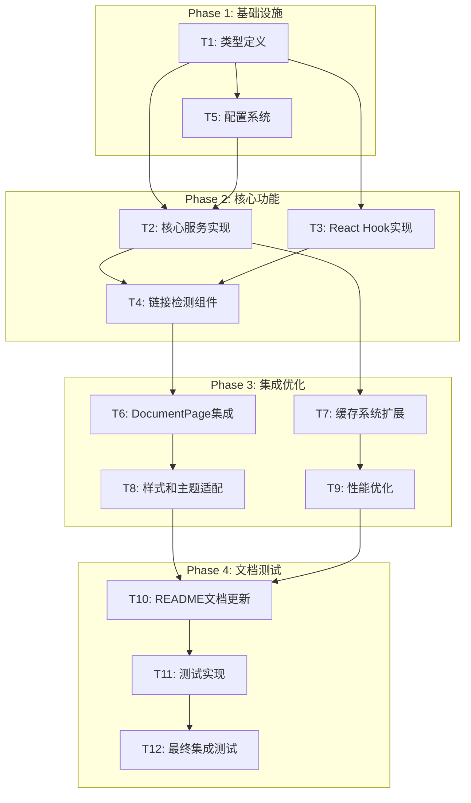

# 文档系统链接自动检测功能 - 任务拆分文档

## 1. 任务依赖关系图



## 2. 原子任务详细定义

### T1: TypeScript类型定义

**输入契约**:
- 前置依赖: 无
- 输入数据: 架构设计文档中的接口定义
- 环境依赖: TypeScript 5.7.2+

**输出契约**:
- 输出数据: 完整的类型定义文件
- 交付物: `src/types/link-detection.ts`
- 验收标准: TypeScript编译无错误，类型覆盖率100%

**实现约束**:
- 技术栈: TypeScript
- 接口规范: 严格遵循架构设计中的接口定义
- 质量要求: 所有类型必须有JSDoc注释

**具体任务内容**:
```typescript
// 需要定义的核心类型
- LinkType, DocumentDifficulty 枚举类型
- ProcessedLink, DocumentContext 接口
- LinkMetadata, AnchorInfo 接口
- NavigationConfig, ValidationResult 接口
- 服务接口: ILinkDetectionService
- Hook接口: UseLinkProcessorOptions
```

**依赖关系**: 无前置任务，为所有后续任务提供类型支持

---

### T2: 核心服务实现

**输入契约**:
- 前置依赖: T1 (类型定义)
- 输入数据: 链接URL、文档上下文
- 环境依赖: React项目环境

**输出契约**:
- 输出数据: 处理后的链接对象
- 交付物: 
  - `src/services/LinkProcessor.ts`
  - `src/services/LinkValidator.ts`
  - `src/services/LinkTransformer.ts`
- 验收标准: 所有链接类型正确识别和处理

**实现约束**:
- 技术栈: TypeScript + 现有项目依赖
- 接口规范: 实现ILinkDetectionService接口
- 质量要求: 单元测试覆盖率 > 80%

**具体任务内容**:
1. **LinkProcessor类**:
   - 链接类型检测逻辑
   - 链接处理流程协调
   - 错误处理和日志记录

2. **LinkValidator类**:
   - 内部链接有效性验证
   - 外部链接格式验证
   - 锚点链接验证

3. **LinkTransformer类**:
   - 内部链接路径转换
   - 外部链接安全属性添加
   - 资源链接处理

**依赖关系**: 依赖T1，为T3、T4提供服务支持

---

### T3: React Hook实现

**输入契约**:
- 前置依赖: T1 (类型定义), T2 (核心服务)
- 输入数据: 链接URL、文档上下文、配置选项
- 环境依赖: React 18.2.0+

**输出契约**:
- 输出数据: 处理后的链接对象或null
- 交付物: `src/hooks/useLinkProcessor.ts`
- 验收标准: Hook正确处理各种链接类型，性能优化到位

**实现约束**:
- 技术栈: React Hooks + TypeScript
- 接口规范: 符合React Hook规范
- 质量要求: 使用useMemo和useCallback优化性能

**具体任务内容**:
```typescript
// Hook实现要点
- 使用useMemo缓存处理结果
- 使用useCallback优化回调函数
- 处理异步链接验证
- 错误边界处理
- 支持配置选项
```

**依赖关系**: 依赖T1、T2，为T4提供Hook支持

---

### T4: 链接检测组件实现

**输入契约**:
- 前置依赖: T1 (类型定义), T2 (核心服务), T3 (React Hook)
- 输入数据: 链接属性、子元素、样式类名
- 环境依赖: React + 现有UI组件库

**输出契约**:
- 输出数据: 渲染的链接元素
- 交付物: `src/components/ui/LinkDetectorComponent.tsx`
- 验收标准: 正确渲染各种类型链接，样式符合设计要求

**实现约束**:
- 技术栈: React + TypeScript + Tailwind CSS
- 接口规范: 兼容ReactMarkdown的链接组件接口
- 质量要求: 响应式设计，无障碍访问支持

**具体任务内容**:
1. **LinkDetectorComponent**:
   - 集成useLinkProcessor Hook
   - 渲染不同类型链接的UI
   - 添加外部链接图标
   - 处理点击事件

2. **HeaderWithAnchor组件**:
   - 为标题添加锚点功能
   - 生成目录导航数据
   - 支持平滑滚动

**依赖关系**: 依赖T1、T2、T3，为T6提供组件支持

---

### T5: 配置系统实现

**输入契约**:
- 前置依赖: T1 (类型定义)
- 输入数据: 文档难度级别、配置参数
- 环境依赖: 现有项目配置系统

**输出契约**:
- 输出数据: 配置对象
- 交付物: `src/config/DifficultyConfig.ts`
- 验收标准: 支持三个难度级别的差异化配置

**实现约束**:
- 技术栈: TypeScript + JSON配置
- 接口规范: 支持运行时配置更新
- 质量要求: 配置验证和默认值处理

**具体任务内容**:
1. **DifficultyConfig类**:
   - 难度级别样式配置
   - 导航行为配置
   - 链接处理规则配置

2. **配置文件**:
   - 基础、中级、高级配置模板
   - 默认配置和覆盖机制

**依赖关系**: 依赖T1，为T2提供配置支持

---

### T6: DocumentPage组件集成

**输入契约**:
- 前置依赖: T4 (链接检测组件)
- 输入数据: 现有DocumentPage组件
- 环境依赖: 现有React组件架构

**输出契约**:
- 输出数据: 增强的DocumentPage组件
- 交付物: 更新的`src/components/DocumentPage.tsx`
- 验收标准: 链接检测功能无缝集成，不影响现有功能

**实现约束**:
- 技术栈: 保持现有技术栈不变
- 接口规范: 不改变组件对外接口
- 质量要求: 向后兼容，性能无明显下降

**具体任务内容**:
1. **ReactMarkdown配置更新**:
   - 替换默认链接组件为LinkDetectorComponent
   - 替换标题组件为HeaderWithAnchor
   - 保持其他组件配置不变

2. **文档上下文传递**:
   - 从路由参数构建DocumentContext
   - 传递给链接检测组件

**依赖关系**: 依赖T4，为T8提供集成基础

---

### T7: 缓存系统扩展

**输入契约**:
- 前置依赖: T2 (核心服务)
- 输入数据: 现有DocumentCache类
- 环境依赖: 现有缓存系统

**输出契约**:
- 输出数据: 扩展的缓存功能
- 交付物: 更新的`src/services/DocumentCache.ts`
- 验收标准: 链接处理结果正确缓存和失效

**实现约束**:
- 技术栈: 保持现有缓存技术栈
- 接口规范: 扩展现有接口，不破坏兼容性
- 质量要求: 缓存命中率 > 80%

**具体任务内容**:
1. **缓存接口扩展**:
   - 添加链接信息缓存方法
   - 添加锚点信息缓存方法
   - 实现智能缓存失效策略

2. **性能优化**:
   - 批量缓存操作
   - 内存使用优化

**依赖关系**: 依赖T2，为T9提供缓存支持

---

### T8: 样式和主题适配

**输入契约**:
- 前置依赖: T6 (DocumentPage集成)
- 输入数据: 现有主题系统
- 环境依赖: Tailwind CSS + 主题切换系统

**输出契约**:
- 输出数据: 适配的样式系统
- 交付物: 更新的样式配置和CSS类
- 验收标准: 在明暗主题下样式正确显示

**实现约束**:
- 技术栈: Tailwind CSS + CSS变量
- 接口规范: 兼容现有主题系统
- 质量要求: 响应式设计，无障碍访问

**具体任务内容**:
1. **链接样式定义**:
   - 不同类型链接的视觉区分
   - 难度级别的颜色标识
   - 悬停和激活状态样式

2. **主题适配**:
   - 明暗主题下的颜色适配
   - 高对比度模式支持

**依赖关系**: 依赖T6，为T10提供样式基础

---

### T9: 性能优化实现

**输入契约**:
- 前置依赖: T7 (缓存系统扩展)
- 输入数据: 性能基准数据
- 环境依赖: React性能分析工具

**输出契约**:
- 输出数据: 优化后的性能指标
- 交付物: 性能优化代码和配置
- 验收标准: 页面加载时间增加 < 100ms

**实现约束**:
- 技术栈: React性能优化技术
- 接口规范: 不改变功能接口
- 质量要求: 通过性能测试基准

**具体任务内容**:
1. **代码分割**:
   - 懒加载重型组件
   - 动态导入优化

2. **渲染优化**:
   - React.memo优化
   - 虚拟滚动(如需要)
   - 防抖和节流

**依赖关系**: 依赖T7，为T11提供优化基础

---

### T10: README文档更新

**输入契约**:
- 前置依赖: T8 (样式和主题适配)
- 输入数据: 现有README.md文件
- 环境依赖: Markdown编辑环境

**输出契约**:
- 输出数据: 更新的README文档
- 交付物: 更新的`README.md`
- 验收标准: 文档完整、准确、易懂

**实现约束**:
- 技术栈: Markdown + 图表工具
- 接口规范: 保持现有文档结构
- 质量要求: 包含完整的使用示例

**具体任务内容**:
1. **文档系统章节**:
   - 架构说明和目录结构
   - 文档创建和编辑流程
   - 链接规范和最佳实践

2. **开发指南**:
   - 链接检测功能的技术说明
   - 扩展和自定义指导
   - 故障排除指南

**依赖关系**: 依赖T8，为T11提供文档基础

---

### T11: 测试实现

**输入契约**:
- 前置依赖: T10 (README文档更新)
- 输入数据: 所有实现的功能代码
- 环境依赖: Jest + React Testing Library

**输出契约**:
- 输出数据: 完整的测试套件
- 交付物: 测试文件和配置
- 验收标准: 测试覆盖率 > 80%，所有测试通过

**实现约束**:
- 技术栈: Jest + React Testing Library + TypeScript
- 接口规范: 遵循现有测试规范
- 质量要求: 包含单元测试、集成测试、端到端测试

**具体任务内容**:
1. **单元测试**:
   - LinkProcessor服务测试
   - LinkValidator测试
   - useLinkProcessor Hook测试

2. **组件测试**:
   - LinkDetectorComponent测试
   - DocumentPage集成测试

3. **端到端测试**:
   - 完整链接检测流程测试
   - 性能基准测试

**依赖关系**: 依赖T10，为T12提供测试基础

---

### T12: 最终集成测试

**输入契约**:
- 前置依赖: T11 (测试实现)
- 输入数据: 完整的功能实现
- 环境依赖: 完整的开发和测试环境

**输出契约**:
- 输出数据: 集成测试报告
- 交付物: 最终的功能验收报告
- 验收标准: 所有验收标准通过，无阻塞性问题

**实现约束**:
- 技术栈: 完整的项目技术栈
- 接口规范: 符合所有设计规范
- 质量要求: 生产环境就绪

**具体任务内容**:
1. **功能验收测试**:
   - 所有链接类型正确处理
   - 三个难度级别功能正常
   - 性能指标达标

2. **兼容性测试**:
   - 不同浏览器兼容性
   - 移动端适配测试
   - 主题切换功能测试

3. **用户体验测试**:
   - 链接点击体验
   - 页面加载性能
   - 错误处理友好性

**依赖关系**: 依赖T11，项目完成的最终验证

## 3. 任务执行计划

### Phase 1: 基础设施 (预计2天)
- T1: 类型定义 (0.5天)
- T5: 配置系统 (1.5天)

### Phase 2: 核心功能 (预计3天)
- T2: 核心服务实现 (1.5天)
- T3: React Hook实现 (0.5天)
- T4: 链接检测组件 (1天)

### Phase 3: 集成优化 (预计3天)
- T6: DocumentPage集成 (1天)
- T7: 缓存系统扩展 (1天)
- T8: 样式和主题适配 (0.5天)
- T9: 性能优化 (0.5天)

### Phase 4: 文档测试 (预计2天)
- T10: README文档更新 (0.5天)
- T11: 测试实现 (1天)
- T12: 最终集成测试 (0.5天)

**总预计时间**: 10天

## 4. 风险评估

### 高风险任务
- **T2 (核心服务实现)**: 复杂度高，影响后续所有任务
- **T6 (DocumentPage集成)**: 涉及现有代码修改，兼容性风险
- **T9 (性能优化)**: 性能目标可能难以达成

### 缓解策略
- 高风险任务优先进行技术验证
- 保持现有功能的完整性测试
- 建立性能监控和回退机制

## 5. 质量保证

### 每个任务的质量门控
- [ ] 代码编译无错误
- [ ] 单元测试通过
- [ ] 代码审查通过
- [ ] 功能验收通过
- [ ] 性能基准达标

### 整体质量指标
- 代码测试覆盖率 > 80%
- TypeScript类型覆盖率 100%
- 页面加载性能影响 < 100ms
- 用户体验无明显下降

---

**文档状态**: 任务拆分完成，可进入审批阶段  
**拆分时间**: 2024年当前时间  
**负责人**: SOLO Document Agent  
**下一步**: 进入Approve阶段，进行任务审查和确认  