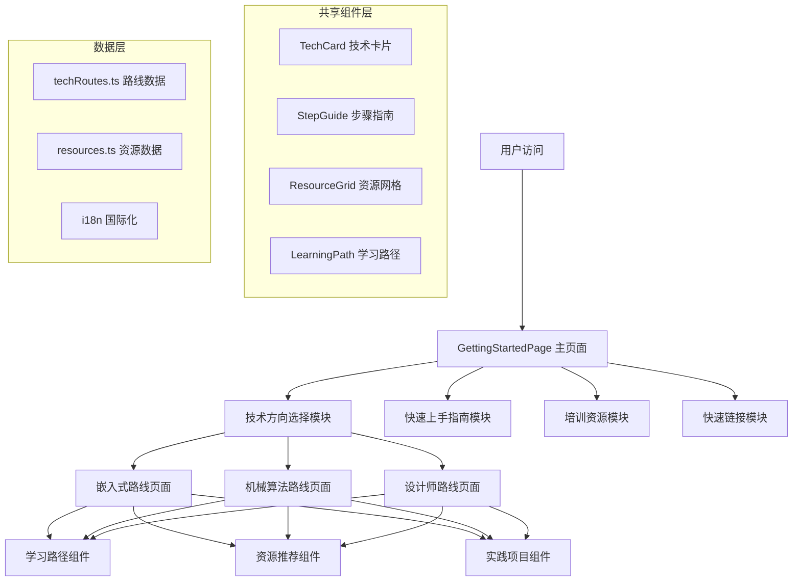
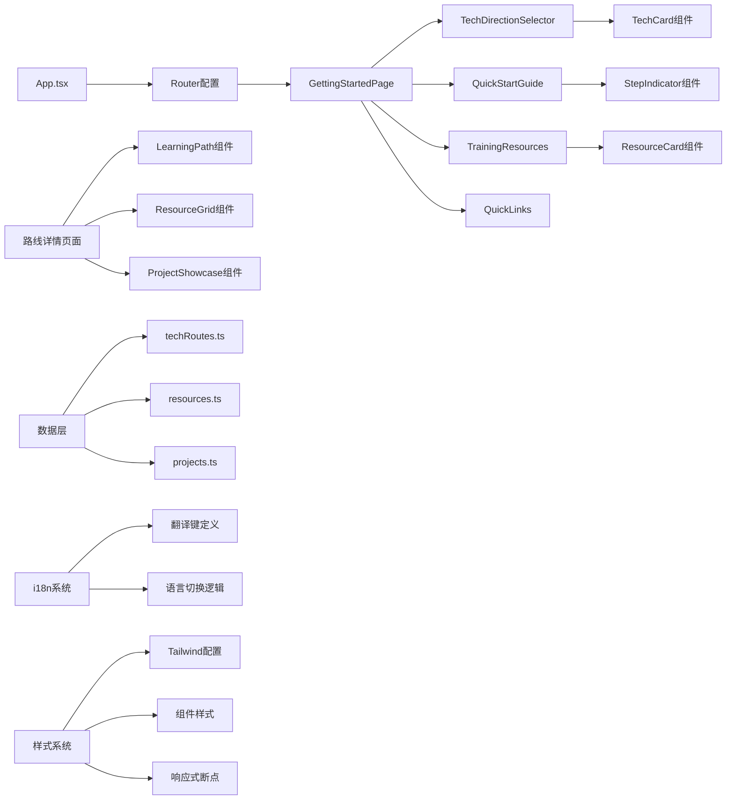
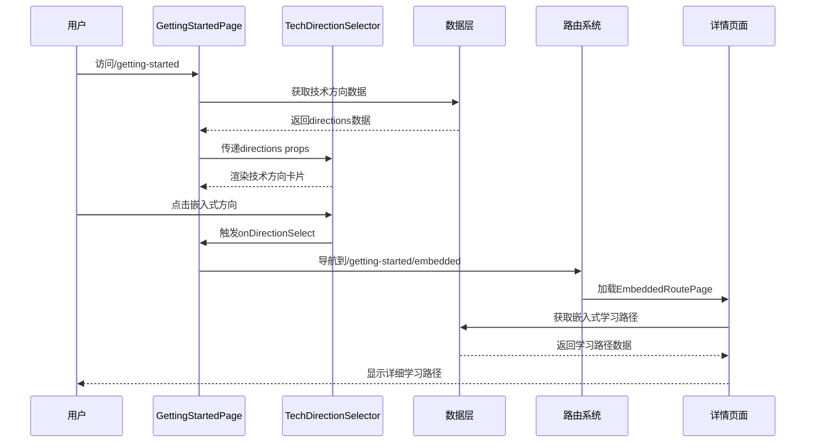

# DESIGN - Getting Started页面增强架构设计

## 1. 整体架构图



## 2. 分层设计和核心组件

### 2.1 页面层 (Pages Layer)

**主页面组件**:
- `GettingStartedPage.tsx` - 主入口页面
- `EmbeddedRoutePage.tsx` - 嵌入式路线详情页
- `MechanicalRoutePage.tsx` - 机械算法路线详情页
- `DesignRoutePage.tsx` - 设计师路线详情页

**页面职责**:
- 页面布局和导航
- 组件组合和数据传递
- 路由参数处理
- SEO优化

### 2.2 组件层 (Components Layer)

**业务组件**:
```typescript
// 技术方向选择组件
interface TechDirectionSelectorProps {
  directions: TechDirection[];
  onDirectionSelect: (direction: string) => void;
}

// 快速上手指南组件
interface QuickStartGuideProps {
  steps: QuickStartStep[];
  variant?: 'default' | 'compact';
}

// 培训资源网格组件
interface TrainingResourcesProps {
  resources: TrainingResource[];
  category?: string;
  layout?: 'grid' | 'list';
}

// 学习路径组件
interface LearningPathProps {
  path: LearningPath;
  currentStage?: number;
  interactive?: boolean;
}
```

**通用组件**:
- `TechCard` - 技术方向卡片
- `StepIndicator` - 步骤指示器
- `ResourceCard` - 资源卡片
- `ProgressPath` - 进度路径
- `TagList` - 标签列表

### 2.3 数据层 (Data Layer)

**数据模型定义**:
```typescript
// 技术方向数据模型
interface TechDirection {
  id: string;
  name: string;
  description: string;
  icon: string;
  color: string;
  route: string;
  difficulty: 'beginner' | 'intermediate' | 'advanced';
  estimatedTime: string;
  prerequisites: string[];
}

// 学习路径数据模型
interface LearningPath {
  id: string;
  title: string;
  stages: LearningStage[];
  totalDuration: string;
  skillLevel: string;
}

interface LearningStage {
  id: string;
  title: string;
  description: string;
  duration: string;
  skills: string[];
  resources: Resource[];
  projects: Project[];
  assessment: Assessment;
}

// 培训资源数据模型
interface TrainingResource {
  id: string;
  title: string;
  type: 'course' | 'tutorial' | 'documentation' | 'project' | 'tool';
  provider: string;
  url: string;
  difficulty: string;
  duration?: string;
  rating?: number;
  tags: string[];
  description: string;
}
```

## 3. 模块依赖关系图



## 4. 接口契约定义

### 4.1 组件接口规范

```typescript
// 主页面组件接口
export interface GettingStartedPageProps {
  className?: string;
}

// 技术方向选择器接口
export interface TechDirectionSelectorProps {
  directions: TechDirection[];
  selectedDirection?: string;
  onDirectionChange: (directionId: string) => void;
  layout?: 'grid' | 'carousel';
  showDescription?: boolean;
}

// 快速上手指南接口
export interface QuickStartGuideProps {
  steps: QuickStartStep[];
  currentStep?: number;
  onStepComplete?: (stepId: string) => void;
  variant?: 'numbered' | 'checkboxes' | 'timeline';
}

// 学习路径组件接口
export interface LearningPathProps {
  path: LearningPath;
  currentStage?: number;
  onStageSelect?: (stageId: string) => void;
  showProgress?: boolean;
  interactive?: boolean;
}
```

### 4.2 数据服务接口

```typescript
// 技术路线数据服务
export interface TechRouteService {
  getAllDirections(): Promise<TechDirection[]>;
  getDirectionById(id: string): Promise<TechDirection | null>;
  getLearningPath(directionId: string): Promise<LearningPath>;
  getResources(directionId: string, category?: string): Promise<TrainingResource[]>;
}

// 用户进度服务（未来扩展）
export interface UserProgressService {
  getUserProgress(userId: string): Promise<UserProgress>;
  updateProgress(userId: string, progress: ProgressUpdate): Promise<void>;
  getRecommendations(userId: string): Promise<Recommendation[]>;
}
```

### 4.3 路由接口定义

```typescript
// 路由配置接口
export interface RouteConfig {
  path: string;
  component: React.ComponentType;
  exact?: boolean;
  meta?: RouteMeta;
}

export interface RouteMeta {
  title: string;
  description: string;
  keywords: string[];
  breadcrumb: BreadcrumbItem[];
}

// 路由参数接口
export interface RouteParams {
  direction?: string;
  stage?: string;
  resource?: string;
}
```

## 5. 数据流向图



## 6. 异常处理策略

### 6.1 数据加载异常
```typescript
// 数据加载错误处理
interface ErrorBoundaryState {
  hasError: boolean;
  error?: Error;
  errorInfo?: ErrorInfo;
}

// 网络请求异常处理
interface ApiErrorHandler {
  onNetworkError: (error: NetworkError) => void;
  onDataNotFound: (resource: string) => void;
  onPermissionDenied: () => void;
  onServerError: (status: number) => void;
}
```

### 6.2 用户体验异常处理
- **加载状态**: 显示骨架屏或加载动画
- **错误状态**: 友好的错误提示和重试按钮
- **空状态**: 引导用户进行下一步操作
- **网络异常**: 离线提示和缓存策略

### 6.3 路由异常处理
```typescript
// 路由守卫和异常处理
interface RouteGuard {
  canActivate: (route: RouteConfig) => boolean;
  onRouteError: (error: RouteError) => void;
  fallbackRoute: string;
}
```

## 7. 性能优化策略

### 7.1 代码分割
```typescript
// 路由级别的代码分割
const EmbeddedRoutePage = lazy(() => import('./pages/EmbeddedRoutePage'));
const MechanicalRoutePage = lazy(() => import('./pages/MechanicalRoutePage'));
const DesignRoutePage = lazy(() => import('./pages/DesignRoutePage'));
```

### 7.2 数据缓存
- 使用React Query进行数据缓存
- 本地存储用户偏好设置
- 图片懒加载和预加载策略

### 7.3 渲染优化
- 使用React.memo优化组件重渲染
- 虚拟滚动处理大量数据
- 防抖处理用户交互

## 8. 安全考虑

### 8.1 数据安全
- 输入验证和XSS防护
- 外部链接安全检查
- 敏感信息脱敏处理

### 8.2 访问控制
- 路由权限验证
- 资源访问控制
- 用户行为审计

---

**设计状态**: 架构设计完成
**下一步**: 进入原子化任务拆分阶段(Atomize)
**设计版本**: v1.0
**最后更新**: 2024年当前时间