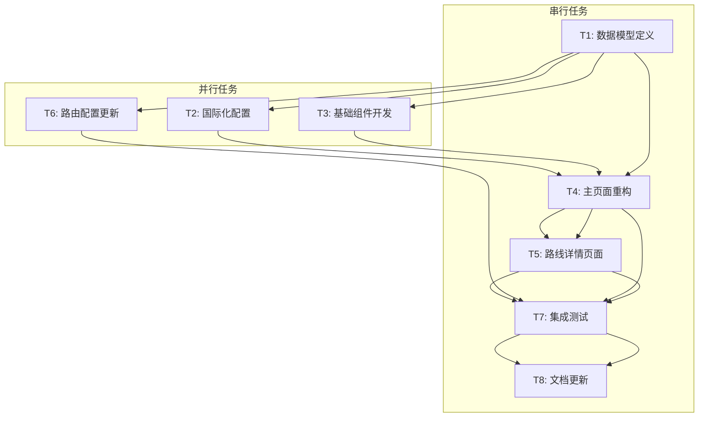

# TASK - Getting Started页面增强任务拆分

## 1. 任务概览

基于DESIGN架构文档，将Getting Started页面增强项目拆分为以下原子任务：

### 1.1 任务依赖图

## 2. 原子任务详细定义

### T1: 数据模型和类型定义

**任务描述**: 创建技术路线、学习路径、培训资源等核心数据模型

**输入契约**:
- 前置依赖: 无
- 输入数据: DESIGN文档中的接口定义
- 环境依赖: TypeScript开发环境

**输出契约**:
- 输出文件: 
  - `src/types/learning.ts` - 学习相关类型定义
  - `src/data/techRoutes.ts` - 技术路线数据
  - `src/data/resources.ts` - 培训资源数据
- 验收标准:
  - [ ] 所有接口类型定义完整
  - [ ] 数据结构符合设计文档
  - [ ] TypeScript编译无错误
  - [ ] 包含完整的JSDoc注释

**实现约束**:
- 使用TypeScript严格模式
- 遵循现有项目的命名规范
- 数据结构支持国际化
- 预留扩展字段

**依赖关系**:
- 后置任务: T2, T3, T4, T5, T6
- 并行任务: 无

---

### T2: 国际化配置扩展

**任务描述**: 为新增功能添加中英文翻译键

**输入契约**:
- 前置依赖: T1完成
- 输入数据: 技术路线和资源数据结构
- 环境依赖: 现有i18n系统

**输出契约**:
- 输出文件:
  - `src/lib/i18n/zh.ts` - 中文翻译更新
  - `src/lib/i18n/en.ts` - 英文翻译更新
  - `src/types/i18n.ts` - 翻译类型更新
- 验收标准:
  - [ ] 所有新增文本有对应翻译键
  - [ ] 中英文翻译内容准确
  - [ ] 翻译键命名规范一致
  - [ ] 类型定义同步更新

**实现约束**:
- 遵循现有翻译键命名规范
- 翻译内容专业准确
- 支持参数化翻译
- 考虑文本长度差异

**依赖关系**:
- 前置任务: T1
- 后置任务: T4, T5
- 并行任务: T3, T6

---

### T3: 基础组件开发

**任务描述**: 开发可复用的基础UI组件

**输入契约**:
- 前置依赖: T1完成
- 输入数据: 组件接口定义
- 环境依赖: React, shadcn/ui, Tailwind CSS

**输出契约**:
- 输出文件:
  - `src/components/learning/TechCard.tsx` - 技术方向卡片
  - `src/components/learning/StepIndicator.tsx` - 步骤指示器
  - `src/components/learning/ResourceCard.tsx` - 资源卡片
  - `src/components/learning/LearningPath.tsx` - 学习路径组件
  - `src/components/learning/ProgressPath.tsx` - 进度路径
- 验收标准:
  - [ ] 所有组件支持TypeScript
  - [ ] 响应式设计适配
  - [ ] 无障碍访问支持
  - [ ] 组件文档完整
  - [ ] 单元测试覆盖率>80%

**实现约束**:
- 使用现有设计系统
- 支持主题切换
- 性能优化(React.memo)
- 遵循组件设计原则

**依赖关系**:
- 前置任务: T1
- 后置任务: T4, T5
- 并行任务: T2, T6

---

### T4: 主页面重构

**任务描述**: 重构GettingStartedPage，集成新功能模块

**输入契约**:
- 前置依赖: T1, T2, T3完成
- 输入数据: 基础组件、数据模型、翻译配置
- 环境依赖: React Router, 现有页面结构

**输出契约**:
- 输出文件:
  - `src/pages/GettingStartedPage.tsx` - 主页面重构
  - `src/components/getting-started/TechDirectionSelector.tsx` - 技术方向选择器
  - `src/components/getting-started/QuickStartGuide.tsx` - 快速上手指南
  - `src/components/getting-started/TrainingResources.tsx` - 培训资源模块
- 验收标准:
  - [ ] 页面布局符合设计稿
  - [ ] 所有交互功能正常
  - [ ] 移动端适配完整
  - [ ] 加载性能优化
  - [ ] SEO元数据完整

**实现约束**:
- 保持现有页面结构
- 渐进式功能增强
- 向后兼容性
- 错误边界处理

**依赖关系**:
- 前置任务: T1, T2, T3
- 后置任务: T7
- 并行任务: T5, T6

---

### T5: 技术路线详情页面

**任务描述**: 创建三个技术方向的详情页面

**输入契约**:
- 前置依赖: T1, T2, T3, T4完成
- 输入数据: 学习路径数据、基础组件
- 环境依赖: React Router, 页面模板

**输出契约**:
- 输出文件:
  - `src/pages/routes/EmbeddedRoutePage.tsx` - 嵌入式路线页
  - `src/pages/routes/MechanicalRoutePage.tsx` - 机械算法路线页
  - `src/pages/routes/DesignRoutePage.tsx` - 设计师路线页
  - `src/components/routes/RouteTemplate.tsx` - 路线页面模板
- 验收标准:
  - [ ] 三个页面内容完整
  - [ ] 学习路径可视化
  - [ ] 资源链接可访问
  - [ ] 返回导航正常
  - [ ] 页面间一致性

**实现约束**:
- 使用统一页面模板
- 内容结构化展示
- 支持深度链接
- 面包屑导航

**依赖关系**:
- 前置任务: T1, T2, T3, T4
- 后置任务: T7
- 并行任务: T6

---

### T6: 路由配置更新

**任务描述**: 更新应用路由配置，添加新页面路由

**输入契约**:
- 前置依赖: T1完成
- 输入数据: 页面组件定义
- 环境依赖: React Router配置

**输出契约**:
- 输出文件:
  - `src/App.tsx` - 路由配置更新
  - `src/types/routes.ts` - 路由类型定义
- 验收标准:
  - [ ] 所有新路由正确配置
  - [ ] 嵌套路由结构正确
  - [ ] 路由守卫正常
  - [ ] 404处理完整
  - [ ] 路由类型安全

**实现约束**:
- 保持现有路由结构
- 支持代码分割
- 路由元数据完整
- 错误处理机制

**依赖关系**:
- 前置任务: T1
- 后置任务: T7
- 并行任务: T2, T3, T4, T5

---

### T7: 集成测试和质量保证

**任务描述**: 进行端到端测试，确保功能完整性

**输入契约**:
- 前置依赖: T4, T5, T6完成
- 输入数据: 完整功能实现
- 环境依赖: 测试框架、开发服务器

**输出契约**:
- 输出文件:
  - `src/__tests__/getting-started.test.tsx` - 页面测试
  - `src/__tests__/components/learning.test.tsx` - 组件测试
  - `cypress/e2e/getting-started.cy.ts` - E2E测试
- 验收标准:
  - [ ] 所有功能测试通过
  - [ ] 跨浏览器兼容性
  - [ ] 性能指标达标
  - [ ] 无控制台错误
  - [ ] 代码覆盖率>85%

**实现约束**:
- 测试用例覆盖全面
- 模拟真实用户场景
- 性能基准测试
- 错误场景测试

**依赖关系**:
- 前置任务: T4, T5, T6
- 后置任务: T8
- 并行任务: 无

---

### T8: 文档更新和部署准备

**任务描述**: 更新项目文档，准备生产部署

**输入契约**:
- 前置依赖: T7完成
- 输入数据: 完整功能实现和测试结果
- 环境依赖: 文档系统、部署环境

**输出契约**:
- 输出文件:
  - `README.md` - 项目文档更新
  - `docs/getting-started-guide.md` - 功能使用指南
  - `CHANGELOG.md` - 变更日志
- 验收标准:
  - [ ] 功能文档完整
  - [ ] 部署说明清晰
  - [ ] 变更记录准确
  - [ ] 用户指南易懂
  - [ ] 开发文档更新

**实现约束**:
- 文档格式规范
- 内容准确完整
- 用户友好性
- 维护便利性

**依赖关系**:
- 前置任务: T7
- 后置任务: 无
- 并行任务: 无

## 3. 任务执行计划

### 3.1 执行顺序

**第一阶段** (基础准备):
- T1: 数据模型定义 (1天)

**第二阶段** (并行开发):
- T2: 国际化配置 (0.5天)
- T3: 基础组件开发 (2天)
- T6: 路由配置更新 (0.5天)

**第三阶段** (页面集成):
- T4: 主页面重构 (1.5天)
- T5: 路线详情页面 (2天)

**第四阶段** (测试部署):
- T7: 集成测试 (1天)
- T8: 文档更新 (0.5天)

**总预估时间**: 8天

### 3.2 风险评估

**高风险任务**:
- T4: 主页面重构 - 可能影响现有功能
- T7: 集成测试 - 可能发现集成问题

**缓解措施**:
- 充分的单元测试
- 渐进式功能发布
- 回滚方案准备
- 用户反馈收集

### 3.3 质量门控

每个任务完成后需要通过以下检查：
- [ ] 代码审查通过
- [ ] 单元测试通过
- [ ] TypeScript编译无错误
- [ ] ESLint检查通过
- [ ] 功能验收通过
- [ ] 性能指标达标

---

**任务状态**: 任务拆分完成
**下一步**: 进入审批阶段(Approve)
**任务版本**: v1.0
**预估工期**: 8个工作日