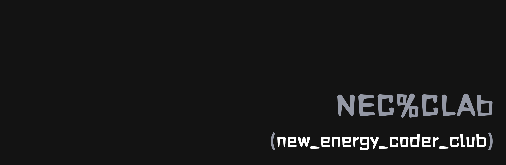

# New Energy Coder Club 官方网站

[](https://reactjs.org/)
[](https://www.typescriptlang.org/)
[](https://vitejs.dev/)
[](https://tailwindcss.com/)
[](https://vercel.com/)
[](LICENSE)

**新能源编程俱乐部官方网站** - 连接、启发和赋能新能源领域开发者和爱好者的现代化平台。

🌐 **在线访问**: [https://www.newenergycoder.club/](https://www.newenergycoder.club/)

## 🚀 快速启动

### 环境要求
- **Node.js**: >= 22.0.0 (推荐最新 LTS 版本)
- **包管理器**: npm (内置) 或 pnpm/bun (可选，更快)
- **操作系统**: Windows, macOS, Linux

### 本地开发
1. **克隆仓库**
```bash
git clone https://github.com/your-username/newenergycoder.club.git
cd newenergycoder.club
```

2. **安装依赖**
```bash
# 使用 npm
npm install
# 或使用 pnpm（推荐）
pnpm install
# 或使用 bun
bun install
```

3. **启动开发服务器**
```bash
npm run dev
# 或 pnpm dev
# 或 bun dev
```
开发服务器将在 `http://localhost:5173` 启动，支持热重载。

4. **构建生产版本**
```bash
npm run build
# 或 pnpm build
# 或 bun run build
```

5. **预览生产构建**
```bash
npm run preview
# 或 pnpm preview
# 或 bun preview
```

6. **代码检查**
```bash
npm run lint
# 或 pnpm lint
# 或 bun lint
```

## 📦 部署

### Vercel 部署（推荐）
- **自动部署**: 推送到 `main` 分支即可自动部署
- **预览部署**: Pull Request 会自动创建预览环境
- **域名配置**: 在 Vercel 控制台配置自定义域名

### 手动部署
```bash
# 构建项目
npm run build
# 将 dist 目录上传到静态托管服务
```

### 环境变量配置
在部署平台配置以下环境变量：
```bash
# Vercel Analytics（可选）
VITE_VERCEL_ANALYTICS_ID=your_analytics_id

# 其他配置
VITE_APP_TITLE=New Energy Coder Club
VITE_APP_DESCRIPTION=新能源编程俱乐部官方网站

# 飞书集成（可选）
FEISHU_WEBHOOK_URL=<飞书群机器人Webhook地址>
FEISHU_WEBHOOK_SECRET=<可选，若开启签名>
```

## 🌟 核心功能

### 页面功能
- **🏠 首页**: 俱乐部概况、特色功能和最新动态
- **👥 团队页面**: 核心团队成员和组织架构
- **📅 活动页面**: 俱乐部活动、技术研讨会
- **🚀 项目页面**: 开源项目和技术成果
- **📚 资源页面**: 学习资料、开发工具和行业报告
- **📚 学习资料选型页**: `/resources/selection` 按方向聚合入口
- **🤝 加入我们**: 多种加入方式，包括飞书群和表单申请
- **📞 联系我们**: 联系信息和地图定位
- **🔬 创新技术展示**: 新能源技术领域的创新成果和技术路线图
- **🤖 AI 对话助手**: 全局悬浮窗打开对话
- **📊 仪表板**: 用户个人中心和数据管理（需登录）

### 技术特性
- **🌍 多语言支持**: 内置国际化（i18n），支持中英文切换
- **🎨 主题切换**: 支持明亮和暗黑模式
- **📱 响应式设计**: 适配桌面、平板和移动设备
- **🔐 用户认证**: 完整的登录/注册系统
- **⚡ 高性能**: 基于 Vite 构建，支持热重载
- **🧩 组件化**: 基于 `shadcn/ui` 和 `Radix UI`
- **🎯 类型安全**: 完整的 TypeScript 支持
- **🔗 智能链接检测**: 自动检测文档中的链接状态

## 🛠️ 技术栈

### 核心技术
- **前端框架**: React 18.2.0 + TypeScript 5.7.2
- **构建工具**: Vite 6.3.5
- **样式框架**: Tailwind CSS 3.4.1
- **UI 组件库**: shadcn/ui + Radix UI
- **路由管理**: React Router DOM 6.22.1
- **状态管理**: Zustand 5.0.6

### 开发工具
- **代码检查**: ESLint 9.22.0 + TypeScript ESLint
- **样式处理**: PostCSS + Autoprefixer
- **图标库**: Lucide React 0.503.0
- **工具函数**: clsx + tailwind-merge + class-variance-authority

## 📁 项目结构

```
newenergycoder.club/
├── .env                   # 环境变量配置
├── .github/               # GitHub 工作流配置
├── .gitignore             # Git 忽略文件配置
├── .trae/                 # Trae AI 配置和文档
├── .vercel/               # Vercel 部署配置
├── docs/                  # 项目文档
├── public/                # 静态资源
├── src/                   # 源代码目录
│   ├── assets/           # 静态资源文件
│   ├── components/       # 可复用组件
│   ├── contexts/         # React Context
│   ├── data/             # 数据文件
│   ├── hooks/            # 自定义 Hooks
│   ├── image/            # 图片资源
│   ├── lib/              # 工具库和配置
│   ├── pages/            # 页面组件
│   ├── routes/           # 路由配置
│   ├── services/         # 业务服务
│   ├── store/            # 状态管理
│   ├── styles/           # 样式文件
│   ├── test/             # 测试文件
│   ├── types/            # TypeScript 类型定义
│   ├── utils/            # 工具函数
│   ├── App.tsx           # 应用主组件
│   ├── main.tsx          # 应用入口
│   └── index.css         # 全局样式
├── eslint.config.js      # ESLint 配置
├── package.json          # 项目依赖和脚本
├── postcss.config.js     # PostCSS 配置
├── tailwind.config.js    # Tailwind CSS 配置
├── tsconfig.json         # TypeScript 配置
├── vercel.json           # Vercel 部署配置
├── vite.config.ts        # Vite 配置
└── vitest.config.ts      # Vitest 测试配置
```

## 👨‍💻 开发指南

### 代码规范
- **命名约定**: PascalCase 命名组件，camelCase 命名变量和函数
- **文件组织**: 每个组件一个文件，相关组件放在同一目录
- **类型定义**: 优先使用 TypeScript 接口定义数据结构
- **样式规范**: 使用 Tailwind CSS 类名，避免内联样式

### 组件开发模板
```tsx
import React from 'react';
import { cn } from '@/lib/utils';

interface ComponentProps {
  className?: string;
  children?: React.ReactNode;
}

export const Component: React.FC<ComponentProps> = ({ 
  className, 
  children 
}) => {
  return (
    <div className={cn('default-styles', className)}>
      {children}
    </div>
  );
};
```

### 状态管理
使用 Zustand 进行状态管理：
```tsx
import { create } from 'zustand';

interface AppState {
  theme: 'light' | 'dark';
  language: 'zh' | 'en';
  setTheme: (theme: 'light' | 'dark') => void;
  setLanguage: (language: 'zh' | 'en') => void;
}

export const useAppStore = create<AppState>((set) => ({
  theme: 'light',
  language: 'zh',
  setTheme: (theme) => set({ theme }),
  setLanguage: (language) => set({ language }),
}));
```

## 🤝 贡献指南

### 贡献流程
1. **Fork 本仓库**
2. **创建您的分支** (`git checkout -b feature/AmazingFeature`)
3. **提交您的更改** (`git commit -m 'Add some AmazingFeature'`)
4. **推送到分支** (`git push origin feature/AmazingFeature`)
5. **提交 Pull Request**

### 提交规范
使用 [Conventional Commits](https://www.conventionalcommits.org/) 规范：
- `feat:` 新功能
- `fix:` 修复 bug
- `docs:` 文档更新
- `style:` 代码格式调整
- `refactor:` 代码重构
- `test:` 测试相关
- `chore:` 构建过程或辅助工具的变动

## ⚡ 性能优化

### 构建优化
- **代码分割**: 使用 React.lazy() 和 Suspense 进行路由级别的代码分割
- **Tree Shaking**: Vite 自动移除未使用的代码
- **资源压缩**: 生产构建自动压缩 JS、CSS 和图片

### 运行时优化
```tsx
// 使用 React.memo 优化组件渲染
export const OptimizedComponent = React.memo(({ data }) => {
  return <div>{data}</div>;
});

// 使用 useMemo 缓存计算结果
const expensiveValue = useMemo(() => {
  return computeExpensiveValue(data);
}, [data]);

// 使用 useCallback 缓存函数
const handleClick = useCallback(() => {
  // 处理点击事件
}, [dependency]);
```

## ❓ 常见问题

### Q: 如何添加新的页面？
A: 在 `src/pages/` 目录下创建新的页面组件，在 `App.tsx` 中添加路由配置，在导航组件中添加链接。

### Q: 如何自定义主题？
A: 修改 `tailwind.config.js` 中的颜色配置，更新 CSS 变量定义，确保深色模式适配。

### Q: 如何添加新的语言支持？
A: 在 `lib/i18n/` 目录下添加新的语言文件，更新语言切换组件，添加相应的翻译内容。

### Q: 构建时出现内存不足错误？
A: 增加 Node.js 内存限制：
```bash
node --max-old-space-size=4096 ./node_modules/.bin/vite build
```

## 📜 许可证

本项目采用 [MIT 许可证](LICENSE)。

## 📞 联系我们

- **Gitee 仓库**: [https://gitee.com/darrenpig/new_energy_coder_club](https://gitee.com/darrenpig/new_energy_coder_club)
- **项目负责人**: [DarrenPig](https://gitee.com/darrenpig)

---

*由 New Energy Coder Club 驱动*
