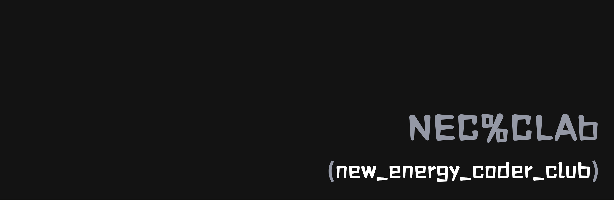

# New Energy Coder Club 官方网站

[](https://reactjs.org/)
[](https://www.typescriptlang.org/)
[](https://vitejs.dev/)
[](https://tailwindcss.com/)
[](https://vercel.com/)
[](LICENSE)

**新能源编程俱乐部官方网站** - 一个旨在连接、启发和赋能新能源领域开发者和爱好者的现代化、功能丰富的平台。

🌐 **在线访问**: [https://www.newenergycoder.club/](https://www.newenergycoder.club/)
## ✨ 项目简介

新能源编程俱乐部（New Energy Coder Club）是一个致力于探索和推进软件技术在新能源领域应用的开发者社区。我们相信，通过代码和创新，可以为可持续发展的未来贡献力量。

本网站作为俱乐部的官方门户，旨在：
- **展示俱乐部形象**：分享我们的使命、愿景和团队成员。
- **发布最新动态**：发布俱乐部活动、技术研讨会和项目更新。
- **提供资源共享**：汇集学习资料、开发工具和行业报告。
- **促进社区互动**：提供一个平台，让成员可以交流思想、协作项目。

## 📊 仓库信息

### 仓库大小
- **总文件数**: 23,950 个文件
- **仓库大小**: 477.22 MB
- **源代码大小**: ~16.39 MB (不含 node_modules)
- **依赖包大小**: ~455 MB (node_modules)

### 优化说明
本项目已进行仓库大小优化，包括：
- ✅ 清理重复的 logo 文件和图片资源
- ✅ 删除不必要的测试文件
- ✅ 优化图片资源存储结构
- ✅ 保持合理的依赖包大小

> **注意**: node_modules 目录占用大部分空间是正常现象，实际源代码仅占用约 16MB。

## 🚀 快速启动

### 环境要求

- **Node.js**: >= 22.0.0 (推荐使用最新 LTS 版本)
- **包管理器**: npm (内置) 或 pnpm/bun (可选，更快)
- **操作系统**: Windows, macOS, Linux

### 本地开发

1. **克隆仓库**
```bash
git clone https://github.com/your-username/newenergycoder.club.git
cd newenergycoder.club
```

2. **安装依赖**
```bash
# 使用 npm
npm install

# 或使用 pnpm（推荐，更快）
pnpm install

# 或使用 bun（最快）
bun install
```

3. **启动开发服务器**
```bash
npm run dev
# 或 pnpm dev
# 或 bun dev
```

开发服务器将在 `http://localhost:5173` 启动，支持热重载。

4. **构建生产版本**
```bash
npm run build
# 或 pnpm build
# 或 bun run build
```

5. **预览生产构建**
```bash
npm run preview
# 或 pnpm preview
# 或 bun preview
```

6. **代码检查**
```bash
npm run lint
# 或 pnpm lint
# 或 bun lint
```

### 本地测试指南

#### 功能测试清单

- [ ] **页面导航**: 测试所有页面路由是否正常工作
  - 首页 (`/`)
  - 团队页面 (`/team`)
  - 活动页面 (`/events`)
  - 项目页面 (`/projects`)
  - 资源页面 (`/resources`)
  - 加入我们 (`/join`)
  - 联系我们 (`/contact`)
  - 仪表板 (`/dashboard`) - 需要登录

- [ ] **响应式设计**: 在不同屏幕尺寸下测试
  - 桌面端 (≥1200px)
  - 平板端 (768px-1199px)
  - 移动端 (<768px)

- [ ] **主题切换**: 测试明亮/暗黑模式切换

- [ ] **语言切换**: 测试中英文切换功能

- [ ] **交互功能**: 测试按钮、表单、模态框等交互元素

#### 常见问题排查

**端口被占用**
```bash
# 查看端口占用
netstat -ano | findstr :5173  # Windows
lsof -ti:5173 | xargs kill -9  # macOS/Linux
```

**依赖安装失败**
```bash
# 清除缓存重新安装
npm cache clean --force
rm -rf node_modules package-lock.json
npm install
```

**TypeScript 类型错误**
```bash
# 检查 TypeScript 配置
npx tsc --noEmit
```

## 🚀 部署

### Vercel 部署（推荐）

本项目已配置 Vercel 自动部署：

1. **自动部署**: 推送到 `main` 分支即可自动部署到生产环境
2. **预览部署**: Pull Request 会自动创建预览环境
3. **域名配置**: 在 Vercel 控制台配置自定义域名

### 手动部署

```bash
# 构建项目
npm run build

# 预览构建结果
npm run preview

# 部署到其他平台
# 将 dist 目录上传到静态托管服务
```

### 环境变量配置

在部署平台配置以下环境变量：

```bash
176→# Vercel Analytics（可选）
177→VITE_VERCEL_ANALYTICS_ID=your_analytics_id

 # 其他配置
 VITE_APP_TITLE=New Energy Coder Club
 VITE_APP_DESCRIPTION=新能源编程俱乐部官方网站
 
### 飞书接入与对话助手

#### 后端表单转发到飞书

- API 路由: `/api/contact`（Vercel Serverless）
- 环境变量:

```bash
FEISHU_WEBHOOK_URL=<飞书群机器人Webhook地址>
FEISHU_WEBHOOK_SECRET=<可选，若开启签名>
```

- 表单位置: `src/pages/ContactPage.tsx`（生产环境会调用 `/api/contact`，开发环境本地模拟）

#### 悬浮窗 AI 对话助手

- 组件: `src/components/AIChatAssistant.tsx`
- 全局接入: `src/components/layout/PageLayout.tsx`（右下角悬浮按钮打开弹窗）
- 提示词文档: `src/components/新能源AI产线先知Prompt.md`

#### Lark MCP 安装

```bash
npm install -g @larksuiteoapi/lark-mcp
```

> 如需在本项目中集成 Lark MCP 服务端/客户端，请在部署平台配置相应的飞书应用凭据，并在服务端路由中完成鉴权与接口调用。
```

### 部署检查清单

- [ ] 构建成功无错误
- [ ] 所有页面路由正常
- [ ] 响应式设计在各设备正常显示
- [ ] 主题切换功能正常
- [ ] 语言切换功能正常
- [ ] 图片和静态资源加载正常
- [ ] SEO 元数据配置正确


## 🌟 主要功能

### 核心功能
- **🌍 多语言支持**: 内置国际化（i18n），支持中英文无缝切换
- **🎨 主题切换**: 支持明亮和暗黑模式，自动适应系统设置
- **📱 响应式设计**: 完美适配桌面、平板和移动设备
- **🔐 用户认证**: 完整的登录/注册系统，支持受保护路由
- **📊 数据可视化**: 内置图表和数据展示组件

### 页面功能
- **🏠 首页**: 展示俱乐部概况、特色功能和最新动态
- **👥 团队页面**: 展示核心团队成员和组织架构
- **📅 活动页面**: 发布和管理俱乐部活动、技术研讨会
- **🚀 项目页面**: 展示开源项目和技术成果
- **📚 资源页面**: 提供学习资料、开发工具和行业报告
- **📚 学习资料选型页**: `/resources/selection` 按方向聚合入口（嵌入式/GUI/算法/结构打印）
- **🤝 加入我们**: 多种加入方式，包括飞书群和表单申请
- **📞 联系我们**: 完整的联系信息和地图定位
- **🔬 创新技术展示**: 展示新能源技术领域的创新成果和技术路线图
- **🤖 AI 对话助手**: 英雄区按钮与全局悬浮窗打开对话，支持查看提示词文档
- **📊 仪表板**: 用户个人中心和数据管理（需登录）

### 技术特性
- **⚡ 高性能**: 基于 Vite 构建，支持热重载和快速构建
- **🧩 组件化**: 基于 `shadcn/ui` 和 `Radix UI`，易于维护和扩展
- **🎯 类型安全**: 完整的 TypeScript 支持
- **📈 分析统计**: 集成 Vercel Analytics 进行访问统计
- **🔍 SEO 优化**: 良好的搜索引擎优化支持
- **🔗 智能链接检测**: 自动检测文档中的链接状态，支持批量验证、缓存优化和性能监控

## 🛠️ 技术栈

### 核心技术
- **前端框架**: React 18.2.0 + TypeScript 5.7.2
- **构建工具**: Vite 6.3.5
- **样式框架**: Tailwind CSS 3.4.1
- **UI 组件库**: shadcn/ui + Radix UI
- **路由管理**: React Router DOM 6.22.1
- **状态管理**: Zustand 5.0.6

### 开发工具
- **代码检查**: ESLint 9.22.0 + TypeScript ESLint
- **样式处理**: PostCSS + Autoprefixer
- **图标库**: Lucide React 0.503.0
- **工具函数**: clsx + tailwind-merge + class-variance-authority

### 部署与分析
- **部署平台**: Vercel
- **CDN 加速**: Cloudflare
- **访问统计**: Vercel Analytics 1.5.0
- **构建优化**: Terser 5.43.1

### 开发体验
- **热重载**: Vite HMR
- **类型检查**: TypeScript 严格模式
- **代码格式化**: ESLint + React Hooks 插件
- **国际化**: 自定义 i18n 解决方案

## 📁 项目结构

```
newenergycoder.club/
├── .env                   # 环境变量配置
├── .github/               # GitHub 工作流配置
│   └── workflows/
│       └── static.yml
├── .gitignore             # Git 忽略文件配置
├── .trae/                 # Trae AI 配置和文档
│   ├── documents/         # 项目文档和设计文档
│   │   ├── ACCEPTANCE_*.md
│   │   ├── ALIGNMENT_*.md
│   │   ├── CONSENSUS_*.md
│   │   ├── DESIGN_*.md
│   │   ├── TASK_*.md
│   │   └── document-link-detection/
│   └── rules/
│       └── project_rules.md
├── .vercel/               # Vercel 部署配置
├── coverage/              # 测试覆盖率报告
├── docs/                  # 项目文档
│   ├── LINK_DETECTION.md  # 链接检测功能文档
│   ├── TEST_SUMMARY.md    # 测试总结文档
│   ├── getting-started/   # 入门指南
│   ├── resources/         # 资源文档
│   ├── technical/         # 技术文档
│   ├── tutorials/         # 教程文档
│   │   ├── advanced/      # 高级教程
│   │   ├── basic/         # 基础教程
│   │   └── intermediate/  # 中级教程
│   └── theme-integration/ # 主题集成文档
├── public/                # 静态资源
│   ├── 404.html          # 404 错误页面
│   ├── docs/             # 公共文档资源
│   └── og-image.svg      # Open Graph 图片
├── src/                   # 源代码目录
│   ├── assets/           # 静态资源文件
│   │   ├── CIT_Logo.png
│   │   ├── NEC Logo.svg
│   │   ├── github-mark.png
│   │   ├── wechat.png
│   │   └── ... (更多图标和图片)
│   ├── components/       # 可复用组件
│   │   ├── auth/         # 用户认证组件
│   │   ├── forms/        # 表单组件
│   │   ├── home/         # 首页专用组件
│   │   ├── layout/       # 布局组件
│   │   ├── markdown/     # Markdown 相关组件
│   │   ├── navigation/   # 导航组件
│   │   ├── ui/           # 基础 UI 组件
│   │   ├── DocumentPage.tsx
│   │   ├── LinkDetectorComponent.tsx
│   │   ├── PerformanceMonitor.tsx
│   │   └── ... (更多组件)
│   ├── config/           # 配置文件
│   │   └── DifficultyConfig.ts
│   ├── contexts/         # React Context
│   │   └── LanguageContext.tsx
│   ├── data/             # 数据文件
│   │   ├── resources.ts
│   │   └── techRoutes.ts
│   ├── hooks/            # 自定义 Hooks
│   │   ├── use-mobile.tsx
│   │   ├── use-theme.ts
│   │   ├── useLinkProcessor.ts
│   │   └── useMarkdown.ts
│   ├── image/            # 图片资源
│   │   ├── contributer/  # 贡献者头像
│   │   ├── designer/     # 设计师头像
│   │   ├── developer/    # 开发者头像
│   │   ├── maintainer/   # 维护者头像
│   │   ├── sponsor/      # 赞助商图片
│   │   └── ... (更多图片)
│   ├── lib/              # 工具库和配置
│   │   ├── i18n/         # 国际化配置
│   │   ├── i18n.ts
│   │   ├── performance.ts
│   │   ├── sentry.ts
│   │   └── utils.ts
│   ├── pages/            # 页面组件
│   │   ├── AdminDashboard.tsx
│   │   ├── ContactPage.tsx
│   │   ├── DashboardPage.tsx
│   │   ├── EventsPage.tsx
│   │   ├── GettingStartedPage.tsx
│   │   ├── HomePage.tsx
│   │   ├── InnovationShowcasePage.tsx
│   │   ├── JoinPage.tsx
│   │   ├── LearningCenter.tsx
│   │   ├── MarkdownViewer.tsx
│   │   ├── ProjectsPage.tsx
│   │   ├── ResourcesPage.tsx
│   │   ├── TeamPage.tsx
│   │   └── ... (更多页面)
│   ├── routes/           # 路由配置
│   ├── services/         # 业务服务
│   ├── store/            # 状态管理
│   ├── styles/           # 样式文件
│   ├── test/             # 测试文件
│   ├── types/            # TypeScript 类型定义
│   ├── utils/            # 工具函数
│   ├── App.tsx           # 应用主组件
│   ├── main.tsx          # 应用入口
│   ├── index.css         # 全局样式
│   ├── NEC-home.gif      # 首页 GIF 动画
│   └── vite-env.d.ts     # Vite 类型定义
├── eslint.config.js      # ESLint 配置
├── package.json          # 项目依赖和脚本
├── postcss.config.js     # PostCSS 配置
├── tailwind.config.js    # Tailwind CSS 配置
├── tsconfig.json         # TypeScript 配置
├── vercel.json           # Vercel 部署配置
├── vite.config.ts        # Vite 配置
├── vitest.config.ts      # Vitest 测试配置
└── start-dev.bat/.ps1    # 开发启动脚本
```

## 👨‍💻 开发指南

### 代码规范

- **命名约定**: 使用 PascalCase 命名组件，camelCase 命名变量和函数
- **文件组织**: 每个组件一个文件，相关组件放在同一目录下
- **类型定义**: 优先使用 TypeScript 接口定义数据结构
- **样式规范**: 使用 Tailwind CSS 类名，避免内联样式

### 组件开发

```tsx
// 组件模板示例
import React from 'react';
import { cn } from '@/lib/utils';

interface ComponentProps {
  className?: string;
  children?: React.ReactNode;
}

export const Component: React.FC<ComponentProps> = ({ 
  className, 
  children 
}) => {
  return (
    <div className={cn('default-styles', className)}>
      {children}
    </div>
  );
};
```

### 状态管理

使用 Zustand 进行状态管理：

```tsx
import { create } from 'zustand';

interface AppState {
  theme: 'light' | 'dark';
  language: 'zh' | 'en';
  setTheme: (theme: 'light' | 'dark') => void;
  setLanguage: (language: 'zh' | 'en') => void;
}

export const useAppStore = create<AppState>((set) => ({
  theme: 'light',
  language: 'zh',
  setTheme: (theme) => set({ theme }),
  setLanguage: (language) => set({ language }),
}));
```

### 国际化

添加新的翻译文本：

```tsx
// lib/i18n/zh.ts
export const zh = {
  common: {
    welcome: '欢迎',
    // ...
  },
  // ...
};

// lib/i18n/en.ts
export const en = {
  common: {
    welcome: 'Welcome',
    // ...
  },
  // ...
};
```

## 🤝 贡献指南

我们欢迎任何形式的贡献！无论是报告错误、提交功能请求，还是直接贡献代码。

### 贡献流程

1. **Fork 本仓库**
2. **创建您的分支** (`git checkout -b feature/AmazingFeature`)
3. **提交您的更改** (`git commit -m 'Add some AmazingFeature'`)
4. **推送到分支** (`git push origin feature/AmazingFeature`)
5. **提交 Pull Request**

### 提交规范

使用 [Conventional Commits](https://www.conventionalcommits.org/) 规范：

- `feat:` 新功能
- `fix:` 修复 bug
- `docs:` 文档更新
- `style:` 代码格式调整
- `refactor:` 代码重构
- `test:` 测试相关
- `chore:` 构建过程或辅助工具的变动

### 代码审查

- 确保代码通过 ESLint 检查
- 确保 TypeScript 类型检查通过
- 添加必要的注释和文档
- 测试新功能的各种场景

## ⚡ 性能优化

### 构建优化

- **代码分割**: 使用 React.lazy() 和 Suspense 进行路由级别的代码分割
- **Tree Shaking**: Vite 自动移除未使用的代码
- **资源压缩**: 生产构建自动压缩 JS、CSS 和图片
- **缓存策略**: 静态资源使用长期缓存

### 运行时优化

```tsx
// 使用 React.memo 优化组件渲染
export const OptimizedComponent = React.memo(({ data }) => {
  return <div>{data}</div>;
});

// 使用 useMemo 缓存计算结果
const expensiveValue = useMemo(() => {
  return computeExpensiveValue(data);
}, [data]);

// 使用 useCallback 缓存函数
const handleClick = useCallback(() => {
  // 处理点击事件
}, [dependency]);
```

### 图片优化

- 使用 WebP 格式图片
- 实现图片懒加载
- 提供多种尺寸的响应式图片

## 🔗 链接检测功能

### 功能概述

智能链接检测是本网站的核心功能之一，专门用于自动检测和验证文档中的链接状态。该功能提供了实时链接验证、批量处理、缓存优化和性能监控等特性，确保文档中的链接始终保持有效和可访问。

### 主要特性

#### 🎯 核心功能
- **自动链接检测**: 自动扫描文档内容，识别所有链接
- **实时状态验证**: 检查链接的可访问性和响应状态
- **批量处理**: 支持同时验证多个链接，提高处理效率
- **智能缓存**: 缓存验证结果，避免重复检查
- **性能优化**: 使用防抖、节流和懒加载等技术优化性能

#### 📊 状态显示
- **有效链接**: 绿色标识，表示链接可正常访问
- **无效链接**: 红色标识，表示链接无法访问或已失效
- **检查中**: 黄色标识，表示正在验证链接状态
- **未检查**: 灰色标识，表示尚未进行验证

#### 🔧 高级功能
- **锚点链接**: 自动为文档标题生成锚点链接
- **难度指示**: 根据文档难度显示不同的视觉标识
- **统计信息**: 显示链接总数、有效数量、无效数量等统计数据
- **错误报告**: 详细的错误信息和修复建议

### 使用方法

#### 基础使用
```tsx
import { LinkDetectorComponent } from '@/components/link-detection/LinkDetectorComponent';

// 在文档页面中使用
<LinkDetectorComponent 
  content={documentContent}
  difficulty="intermediate"
  onLinksProcessed={(links) => console.log('处理的链接:', links)}
/>
```

#### 使用 Hook
```tsx
import { useLinkProcessor } from '@/hooks/useLinkProcessor';

const MyComponent = () => {
  const { processLinks, isProcessing, processedLinks, clearCache } = useLinkProcessor();
  
  const handleProcess = async () => {
    const links = await processLinks(content, { enableCache: true });
    console.log('处理结果:', links);
  };
  
  return (
    <div>
      <button onClick={handleProcess} disabled={isProcessing}>
        {isProcessing ? '处理中...' : '检测链接'}
      </button>
      <button onClick={clearCache}>清除缓存</button>
    </div>
  );
};
```

#### 懒加载组件
```tsx
import { LazyLinkDetector } from '@/components/link-detection/LazyLinkDetector';

// 性能优化的懒加载版本
<LazyLinkDetector 
  content={content}
  difficulty="advanced"
  enableViewportLazy={true}
/>
```

### 配置选项

#### 缓存配置
```typescript
interface CacheConfig {
  maxSize: number;        // 最大缓存条目数
  ttl: number;           // 缓存生存时间（毫秒）
  enableLocalStorage: boolean; // 是否启用本地存储
  cleanupInterval: number;     // 清理间隔（毫秒）
}
```

#### 性能配置
```typescript
interface PerformanceConfig {
  debounceDelay: number;    // 防抖延迟
  throttleDelay: number;    // 节流延迟
  batchSize: number;        // 批处理大小
  maxConcurrency: number;   // 最大并发数
}
```

### 样式定制

链接检测组件支持完整的样式定制，包括：

- **主题适配**: 自动适配明亮/暗黑主题
- **响应式设计**: 支持各种屏幕尺寸
- **状态指示**: 不同链接状态的视觉反馈
- **动画效果**: 平滑的加载和状态切换动画

详细的样式定制说明请参考 [链接检测功能文档](./docs/LINK_DETECTION.md)。

### 性能优化

- **智能缓存**: 多层缓存策略，减少重复验证
- **批量处理**: 并发处理多个链接，提高效率
- **懒加载**: 按需加载组件，减少初始加载时间
- **防抖节流**: 避免频繁的验证请求
- **内存管理**: 自动清理过期缓存，防止内存泄漏

## ❓ 常见问题

### Q: 如何添加新的页面？

A: 
1. 在 `src/pages/` 目录下创建新的页面组件
2. 在 `App.tsx` 中添加路由配置
3. 在导航组件中添加链接

### Q: 如何自定义主题？

A: 
1. 修改 `tailwind.config.js` 中的颜色配置
2. 更新 CSS 变量定义
3. 确保深色模式适配

### Q: 如何添加新的语言支持？

A: 
1. 在 `lib/i18n/` 目录下添加新的语言文件
2. 更新语言切换组件
3. 添加相应的翻译内容

### Q: 构建时出现内存不足错误？

A: 
```bash
# 增加 Node.js 内存限制
node --max-old-space-size=4096 ./node_modules/.bin/vite build
```

### Q: 如何启用 PWA 功能？

A: 
1. 安装 `vite-plugin-pwa`
2. 配置 `vite.config.ts`
3. 添加 Service Worker 和 Manifest 文件

## 🔬 创新技术展示模块

### 功能概述

创新技术展示模块是本网站的核心功能之一，专门用于展示新能源技术领域的创新成果和技术发展路线图。该模块提供了一个直观、交互式的平台，让用户能够深入了解各种新能源技术的特点、应用场景和发展前景。

### 主要功能

#### 🎯 技术分类展示
- **太阳能技术**: 光伏发电、太阳能热利用、聚光太阳能等
- **风能技术**: 陆上风电、海上风电、小型风力发电等
- **储能技术**: 锂电池、氢储能、抽水蓄能、压缩空气储能等
- **智能电网**: 智能配电、需求响应、微电网技术等
- **电动汽车**: 动力电池、充电技术、车网互动等
- **其他新能源**: 地热能、生物质能、海洋能等

#### 🔍 技术详情展示
每项技术包含以下详细信息：
- **技术名称和简介**: 清晰的技术描述
- **技术成熟度**: 从实验室阶段到商业化应用的成熟度评级
- **应用场景**: 具体的应用领域和使用案例
- **技术指标**: 关键性能参数和技术规格
- **发展趋势**: 技术发展方向和市场前景
- **相关资源**: 技术文档、研究报告、演示视频等

#### 🔄 交互式功能
- **技术筛选**: 按分类、成熟度、应用场景等条件筛选技术
- **技术对比**: 选择多项技术进行并排对比分析
- **搜索功能**: 快速搜索特定技术或关键词
- **收藏功能**: 收藏感兴趣的技术项目
- **分享功能**: 分享技术信息到社交媒体

#### 🗺️ 技术路线图
- **时间轴展示**: 按时间顺序展示技术发展历程
- **里程碑标记**: 标注重要的技术突破和商业化节点
- **未来规划**: 展示技术发展的未来方向和预期目标
- **交互式导航**: 点击时间节点查看详细信息

### 使用指南

#### 访问方式
1. 在网站导航栏点击「创新技术展示」
2. 或直接访问 `/innovation` 路径
3. 支持桌面端和移动端访问

#### 操作说明
1. **浏览技术**: 在主页面浏览所有技术卡片
2. **分类筛选**: 使用顶部分类标签筛选特定领域技术
3. **搜索技术**: 使用搜索框快速查找技术
4. **查看详情**: 点击技术卡片查看详细信息
5. **技术对比**: 选择多个技术进行对比分析
6. **查看路线图**: 切换到路线图视图了解技术发展历程

### 技术实现

#### 数据结构
```typescript
// 技术分类枚举
enum TechnologyCategory {
  SOLAR = 'solar',
  WIND = 'wind',
  STORAGE = 'storage',
  SMART_GRID = 'smart_grid',
  ELECTRIC_VEHICLE = 'electric_vehicle',
  OTHER = 'other'
}

// 技术成熟度等级
enum MaturityLevel {
  RESEARCH = 'research',        // 研究阶段
  DEVELOPMENT = 'development',  // 开发阶段
  DEMONSTRATION = 'demonstration', // 示范阶段
  COMMERCIAL = 'commercial'     // 商业化阶段
}

// 创新技术接口
interface InnovationTechnology {
  id: string;
  name: string;
  category: TechnologyCategory;
  maturity: MaturityLevel;
  description: string;
  applications: string[];
  metrics: TechnologyMetrics;
  imageUrl?: string;
  videoUrl?: string;
  resources: TechnologyResource[];
  tags: string[];
  createdAt: Date;
  updatedAt: Date;
}
```

#### 组件架构
- **InnovationShowcasePage**: 主页面组件
- **TechnologyCard**: 技术卡片组件
- **TechnologyFilter**: 筛选组件
- **TechnologyComparison**: 对比组件
- **TechnologyRoadmap**: 路线图组件
- **TechnologyDetail**: 详情模态框组件

#### 状态管理
使用 React Hooks 进行本地状态管理：
- `useState`: 管理筛选条件、搜索关键词、选中技术等
- `useMemo`: 缓存筛选后的技术列表
- `useCallback`: 优化事件处理函数性能

### 数据管理

#### 数据来源
- **静态数据**: 预定义的技术信息存储在组件中
- **动态数据**: 支持从 API 获取最新技术信息
- **用户数据**: 用户收藏、浏览历史等个性化数据

#### 数据更新
- **定期更新**: 技术信息定期更新以反映最新发展
- **版本控制**: 技术信息变更记录和版本管理
- **数据验证**: 确保数据的准确性和完整性

### 扩展功能

#### 计划中的功能
- **用户评论**: 允许用户对技术进行评论和讨论
- **专家点评**: 邀请行业专家提供技术点评
- **技术评分**: 用户可以对技术进行评分
- **推荐系统**: 基于用户兴趣推荐相关技术
- **数据可视化**: 更丰富的图表和数据展示
- **API 接口**: 提供开放 API 供第三方应用使用

#### 性能优化
- **虚拟滚动**: 处理大量技术数据时的性能优化
- **图片懒加载**: 优化页面加载速度
- **缓存策略**: 缓存技术数据减少网络请求
- **代码分割**: 按需加载组件代码

## 🏗️ 技术架构图

### 系统整体架构

```
┌─────────────────────────────────────────────────────────────────┐
│                        用户界面层 (UI Layer)                      │
├─────────────────────────────────────────────────────────────────┤
│  React Components  │  Tailwind CSS  │  Responsive Design       │
│  - Header/Footer   │  - Utility Classes │  - Mobile First      │
│  - Navigation      │  - Custom Themes   │  - Breakpoints       │
│  - Page Layouts    │  - Dark/Light Mode │  - Flexible Grids    │
└─────────────────────────────────────────────────────────────────┘
                                  ↓
┌─────────────────────────────────────────────────────────────────┐
│                       业务逻辑层 (Business Layer)                 │
├─────────────────────────────────────────────────────────────────┤
│  State Management  │  Routing        │  Internationalization   │
│  - Zustand Store   │  - React Router │  - i18n System          │
│  - Local State     │  - Protected Routes │ - Multi-language    │
│  - Context API     │  - Navigation   │  - Dynamic Loading      │
└─────────────────────────────────────────────────────────────────┘
                                  ↓
┌─────────────────────────────────────────────────────────────────┐
│                        数据层 (Data Layer)                       │
├─────────────────────────────────────────────────────────────────┤
│  Static Data       │  API Integration │  Local Storage          │
│  - Mock Data       │  - REST APIs     │  - User Preferences     │
│  - Configuration   │  - GraphQL       │  - Cache Management     │
│  - Constants       │  - WebSocket     │  - Offline Support      │
└─────────────────────────────────────────────────────────────────┘
                                  ↓
┌─────────────────────────────────────────────────────────────────┐
│                       基础设施层 (Infrastructure)                 │
├─────────────────────────────────────────────────────────────────┤
│  Build Tools       │  Development     │  Deployment             │
│  - Vite            │  - Hot Reload    │  - Vercel Platform      │
│  - TypeScript      │  - ESLint        │  - CDN Distribution     │
│  - PostCSS         │  - Dev Server    │  - Environment Config   │
└─────────────────────────────────────────────────────────────────┘
```

### 创新技术展示模块架构

```
┌─────────────────────────────────────────────────────────────────┐
│                   InnovationShowcasePage                        │
│                    (主页面容器组件)                               │
└─────────────────────┬───────────────────────────────────────────┘
                      │
        ┌─────────────┼─────────────┐
        │             │             │
        ▼             ▼             ▼
┌─────────────┐ ┌─────────────┐ ┌─────────────┐
│ HeroSection │ │TechFilter   │ │TechRoadmap  │
│ (英雄区域)   │ │(筛选组件)    │ │(路线图)      │
└─────────────┘ └─────────────┘ └─────────────┘
        │             │             │
        └─────────────┼─────────────┘
                      │
                      ▼
        ┌─────────────────────────────┐
        │      TechnologyGrid         │
        │      (技术网格容器)          │
        └─────────────┬───────────────┘
                      │
        ┌─────────────┼─────────────┐
        │             │             │
        ▼             ▼             ▼
┌─────────────┐ ┌─────────────┐ ┌─────────────┐
│TechnologyCard│ │TechComparison│ │TechDetail   │
│(技术卡片)    │ │(技术对比)    │ │(详情模态框)  │
└─────────────┘ └─────────────┘ └─────────────┘
```

### 数据流架构

```
┌─────────────┐    ┌─────────────┐    ┌─────────────┐
│   用户操作   │───▶│   状态管理   │───▶│   UI 更新    │
│ User Actions│    │ State Mgmt  │    │ UI Updates  │
└─────────────┘    └─────────────┘    └─────────────┘
       │                   │                   │
       │                   ▼                   │
       │          ┌─────────────┐              │
       │          │   数据处理   │              │
       │          │Data Processing│             │
       │          └─────────────┘              │
       │                   │                   │
       │                   ▼                   │
       │          ┌─────────────┐              │
       └─────────▶│   API 调用   │◀─────────────┘
                  │ API Calls   │
                  └─────────────┘
```

## 🛠️ 二次开发指南

### 快速开始

#### 环境准备
1. **Node.js**: 确保安装 Node.js 22.0.0 或更高版本
2. **包管理器**: 推荐使用 pnpm 或 npm
3. **IDE**: 推荐使用 VS Code 配合相关插件
4. **Git**: 用于版本控制和协作开发

#### 开发环境配置
```bash
# 1. 克隆项目
git clone https://github.com/your-username/newenergycoder.club.git
cd newenergycoder.club

# 2. 安装依赖
npm install
# 或
pnpm install

# 3. 启动开发服务器
npm run dev
# 或
pnpm dev

# 4. 在浏览器中访问 http://localhost:5173
```

### 添加新技术

#### 1. 定义技术数据
在 `src/pages/InnovationShowcasePage.tsx` 中的 `mockTechnologies` 数组添加新技术：

```typescript
const newTechnology: InnovationTechnology = {
  id: 'unique-tech-id',
  name: '新技术名称',
  category: TechnologyCategory.SOLAR, // 选择合适的分类
  maturity: MaturityLevel.DEVELOPMENT,
  description: '技术详细描述...',
  applications: ['应用场景1', '应用场景2'],
  metrics: {
    efficiency: '效率指标',
    cost: '成本指标',
    capacity: '容量指标',
    lifespan: '使用寿命'
  },
  imageUrl: 'https://example.com/tech-image.jpg',
  videoUrl: 'https://example.com/tech-video.mp4',
  resources: [
    {
      title: '技术文档',
      url: 'https://example.com/doc',
      type: 'document'
    }
  ],
  tags: ['标签1', '标签2'],
  createdAt: new Date(),
  updatedAt: new Date()
};
```

#### 2. 添加新技术分类
如需添加新的技术分类，修改 `src/types/innovation.ts`：

```typescript
// 1. 在枚举中添加新分类
enum TechnologyCategory {
  // ... 现有分类
  NEW_CATEGORY = 'new_category'
}

// 2. 在配置中添加分类信息
export const categoryConfig = {
  // ... 现有配置
  [TechnologyCategory.NEW_CATEGORY]: {
    label: '新分类名称',
    color: 'bg-purple-500',
    icon: '🔋' // 选择合适的图标
  }
};
```

#### 3. 更新翻译文件
在 `src/lib/i18n/locales/` 目录下的语言文件中添加新的翻译键：

```typescript
// zh.ts (中文)
export const zhTranslations = {
  // ... 现有翻译
  innovation: {
    categories: {
      // ... 现有分类
      new_category: '新分类名称'
    }
  }
};

// en.ts (英文)
export const enTranslations = {
  // ... 现有翻译
  innovation: {
    categories: {
      // ... 现有分类
      new_category: 'New Category Name'
    }
  }
};
```

### 修改展示样式

#### 1. 自定义技术卡片样式
修改 `TechnologyCard` 组件的样式：

```tsx
// 在 InnovationShowcasePage.tsx 中找到技术卡片部分
<div className="bg-white dark:bg-gray-800 rounded-lg shadow-md hover:shadow-lg transition-shadow p-6">
  {/* 自定义卡片内容和样式 */}
</div>
```

#### 2. 调整布局和间距
修改网格布局和响应式设计：

```tsx
// 调整网格列数和间距
<div className="grid grid-cols-1 md:grid-cols-2 lg:grid-cols-3 xl:grid-cols-4 gap-6">
  {/* 技术卡片 */}
</div>
```

#### 3. 自定义主题颜色
在 `tailwind.config.js` 中修改颜色配置：

```javascript
module.exports = {
  theme: {
    extend: {
      colors: {
        // 添加自定义颜色
        'custom-primary': '#your-color',
        'custom-secondary': '#your-color'
      }
    }
  }
};
```

### 扩展功能

#### 1. 添加搜索功能
```tsx
// 在页面组件中添加搜索状态
const [searchTerm, setSearchTerm] = useState('');

// 添加搜索过滤逻辑
const filteredTechnologies = useMemo(() => {
  return technologies.filter(tech => 
    tech.name.toLowerCase().includes(searchTerm.toLowerCase()) ||
    tech.description.toLowerCase().includes(searchTerm.toLowerCase())
  );
}, [technologies, searchTerm]);

// 添加搜索输入框
<input
  type="text"
  placeholder="搜索技术..."
  value={searchTerm}
  onChange={(e) => setSearchTerm(e.target.value)}
  className="w-full px-4 py-2 border rounded-lg"
/>
```

#### 2. 添加收藏功能
```tsx
// 使用 Zustand 管理收藏状态
import { create } from 'zustand';

interface FavoriteStore {
  favorites: string[];
  addFavorite: (id: string) => void;
  removeFavorite: (id: string) => void;
  isFavorite: (id: string) => boolean;
}

export const useFavoriteStore = create<FavoriteStore>((set, get) => ({
  favorites: [],
  addFavorite: (id) => set((state) => ({ 
    favorites: [...state.favorites, id] 
  })),
  removeFavorite: (id) => set((state) => ({ 
    favorites: state.favorites.filter(fav => fav !== id) 
  })),
  isFavorite: (id) => get().favorites.includes(id)
}));
```

#### 3. 集成外部 API
```tsx
// 创建 API 服务
const apiService = {
  async getTechnologies(): Promise<InnovationTechnology[]> {
    const response = await fetch('/api/technologies');
    return response.json();
  },
  
  async getTechnology(id: string): Promise<InnovationTechnology> {
    const response = await fetch(`/api/technologies/${id}`);
    return response.json();
  }
};

// 在组件中使用
const [technologies, setTechnologies] = useState<InnovationTechnology[]>([]);
const [loading, setLoading] = useState(true);

useEffect(() => {
  apiService.getTechnologies()
    .then(setTechnologies)
    .finally(() => setLoading(false));
}, []);
```

### 性能优化建议

#### 1. 组件优化
```tsx
// 使用 React.memo 优化组件渲染
const TechnologyCard = React.memo(({ technology }) => {
  return (
    <div>{/* 卡片内容 */}</div>
  );
});

// 使用 useMemo 缓存计算结果
const filteredTechnologies = useMemo(() => {
  return technologies.filter(/* 筛选逻辑 */);
}, [technologies, filters]);

// 使用 useCallback 缓存函数
const handleFilterChange = useCallback((category) => {
  setSelectedCategory(category);
}, []);
```

#### 2. 图片优化
```tsx
// 使用懒加载
const LazyImage = ({ src, alt, ...props }) => {
  const [loaded, setLoaded] = useState(false);
  const imgRef = useRef();

  useEffect(() => {
    const observer = new IntersectionObserver(
      ([entry]) => {
        if (entry.isIntersecting) {
          setLoaded(true);
          observer.disconnect();
        }
      },
      { threshold: 0.1 }
    );

    if (imgRef.current) {
      observer.observe(imgRef.current);
    }

    return () => observer.disconnect();
  }, []);

  return (
    <div ref={imgRef} {...props}>
      {loaded && }
    </div>
  );
};
```

### 测试指南

#### 1. 单元测试
```tsx
// 使用 Jest 和 React Testing Library
import { render, screen } from '@testing-library/react';
import { InnovationShowcasePage } from './InnovationShowcasePage';

test('renders innovation showcase page', () => {
  render(<InnovationShowcasePage />);
  expect(screen.getByText('创新技术展示')).toBeInTheDocument();
});

test('filters technologies by category', () => {
  render(<InnovationShowcasePage />);
  // 测试筛选功能
});
```

#### 2. 集成测试
```tsx
// 测试用户交互流程
import { fireEvent, waitFor } from '@testing-library/react';

test('user can search and filter technologies', async () => {
  render(<InnovationShowcasePage />);
  
  // 测试搜索
  const searchInput = screen.getByPlaceholderText('搜索技术...');
  fireEvent.change(searchInput, { target: { value: '太阳能' } });
  
  await waitFor(() => {
    expect(screen.getByText('光伏发电')).toBeInTheDocument();
  });
  
  // 测试筛选
  const solarFilter = screen.getByText('太阳能');
  fireEvent.click(solarFilter);
  
  await waitFor(() => {
    // 验证筛选结果
  });
});
```

### 部署配置

#### 1. 环境变量配置
```bash
# .env.local
VITE_API_BASE_URL=https://api.example.com
VITE_ANALYTICS_ID=your-analytics-id
VITE_FEATURE_FLAGS=innovation_module:true
```

#### 2. 构建优化
```javascript
// vite.config.ts
export default defineConfig({
  build: {
    rollupOptions: {
      output: {
        manualChunks: {
          vendor: ['react', 'react-dom'],
          innovation: ['./src/pages/InnovationShowcasePage']
        }
      }
    }
  }
});
```

### 常见问题解决

#### Q: 如何添加新的技术成熟度等级？
A: 在 `src/types/innovation.ts` 中的 `MaturityLevel` 枚举添加新等级，并更新相关配置。

#### Q: 如何自定义技术卡片的显示字段？
A: 修改 `InnovationTechnology` 接口添加新字段，然后在卡片组件中显示。

#### Q: 如何实现技术数据的持久化存储？
A: 可以集成 localStorage、IndexedDB 或外部数据库 API。

#### Q: 如何添加技术评分功能？
A: 在技术接口中添加评分字段，创建评分组件，并实现评分逻辑。

## 📜 许可证

本项目采用 [MIT 许可证](LICENSE)。

## 📞 联系我们

- **Gitee 仓库**: [https://gitee.com/darrenpig/new_energy_coder_club](https://gitee.com/darrenpig/new_energy_coder_club)
- **项目负责人**: [DarrenPig](https://gitee.com/darrenpig)

---

*由 New Energy Coder Club 驱动*
