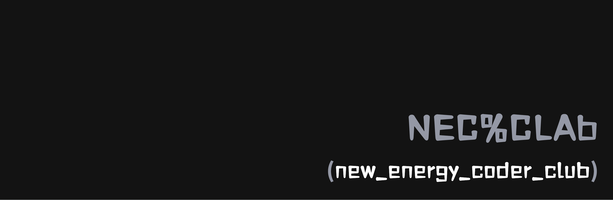

# 基础教程

## 概述

欢迎来到新能源编程俱乐部的基础教程！本教程专为编程初学者设计，将带您从零开始学习编程的基础知识，建立扎实的编程基础。

## 学习目标

- 理解编程的基本概念和思维方式
- 掌握至少一门编程语言的基础语法
- 学会使用基本的开发工具和环境
- 培养良好的编程习惯和代码风格
- 具备解决简单编程问题的能力

## 课程大纲

### 第一部分：编程入门

#### 1. 编程基础概念
- 什么是编程？
- 计算机如何工作？
- 编程语言的分类和特点
- 算法和程序的关系

#### 2. 开发环境搭建
- 选择合适的编程语言
- 安装开发工具（IDE/编辑器）
- 配置开发环境
- 第一个程序：Hello World

### 第二部分：语言基础

#### 3. 变量和数据类型
- 变量的概念和命名规则
- 基本数据类型（整数、浮点数、字符串、布尔值）
- 变量的声明和赋值
- 类型转换

#### 4. 运算符和表达式
- 算术运算符
- 比较运算符
- 逻辑运算符
- 运算符优先级
- 表达式的计算

#### 5. 输入输出
- 标准输入输出
- 格式化输出
- 文件读写基础

### 第三部分：控制结构

#### 6. 条件语句
- if语句的使用
- if-else语句
- 多重条件判断
- switch语句（适用语言）

#### 7. 循环语句
- for循环
- while循环
- do-while循环
- 循环的嵌套
- break和continue

### 第四部分：函数和模块

#### 8. 函数基础
- 函数的定义和调用
- 参数传递
- 返回值
- 局部变量和全局变量
- 函数的作用域

#### 9. 模块化编程
- 代码的组织和结构
- 模块的导入和使用
- 包管理基础

### 第五部分：数据结构基础

#### 10. 数组和列表
- 数组的概念和使用
- 列表的操作
- 多维数组
- 常用数组算法

#### 11. 字符串处理
- 字符串的基本操作
- 字符串的查找和替换
- 正则表达式入门

#### 12. 字典和映射
- 键值对的概念
- 字典的基本操作
- 哈希表的基本原理

## 实践项目

### 初级项目
1. **计算器程序**
   - 实现基本的四则运算
   - 处理用户输入
   - 错误处理

2. **猜数字游戏**
   - 随机数生成
   - 用户交互
   - 游戏逻辑实现

3. **简单的文本处理工具**
   - 文件读取
   - 字符串操作
   - 结果输出

### 进阶项目
1. **学生成绩管理系统**
   - 数据存储和检索
   - 统计分析功能
   - 用户界面设计

2. **简单的网页爬虫**
   - HTTP请求
   - HTML解析
   - 数据提取

## 编程语言选择指南

### Python（推荐初学者）
**优点：**
- 语法简洁易懂
- 丰富的库和框架
- 广泛的应用领域
- 活跃的社区支持

**适用场景：**
- 数据分析和科学计算
- Web开发
- 人工智能和机器学习
- 自动化脚本

### JavaScript
**优点：**
- 前端开发必备
- 可以做全栈开发
- 学习资源丰富
- 就业机会多

**适用场景：**
- 网页前端开发
- 服务器端开发（Node.js）
- 移动应用开发
- 桌面应用开发

### Java
**优点：**
- 跨平台性好
- 企业级应用广泛
- 严格的类型系统
- 丰富的生态系统

**适用场景：**
- 企业级应用开发
- Android应用开发
- 大数据处理
- 分布式系统

### C++
**优点：**
- 性能优秀
- 底层控制能力强
- 广泛的应用领域
- 深入理解计算机原理

**适用场景：**
- 系统编程
- 游戏开发
- 嵌入式开发
- 高性能计算

## 学习方法和建议

### 学习策略
1. **循序渐进**：从简单概念开始，逐步深入
2. **理论结合实践**：每学一个概念都要编写代码验证
3. **多做练习**：通过大量练习巩固知识
4. **项目驱动**：通过实际项目应用所学知识

### 常见误区
1. **急于求成**：编程需要时间积累，不要急躁
2. **只看不练**：编程是实践性很强的技能
3. **忽视基础**：基础不牢，后续学习会很困难
4. **孤立学习**：要学会利用社区和资源

### 学习资源

#### 在线教程
- [菜鸟教程](https://www.runoob.com/)
- [廖雪峰的官方网站](https://www.liaoxuefeng.com/)
- [Codecademy](https://www.codecademy.com/)
- [freeCodeCamp](https://www.freecodecamp.org/)

#### 练习平台
- [LeetCode](https://leetcode.com/)
- [牛客网](https://www.nowcoder.com/)
- [HackerRank](https://www.hackerrank.com/)
- [Codewars](https://www.codewars.com/)

#### 开发工具
- **文本编辑器**：VS Code、Sublime Text
- **集成开发环境**：PyCharm、IntelliJ IDEA
- **版本控制**：Git、GitHub
- **在线编程**：Repl.it、CodePen

## 学习计划建议

### 第1-2周：环境搭建和基础概念
- 选择编程语言
- 搭建开发环境
- 学习基本语法
- 完成Hello World程序

### 第3-4周：变量和运算
- 掌握数据类型
- 学习运算符
- 练习简单计算程序

### 第5-6周：控制结构
- 学习条件语句
- 掌握循环结构
- 完成猜数字游戏

### 第7-8周：函数和模块
- 理解函数概念
- 学习模块化编程
- 重构之前的代码

### 第9-10周：数据结构
- 学习数组和列表
- 掌握字符串处理
- 完成文本处理项目

### 第11-12周：综合项目
- 设计并实现一个完整项目
- 代码优化和调试
- 项目总结和反思

## 进阶方向

完成基础教程后，您可以选择以下方向继续深入学习：

- **Web开发**：学习前端和后端技术
- **数据科学**：学习数据分析和机器学习
- **移动开发**：学习iOS或Android开发
- **游戏开发**：学习游戏引擎和图形编程
- **系统编程**：学习操作系统和网络编程
- **人工智能**：学习深度学习和神经网络

## 常见问题解答

**Q: 我应该选择哪种编程语言开始学习？**
A: 对于初学者，推荐Python，因为它语法简单，应用广泛。如果你对Web开发感兴趣，可以选择JavaScript。

**Q: 学习编程需要数学基础吗？**
A: 基础的数学知识有帮助，但不是必需的。随着学习深入，可以逐步补充相关数学知识。

**Q: 多长时间可以学会编程？**
A: 这取决于学习强度和目标。一般来说，掌握基础需要2-3个月，达到就业水平需要6-12个月。

**Q: 遇到问题时应该怎么办？**
A: 首先尝试自己解决，然后查阅文档，最后可以在社区或论坛寻求帮助。学会提问也是重要技能。

---

*编程是一门实践性很强的技能，只有通过不断的练习和项目实战才能真正掌握。祝您学习愉快！*