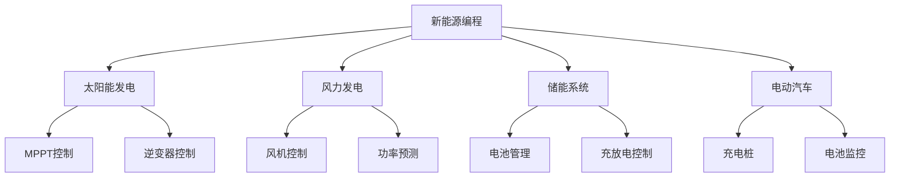

# 编程基础入门

欢迎来到新能源编程的世界！本章将为您介绍新能源编程的基础知识，帮助您建立扎实的编程基础。

## 🎯 学习目标

完成本章学习后，您将：

- [ ] 了解新能源编程的应用领域
- [ ] 掌握基本的编程概念和术语
- [ ] 学会选择合适的编程语言
- [ ] 能够搭建基本的开发环境
- [ ] 编写您的第一个新能源相关程序

## 🌟 新能源编程概述

### 什么是新能源编程？

新能源编程是指运用编程技术开发新能源相关的软件系统，包括：

- **能源管理系统**：智能电网、微电网控制
- **设备控制软件**：太阳能逆变器、风力发电机控制
- **监测与分析**：能源数据采集、性能分析
- **用户界面**：能源管理APP、监控平台

### 应用领域



## 💻 编程语言选择

### C/C++
**适用场景**：嵌入式系统、实时控制

```cpp
// 简单的PWM控制示例
#include <iostream>

class PWMController {
private:
    int dutyCycle;  // 占空比 (0-100)
    
public:
    PWMController() : dutyCycle(0) {}
    
    void setDutyCycle(int duty) {
        if (duty >= 0 && duty <= 100) {
            dutyCycle = duty;
            std::cout << "PWM占空比设置为: " << duty << "%" << std::endl;
        }
    }
    
    void startPWM() {
        std::cout << "PWM输出启动，占空比: " << dutyCycle << "%" << std::endl;
    }
};
```

**优势**：
- 高性能，适合实时系统
- 直接硬件访问能力
- 丰富的库支持

### Python
**适用场景**：数据分析、机器学习、快速原型

```python
import numpy as np
import matplotlib.pyplot as plt

def solar_power_prediction(irradiance, temperature, panel_area=10):
    """
    简单的太阳能功率预测模型
    
    Args:
        irradiance: 太阳辐照度 (W/m²)
        temperature: 温度 (°C)
        panel_area: 面板面积 (m²)
    
    Returns:
        预测功率 (W)
    """
    # 简化的功率计算公式
    efficiency = 0.2 * (1 - 0.004 * (temperature - 25))
    power = irradiance * panel_area * efficiency
    
    return max(0, power)

# 示例使用
irradiance_data = np.array([200, 400, 600, 800, 1000, 800, 600, 400])
temperature_data = np.array([20, 25, 30, 35, 40, 35, 30, 25])

power_output = []
for i, t in zip(irradiance_data, temperature_data):
    power = solar_power_prediction(i, t)
    power_output.append(power)
    print(f"辐照度: {i} W/m², 温度: {t}°C, 预测功率: {power:.2f} W")
```

**优势**：
- 语法简洁，易于学习
- 强大的数据处理能力
- 丰富的科学计算库

### JavaScript/TypeScript
**适用场景**：Web应用、用户界面、数据可视化

```typescript
interface EnergyData {
    timestamp: Date;
    solarPower: number;
    windPower: number;
    batteryLevel: number;
}

class EnergyMonitor {
    private data: EnergyData[] = [];
    
    addData(energyData: EnergyData): void {
        this.data.push(energyData);
        this.updateDisplay();
    }
    
    getTotalPower(): number {
        const latest = this.data[this.data.length - 1];
        return latest ? latest.solarPower + latest.windPower : 0;
    }
    
    private updateDisplay(): void {
        const totalPower = this.getTotalPower();
        console.log(`当前总发电功率: ${totalPower} kW`);
    }
}

// 使用示例
const monitor = new EnergyMonitor();
monitor.addData({
    timestamp: new Date(),
    solarPower: 150,
    windPower: 80,
    batteryLevel: 75
});
```

## 🛠️ 开发环境搭建

### 基础工具

1. **代码编辑器**
   - Visual Studio Code（推荐）
   - Sublime Text
   - Atom

2. **版本控制**
   - Git
   - GitHub/GitLab

3. **编译器/解释器**
   - GCC（C/C++）
   - Python 3.8+
   - Node.js（JavaScript）

### VS Code 配置示例

```json
// .vscode/settings.json
{
    "C_Cpp.default.cppStandard": "c++17",
    "python.defaultInterpreterPath": "python3",
    "editor.tabSize": 4,
    "editor.insertSpaces": true,
    "files.autoSave": "afterDelay",
    "extensions.recommendations": [
        "ms-vscode.cpptools",
        "ms-python.python",
        "ms-vscode.vscode-typescript-next"
    ]
}
```

## 🚀 第一个程序

让我们编写一个简单的能源计算器：

```python
#!/usr/bin/env python3
# -*- coding: utf-8 -*-
"""
新能源计算器 - 第一个程序
计算太阳能板的日发电量
"""

def calculate_daily_energy(panel_power, peak_sun_hours, efficiency=0.85):
    """
    计算太阳能板日发电量
    
    Args:
        panel_power: 面板额定功率 (W)
        peak_sun_hours: 峰值日照时数 (h)
        efficiency: 系统效率 (默认85%)
    
    Returns:
        日发电量 (Wh)
    """
    daily_energy = panel_power * peak_sun_hours * efficiency
    return daily_energy

def main():
    print("=== 新能源计算器 ===")
    print("计算太阳能板日发电量\n")
    
    try:
        # 用户输入
        power = float(input("请输入太阳能板功率 (W): "))
        sun_hours = float(input("请输入峰值日照时数 (h): "))
        
        # 计算发电量
        energy = calculate_daily_energy(power, sun_hours)
        
        # 显示结果
        print(f"\n计算结果:")
        print(f"面板功率: {power} W")
        print(f"峰值日照: {sun_hours} h")
        print(f"日发电量: {energy:.2f} Wh ({energy/1000:.2f} kWh)")
        
        # 年发电量估算
        yearly_energy = energy * 365 / 1000  # kWh
        print(f"年发电量估算: {yearly_energy:.2f} kWh")
        
    except ValueError:
        print("输入错误，请输入有效的数字！")
    except Exception as e:
        print(f"程序出错: {e}")

if __name__ == "__main__":
    main()
```

## 📝 编程最佳实践

### 代码规范

1. **命名规范**
   ```python
   # 好的命名
   solar_panel_power = 300  # W
   battery_voltage = 12.5   # V
   
   # 避免的命名
   p = 300
   v = 12.5
   ```

2. **注释规范**
   ```cpp
   /**
    * @brief 设置PWM占空比
    * @param duty_cycle 占空比值 (0-100)
    * @return 设置是否成功
    */
   bool setPWMDutyCycle(int duty_cycle) {
       // 参数验证
       if (duty_cycle < 0 || duty_cycle > 100) {
           return false;
       }
       
       // 设置PWM寄存器
       PWM_DUTY_REG = (duty_cycle * PWM_MAX_VALUE) / 100;
       return true;
   }
   ```

3. **错误处理**
   ```python
   def read_sensor_data(sensor_id):
       try:
           data = sensor.read(sensor_id)
           if data is None:
               raise ValueError(f"传感器 {sensor_id} 无数据")
           return data
       except Exception as e:
           logger.error(f"读取传感器数据失败: {e}")
           return None
   ```

## 🔍 调试技巧

### 1. 使用调试器
```python
import pdb

def calculate_power(voltage, current):
    pdb.set_trace()  # 设置断点
    power = voltage * current
    return power
```

### 2. 日志记录
```python
import logging

logging.basicConfig(level=logging.INFO)
logger = logging.getLogger(__name__)

def monitor_battery(voltage):
    logger.info(f"电池电压: {voltage}V")
    
    if voltage < 10.5:
        logger.warning("电池电压过低！")
    elif voltage > 14.5:
        logger.warning("电池电压过高！")
```

## 📚 推荐学习资源

### 在线课程
- [Python编程基础](https://www.python.org/about/gettingstarted/)
- [C++入门教程](https://www.learncpp.com/)
- [JavaScript现代教程](https://javascript.info/)

### 实践项目
1. **能源数据记录器**：记录和分析家庭用电数据
2. **简易充电控制器**：控制电池充电过程
3. **太阳能追踪系统**：模拟太阳能板角度调节

## 🎓 下一步学习

掌握基础后，您可以继续学习：

- [编程基础进阶](./fundamentals)
- [数据结构与算法](/docs/tutorials/intermediate/algorithms)
- [嵌入式系统开发](/docs/tutorials/intermediate/embedded)

---

**准备好深入学习了吗？** [开始下一章](./fundamentals) 或 [查看实践项目](/docs/tutorials/basic/projects)