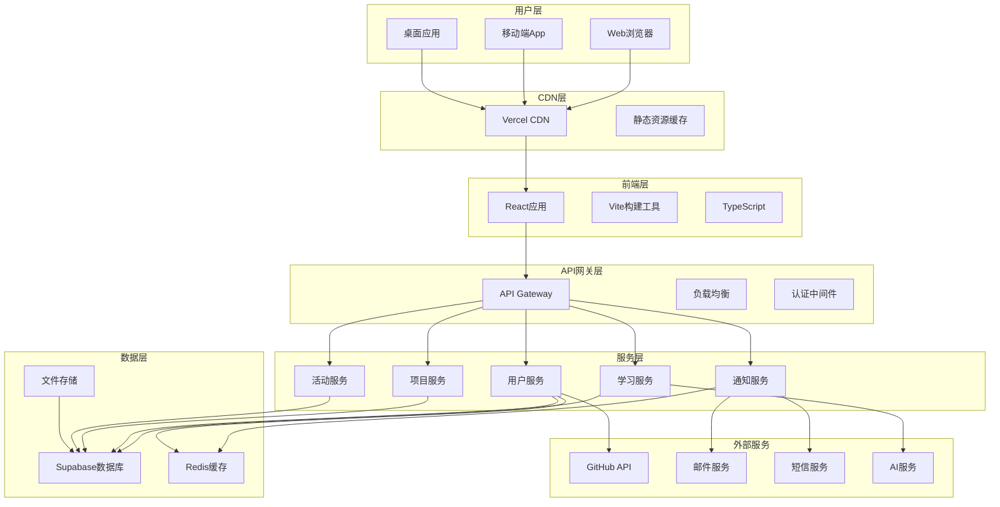
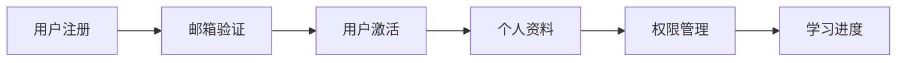
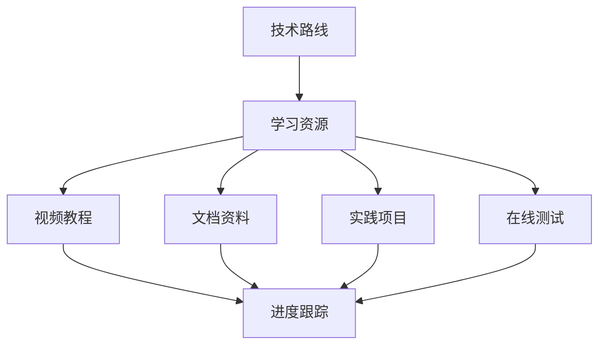
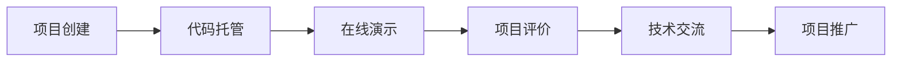
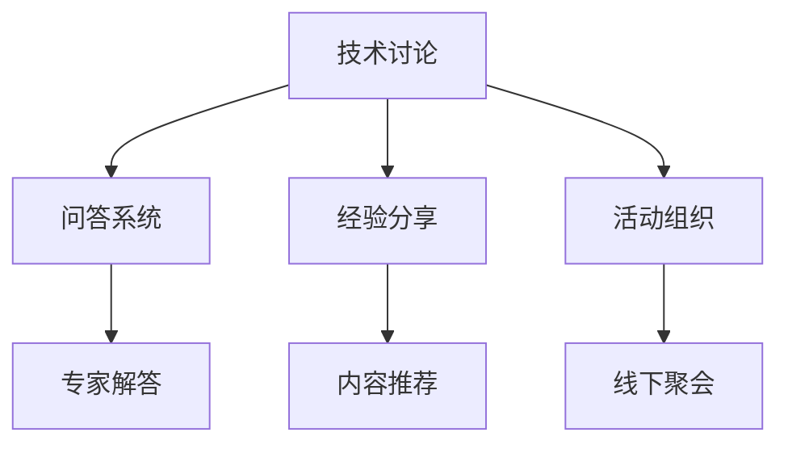
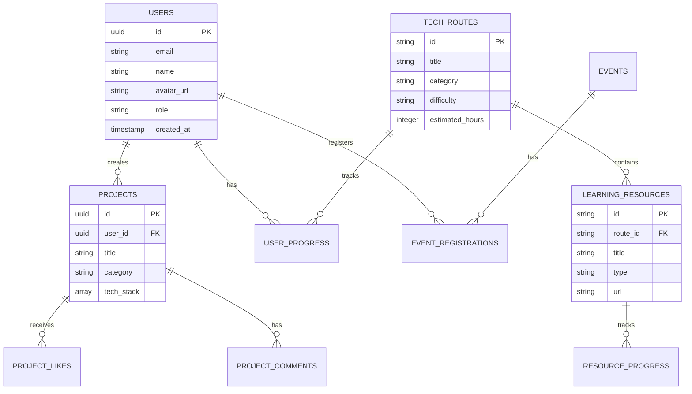
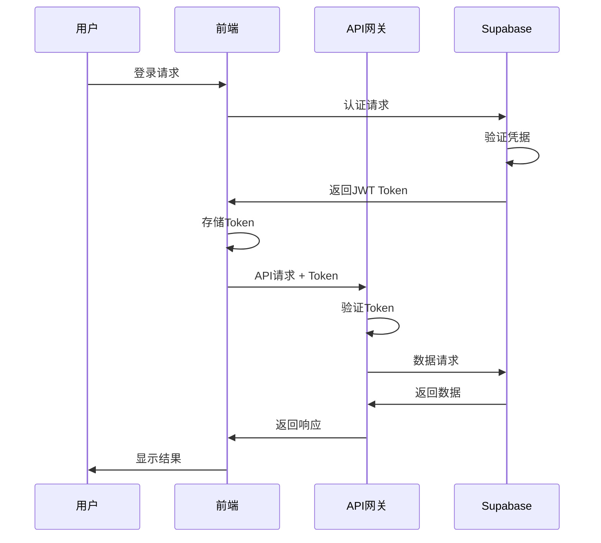
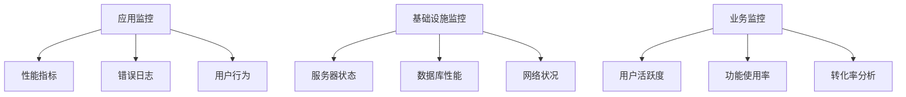

# 系统架构

## 概述

新能源编程俱乐部平台采用现代化的前后端分离架构，结合云原生技术栈，为用户提供高性能、可扩展的学习和交流平台。

## 整体架构



## 技术栈

### 前端技术栈

#### 核心框架
- **React 18**: 用户界面构建框架
- **TypeScript**: 类型安全的JavaScript超集
- **Vite**: 现代化的前端构建工具

#### UI组件库
- **Tailwind CSS**: 原子化CSS框架
- **Shadcn/ui**: 基于Radix UI的组件库
- **Lucide React**: 图标库
- **React Markdown**: Markdown渲染

#### 状态管理
- **Zustand**: 轻量级状态管理库
- **React Query**: 服务端状态管理
- **React Hook Form**: 表单状态管理

#### 路由和导航
- **React Router**: 客户端路由
- **React Helmet**: 页面元数据管理

#### 开发工具
- **ESLint**: 代码质量检查
- **Prettier**: 代码格式化
- **Husky**: Git钩子管理

### 后端技术栈

#### 数据库和存储
- **Supabase**: 后端即服务平台
  - PostgreSQL数据库
  - 实时订阅
  - 认证服务
  - 文件存储
- **Redis**: 缓存和会话存储

#### 外部服务集成
- **GitHub API**: 代码仓库集成
- **Vercel**: 部署和托管
- **SendGrid**: 邮件服务
- **OpenAI API**: AI功能支持

## 架构设计原则

### 1. 模块化设计
- 组件化开发，提高代码复用性
- 服务化架构，便于维护和扩展
- 清晰的模块边界和接口定义

### 2. 性能优化
- 代码分割和懒加载
- 静态资源CDN加速
- 数据库查询优化
- 缓存策略设计

### 3. 安全性
- JWT认证机制
- HTTPS加密传输
- 输入验证和SQL注入防护
- CORS跨域安全配置

### 4. 可扩展性
- 微服务架构设计
- 水平扩展支持
- 插件化功能模块
- API版本管理

### 5. 用户体验
- 响应式设计
- 渐进式Web应用(PWA)
- 离线功能支持
- 无障碍访问支持

## 核心模块设计

### 用户管理模块



**功能特性：**
- 多种注册方式（邮箱、GitHub、微信）
- 用户角色和权限管理
- 个人资料和偏好设置
- 学习进度跟踪

### 学习资源模块



**功能特性：**
- 结构化学习路径
- 多媒体学习资源
- 个性化推荐算法
- 学习进度可视化

### 项目展示模块



**功能特性：**
- GitHub集成
- 在线代码预览
- 项目评分和评论
- 技术标签分类

### 社区交流模块



**功能特性：**
- 实时聊天系统
- 技术问答平台
- 活动发布和报名
- 专家在线答疑

## 数据库设计

### 核心数据表

#### 用户表 (users)
```sql
CREATE TABLE users (
    id UUID PRIMARY KEY DEFAULT gen_random_uuid(),
    email VARCHAR(255) UNIQUE NOT NULL,
    password_hash VARCHAR(255),
    name VARCHAR(100) NOT NULL,
    avatar_url TEXT,
    university VARCHAR(200),
    major VARCHAR(100),
    github_username VARCHAR(100),
    bio TEXT,
    role VARCHAR(20) DEFAULT 'user',
    status VARCHAR(20) DEFAULT 'active',
    created_at TIMESTAMP WITH TIME ZONE DEFAULT NOW(),
    updated_at TIMESTAMP WITH TIME ZONE DEFAULT NOW()
);
```

#### 技术路线表 (tech_routes)
```sql
CREATE TABLE tech_routes (
    id VARCHAR(50) PRIMARY KEY,
    title VARCHAR(200) NOT NULL,
    description TEXT,
    category VARCHAR(50) NOT NULL,
    difficulty VARCHAR(20) NOT NULL,
    estimated_hours INTEGER,
    prerequisites TEXT[],
    skills TEXT[],
    order_index INTEGER DEFAULT 0,
    is_active BOOLEAN DEFAULT true,
    created_at TIMESTAMP WITH TIME ZONE DEFAULT NOW(),
    updated_at TIMESTAMP WITH TIME ZONE DEFAULT NOW()
);
```

#### 学习资源表 (learning_resources)
```sql
CREATE TABLE learning_resources (
    id VARCHAR(50) PRIMARY KEY,
    route_id VARCHAR(50) REFERENCES tech_routes(id),
    title VARCHAR(200) NOT NULL,
    description TEXT,
    type VARCHAR(20) NOT NULL, -- video, documentation, practice, book
    url TEXT,
    difficulty VARCHAR(20) NOT NULL,
    estimated_hours INTEGER,
    is_free BOOLEAN DEFAULT true,
    language VARCHAR(10) DEFAULT 'zh',
    tags TEXT[],
    tech_stack TEXT[],
    order_index INTEGER DEFAULT 0,
    created_at TIMESTAMP WITH TIME ZONE DEFAULT NOW(),
    updated_at TIMESTAMP WITH TIME ZONE DEFAULT NOW()
);
```

#### 项目表 (projects)
```sql
CREATE TABLE projects (
    id UUID PRIMARY KEY DEFAULT gen_random_uuid(),
    user_id UUID REFERENCES users(id),
    title VARCHAR(200) NOT NULL,
    description TEXT,
    category VARCHAR(50),
    tech_stack TEXT[],
    github_url TEXT,
    demo_url TEXT,
    images TEXT[],
    status VARCHAR(20) DEFAULT 'active',
    likes_count INTEGER DEFAULT 0,
    views_count INTEGER DEFAULT 0,
    created_at TIMESTAMP WITH TIME ZONE DEFAULT NOW(),
    updated_at TIMESTAMP WITH TIME ZONE DEFAULT NOW()
);
```

### 数据关系图



## 安全架构

### 认证和授权



### 安全措施

1. **认证安全**
   - JWT Token认证
   - Token自动刷新机制
   - 多因素认证支持

2. **数据安全**
   - 数据库连接加密
   - 敏感数据脱敏
   - 定期数据备份

3. **传输安全**
   - HTTPS强制加密
   - API请求签名验证
   - CORS安全配置

4. **应用安全**
   - 输入验证和过滤
   - SQL注入防护
   - XSS攻击防护
   - CSRF保护

## 性能优化策略

### 前端优化

1. **代码优化**
   - 代码分割和懒加载
   - Tree Shaking去除无用代码
   - 组件级别的性能优化

2. **资源优化**
   - 图片压缩和WebP格式
   - 静态资源CDN加速
   - 浏览器缓存策略

3. **渲染优化**
   - 虚拟滚动
   - 防抖和节流
   - 骨架屏加载

### 后端优化

1. **数据库优化**
   - 索引优化
   - 查询语句优化
   - 连接池管理

2. **缓存策略**
   - Redis缓存热点数据
   - CDN缓存静态资源
   - 浏览器缓存策略

3. **API优化**
   - 响应数据压缩
   - 批量请求支持
   - 分页和限流

## 监控和运维

### 监控体系



### 运维策略

1. **自动化部署**
   - CI/CD流水线
   - 蓝绿部署
   - 回滚机制

2. **容灾备份**
   - 数据定期备份
   - 多地域部署
   - 故障自动切换

3. **性能监控**
   - 实时性能监控
   - 异常告警机制
   - 性能报告生成

## 扩展性设计

### 水平扩展
- 微服务架构支持
- 负载均衡配置
- 数据库读写分离
- 缓存集群部署

### 功能扩展
- 插件化架构设计
- API版本管理
- 第三方集成接口
- 多语言国际化支持

## 技术债务管理

### 代码质量
- 定期代码审查
- 技术债务评估
- 重构计划制定
- 文档持续更新

### 依赖管理
- 依赖版本控制
- 安全漏洞扫描
- 定期依赖更新
- 兼容性测试

---

*本文档描述了新能源编程俱乐部平台的整体架构设计，随着业务发展会持续更新和优化。*